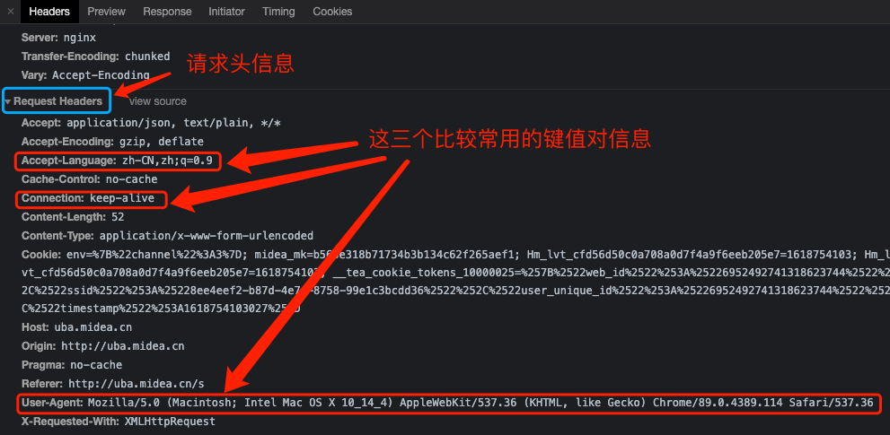

# HTTP 网络编程实现

## 实验介绍

本实验主要介绍基于 Go 语言如何用 Socket 编程知识实现并发通讯服务的案例，从而让大家巩固下前面所学的知识，达到学有所用的效果。另外本实验要求需要有 Go 语言的基础，对 Go 语言基本语法有一定的了解。

#### 知识点

- http 协议介绍
- web 工作方式
- 地址 URL 说明
- http 报文解析
- http 编程实现

## http 协议介绍

#### http 是什么

我们平时所说的 http 其实是指网络七层模型中应用层的 http 协议，也叫超文本传输协议（HTTP，HyperText Transfer Protocol)。既然是协议，那么它就是一种规范或者说是一种规则，它详细规定了浏览器和万维网服务器之间的相互通信。

平时上网使用的浏览器，打开网页搜索内容时，其实就是发起一个 http 请求到服务器上指定端口，比如，我们打开网页在百度搜索“http 协议”时，就会向百度搜索引擎服务器发起 http 请求，我们通常称发起请求的一端（浏览器）为客户端，响应或返回请求的一端称为服务端（服务器）。当然这里只是简单的说明了下，实际上客户端和服务端的通讯、数据传输要负责的多，往往在客户端和服务器端中间可能存在多个“中间层”，比如代理服务器、网关等。所以如果要提高客户端和服务器端之间的并发处理能力，可以从中间层入手，一般是优化网关（比如 ngnix），或者使用隧道优化技术等。

通常情况下，由客户端发起一个 http 请求，创建一个到服务器端的 TCP 连接，可以指定端口，没有指定端口时，一般是默认使用 80 端口，当然是需要服务器端提前监听该端口，客户端才能创建连接成功，即服务器端需要运行监听那个端口的程序，等待客户端请求连接的到来。一旦收到请求，服务器端就会向客户端返回一个状态，比如"HTTP/1.1 200 OK"，以及返回的内容，如请求的文件、错误消息等。

## web 工作方式（http 工作流程及原理）

前面说到，http 协议规定了浏览器和万维网服务器之间是怎样进行通信的，也就是说在应用层定义了客户端如何向服务器端发起请求，以及服务器端如何把响应数据返回送给客户端。简单来说 http 协议采用了请求/响应的模型。

以下是 http 从客户端发起请求到服务器端响应请求的简要步骤：

1. 客户端向服务器端发起建立连接的请求；
2. 服务器端接受请求并返回 http 响应；
3. 客户端处理服务器端响应的信息；
4. 数据处理完后，释放 tcp 连接，若请求头的 connection 模式设置为了 close，则服务器主动关闭 tcp 连接，客户端被动关闭连接；若 connection 模式设置为了 keepalive，则该连接会保持一段时间，在该时间内可以继续使用该连接。

我们来看下，在浏览器地址栏输入 url 按下回车之后会经历哪些流程：

1. 首先在浏览器地址栏输入 url 回车后，浏览器会先解析本地 DNS 配置，如果没解析域名对应 IP 地址，则继续向 DNS 域名解析服务器请求解析该 URL 中的域名所对应的 IP 地址;
2. 如果解析出了 IP 地址，则根据 IP 地址和端口号，向服务器建立连接（该过程也会涉及建立连接的三次握手），否则请求失败;
3. 浏览器向服务器端发出获取资源的 http 请求，其实就是请求 url 中域名后面对应部分的路径;
4. 服务器对浏览器请求做相应的处理，并将请求的资源响应发送给浏览器;
5. 然后根据 connection 中设置的值，来判断是否需要释放连接;
6. 浏览器获取到服务器端返回的资源，将相应的资源解析并渲染显示在浏览器页面。

上面说到的资源我们可以理解为请求需要的文件内容，比如浏览页面的 html 文件等。

简单的请求连接示意图如下所示：


上图中的 web 服务器我们也称为 http 服务器，因为它主要是通过 http 协议与客户端进行通信，而客户端通常指的是浏览器了。我们可以看到，客户端需要先通过 DNS 服务器进行域名解析出相应的 IP 地址，再根据 IP 地址向 web 服务器发起请求，最后经过服务器端的处理及响应返回资源，客户端（浏览器）就可以将相应的资源渲染显示在浏览器页面了。

## 地址 URL 说明

URL 英文全称为 Unique Resource Location，中文理解就是唯一的资源位置，用来表示网络资源，可以理解为网络文件的路径。有一点需要注意的是 URL 的长度是有限制的，不同的服务器 URL 的限制值不一样。

URL 的格式举例：`http://www.baidu.com/`

## http 报文解析

客户端向服务器发送一个请求报文，请求报文包含请求的方法、URL、协议版本、请求头部和请求数据等。服务器返回一个状态行作为响应，响应的内容包括协议的版本、状态码、服务器信息、响应头部和响应数据等。

#### 请求报文解析

请求报文格式如下图所示：


请求行解释说明：

根据上图可以知道请求行是由请求方法、URL、HTTP 协议版本以及换行符号字段组成，它们之间是用空格分隔。比如，`GET /index.html HTTP/1.1`。我们平时常用的 HTTP 协议的请求方法有 GET 和 POST 等。

GET 方法说明：

- 当客户端需要从服务器中获取某个资源时，一般是用 GET 方法。使用 GET 方法时，服务器会将 URL 请求的资源放在响应报文的数据块部分返回给客户端，简单来说就是向服务器请求某个资源时就用 GET 方法。
- 另外，在使用 GET 方法的时候，需要将请求参数以及相应的参数值写在 URL 后面，而且是通过问号来区分 URL 的结尾和请求参数的开始。前面也提到过，URL 的长度是有限的，因此参数的数量不宜太多，避免超过 URL 的长度，所以，使用 GET 方法一般不适合用于上传数据。

POST 方法说明：

- 如果客户端请求的参数比较多，而且参数不想在 URL 后面展示的时候，可以用 POST 方法来请求，比如在浏览器页面输入帐号密码进行登录时，需要使用 POST 方法向服务器提交数据。
- 使用 POST 方法的场景，一般适用于更新资源信息，以及附带有用户数据，而 GET 方法一般用于获取或查询资源信息。
- 另外，POST 方法请求的参数或者说是请求包的长度没有限制，只需要将请求参数封装在 HTTP 请求数据中即可，主要是因为 POST 方法携带的数据，在 HTTP 请求中是以键值队的形式存储的，每次请求都可以传输大量的数据。

请求头解释说明：

请求头主要是为请求报文增加一些附带信息（客户端的一些信息），以键值对对形式存在，即 key/value 对组成。由上图可以看出请求头可以有多行，而且每一行是一对 key/value，key 和 value 之间使用冒号分隔。比如我们常用的有 Accept-Language、Connection 和 User-Agent，如下图所示：



#### 响应报文解析

响应报文包括状态行、响应头部和响应正文。其中状态行包含协议的版本、状态码、状态码描述信息；响应头部跟请求头部类似，也是以键值对对形式存在；响应正文是返回给客户端端数据。响应报文格式如下图所示：


这里主要说下平时用的比较多的状态码及其含义，如下表格所示：

| 状态码 | 状态码含义         |
| ------ | ------------------ |
| 200    | 请求成功           |
| 300    | 重定向             |
| 400    | 请求出错（客户端） |
| 401    | 没有授权           |
| 403    | 请求被禁止         |
| 404    | 请求的资源不存在   |
| 500    | 服务器内部错误     |

## http 编程实现（基于 Go 语言实现）

#### http 服务端实现

服务端完整代码实现如下：

```go
/*
	file：httpServer.go
	runCmd：go run httpServer.go
 */

 package main

 import ()
	 "fmt"
	 "net/http"
 )

 // 处理函数，w 写数据给客户端，r 获取客户端发送过来的数据
 func HelloHandler(w http.ResponseWriter, r *http.Request)  {
	 // 返回打印信息
	 fmt.Fprintln(w, "Hello golang，this is handler response.")

	 // 请求方法、URL、请求头信息、请求体
	 respMsg := fmt.Sprintf(" method: %v\n url: %v\n header: %v\n body: %v\n", r.Method, r.URL, r.Header, r.Body)

	 // 返回 respMsg 数据给客户端
	 _, err := w.Write([]byte(respMsg))
	 // 错误处理
	 if err != nil {
		 fmt.Println(err)
	 }
 }

 // 主函数
 func main() {
	 // 注册路由及处理函数，用户请求连接后，会调用该 HelloHandler 函数处理
	 http.HandleFunc("/hello", HelloHandler)

	 // 监听并绑定地址和端口，这里用的是本地地址
	 err := http.ListenAndServe("127.0.0.1:8080", nil)
	 // 错误处理
	 if err != nil {
		 fmt.Println(err)
	 }
 }
```

通过以上服务端代码可以知道，基于 Go 语言实现的 http 网络编程相对前面实验的实现来说比较简单，也比较容易理解，主要涉及到两个函数的调用，分别是 `http.HandleFunc` 和 `http.ListenAndServe`。

俗话说，知其然知其所以然，接下来我们来看下这两个函数具体是怎么实现的，以及它们之间的调用关系，如下图所示：


由上图可以看出，围绕这两个函数，Go 语言底层实际上是封装了比较复杂的数据结构以及网络库函数之间的调用，其中由 `net.Listen("tcp", addr)` 函数的使用可以说明 http 的底层其实是基于 TCP 协议来进行网络通信的。

Handler 接口说明：

Go 语言没有继承和多态的方式，但是可以通过接口的实现方式来达到继承和多态的效果。所谓接口就是定义声明了方法的说明，任何结构或对象只要实现了与接口相同的方法，就相当于实现了该接口。而 Go 语言中的 http 服务的设计就是基于 handler 接口的实现来进行处理的。handler 接口定义如下：

```go
type Handler interface {
    ServeHTTP(ResponseWriter, *Request)
}
```

可以看出任何结构体，如果实现了 ServeHTTP 方法，那么就可以说该结构实现了该接口，也可以称之为 handler 对象。而 ServeMux 会使用 handler 并调用其 ServeHTTP 方法处理请求并返回响应。另外，ServeMux 也会调 Handler 方法寻找注册到路由上的 handler 函数，这里服务端实现用的则是 HelloHandler 函数。

ServeMux 的 Handler 方法会对 URL 进行简单的处理，然后创建一个锁，开始调用 match 方法并返回一个 handler 和 pattern。

通过上图中的源码实现可以看出 `map[string]muxEntry`，后者存储了 pattern 和 handler 处理器函数，因此通过迭代 m 寻找出注册路由的 patten 模式与实际 url 匹配的 handler 函数并返回。

返回的结构一直传递到 mux 的 ServeHTTP 方法，接下来调用 handler 函数的 ServeHTTP 方法，即 IndexHandler 函数，然后把 response 写到 http.RequestWirter 对象返回给客户端。

上述函数运行结束即 `serverHandler{c.server}.ServeHTTP(w, w.req)`运行结束。接下来就是对请求处理完毕之后上希望和连接断开的相关逻辑。

至此，Golang 中一个完整的 http 服务介绍完毕，包括注册路由，开启监听，处理连接，路由处理函数等。

#### http 服务实现总结

多数的 web 应用基于 HTTP 协议，客户端和服务器通过 request-response 的方式交互。一个 server 并不可少的两部分莫过于路由注册和连接处理。Golang 通过一个 ServeMux 实现了的 multiplexer 路由多路复用器来管理路由。同时提供一个 Handler 接口提供 ServeHTTP 用来实现 handler 处理其函数，后者可以处理实际 request 并构造 response。

ServeMux 和 handler 处理器函数的连接桥梁就是 Handler 接口。ServeMux 的 ServeHTTP 方法实现了寻找注册路由的 handler 的函数，并调用该 handler 的 ServeHTTP 方法。ServeHTTP 方法就是真正处理请求和构造响应的地方。

回顾 go 的 http 包实现 http 服务的流程，可见大师们的编码设计之功力。学习有利提高自身的代码逻辑组织能力。更好的学习方式除了阅读，就是实践。

#### http 客户端实现

## 实验总结

以上是基于 Go 语言实现并发通讯服务的案例。通过学习完本实验，大家可以知道如何用 Go 语言的 Socket 编程来实现多用户（客户端）进行通讯了，其实大家可以理解为一个聊天室。后续如果能力可以的话，大家可以在该基础上，用 redis 数据库替换以上说到的客户端全局队列，实现用户的登录、注册以及用户在线列表等，学会举一反三，达到学有所用的效果。本实验代码相对前面实验来说比较简洁，实现流程也比较简单，其中最经典、也最值得学习的就是 Go 语言的协程（Goroutine），希望同学们可以理解到协程使用的精髓。
