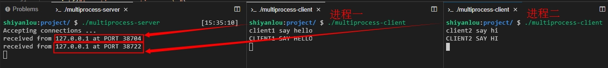
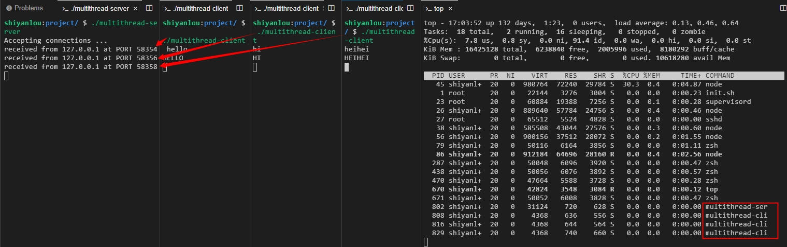
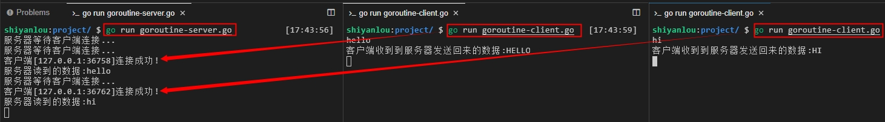

# 并发服务编程实现

## 实验介绍

本实验主要介绍什么是并发服务以及代码实现。

#### 知识点

- 进程、线程和协程的介绍
- 多进程并发服务
- 多线程并发服务
- 多协程并发服务
- 多路 I/O 转接服务

## 进程、线程和协程的介绍

#### 什么是进程

众所周知，计算机的核心是 CPU，它主要负责程序的所有计算任务；而进程则是一个具有一定独立功能的程序，也可以理解为在一个数据集上的一次动态执行的过程，是操作系统进行资源分配和调度的一个独立单位，是一种抽象的概念，一般由程序、数据集合和程序控制块三部分组成。

- 程序一般用于描述进程要完成的功能，是控制进程执行的指令集；
- 数据集合是程序在执行时所需要的数据和工作空间；
- 程序控制块（简称 PCB），它包含进程的描述信息和控制信息，唯一标识进程的存在。

#### 什么是线程

线程也是操作系统提供的一种抽象概念，是程序执行中一个比较单一的顺序控制流程，即程序执行的最小单元，可以理解为处理器调度的基本单位。一个进程可以有一个或多个线程，同一进程中的多个线程是共享该进程中的全部系统资源的，比如虚拟地址空间、文件描述符和信号处理等资源，但同一进程中的多个线程有各自的调用栈信息以及存储本地线程空间。

同样，操作系统也会为线程分配一个线程控制块（简称 TCB），将所有用于控制和管理线程的信息记录在线程的控制块中，线程控制块通常包括以下几个部分：

- 线程标志符：作为线程的唯一标识
- 一组寄存器：用于存储线程信息
- 线程运行状态：线程当前运行的状态
- 优先级：线程运行的优先级

我们来看下线程具有这几种状态：初始态、就绪状态、等待（阻塞）状态、执行状态和终止状态，线程的生命周期如下图所示：


#### 什么是协程

协程又称为微线程，顾名思义协程是一种比线程更加轻量级的执行过程，不是被操作系统内核所管理，而完全是由程序所控制，即基于用户态的。

可以理解为一个线程中有多个子程序，但执行过程中，子程序内部可中断，然后转而执行别的子程序，在执行完别的子程序后再返回来继续执行刚刚中断的子程序。协程之间的切换不需要涉及任何系统调用或任何阻塞调用，即协程只在一个线程中执行，是在子程序之间的切换，发生在用户态上，而线程的阻塞状态是由操作系统内核来完成，发生在内核态上，因此协程相比线程来说更加节省开销，主要是线程创建和切换需要资源较多。

协程一般适用于 IO 阻塞且需要大量并发的场景，当发生 IO 阻塞时，由协程的调度器进行调度，将数据流中断掉，并且记录当前的栈信息，阻塞完后立刻再通过线程恢复协程栈，并把阻塞的结果放到这个线程上去运行。

#### 进程、线程以及协程之间的关系

操作系统中进程、线程以及协程的关系大致如下图所示：


由上图可以看出同一进程中的多个线程是共享该进程中的系统资源，也就是说线程不能脱离于进程而单独存在。另外，进程之间是有相应的程序、数据块和地址空间的。一个线程中可以有多个子程序（协程），协程之间是由代码逻辑来控制切换的，即基于用户态上（由用户程序控制）。

## 多进程并发服务实现

一般服务器按实现方式可以分为单例类和并发类服务，我们平时用 C 语言编写的简单 Socket 服务端和客户端通信的例子是属于单例类的，即服务端每次只能将一个客户端的请求处理完后才能处理下一个请求，其特点是实现起来比较简单，系统资源消耗小，但是处理效率比较低。

而往往在实际应用中，并发类服务用的比较多，通常不会让一个服务长时间处理一个客户端请求，而是需要服务端可以同时处理多个客户请求的到来，这种可以同时处理多个客户端请求的服务，我们一般称为并发服务，并发服务的优势就是处理效率高，但实现起来有点复杂。

在 Linux 环境下通常有三种实现并发服务的方式：多进程并发服务器，多线程并发服务器和 IO 多路复用。

先来看下多进程并发服务器的实现。实现多进程并发服务器时，我们需要考虑和观察的以下几个点：

1. 父进程创建套接字（文件描述符）的数量，注意：父进程中需要 close 关闭 accept 返回的新文件描述符
2. 系统内允许创建的进程个数，一般与内存大小有关，注意观察内存情况
3. 是否有进程创建过多的情况，创建过多会影响服务性能，注意观察资源（CPU、内存等）消耗情况

多进程并发服务器实现流程图如下所示：


#### 基于 C 语言实现

以下是基于 C 语言实现多进程并发服务通信。

- 服务端 server

服务端实现一般有以下几个步骤：

1. 创建套接字 Socket
2. 绑定地址结构 Bind
3. 监听套接字（设置监听上限） Listen
4. 接收客户端连接请求 Accept
5. 创建子进程 fork
6. 与客户端通信并处理数据 Read、Write
7. 关闭套接字 Close

封装的网络通信相关函数实现代码（socket-comm.c）如下，后面服务端和客户端通信会调用到：

```c
/*
	file: socket-comm.c
*/

#include <stdlib.h>
#include <errno.h>
#include <sys/socket.h>
#include <stdio.h>
#include <unistd.h>

// 错误处理并退出函数
void perr_exit(const char *s)
{
	perror(s);
	exit(1);
}

// 封装创建套接字 socket 的函数
int Socket(int family, int type, int protocol)
{
	int n;
	n = socket(family, type, protocol);
	if ( n < 0)
	{
		perr_exit("socket error");
	}
	return n;
}

// 封装绑定地址信息的 bind 函数
int Bind(int fd, const struct sockaddr *sa, socklen_t salen)
{
	int n;
	n = bind(fd, sa, salen);
	if (n < 0)
	{
		perr_exit("bind error");
	}
	return n;
}

// 封装建立连接的 connect 函数
int Connect(int fd, const struct sockaddr *sa, socklen_t salen)
{
	int n;
	n = connect(fd, sa, salen);
	if (n < 0)
	{
		perr_exit("connect error");
	}
	return n;
}

// 封装接收连接的 accept 函数
int Accept(int fd, struct sockaddr *sa, socklen_t *salenptr)
{
	int n;
	n = accept(fd, sa, salenptr);
	reAccept:
	if ( n < 0) {
		if ((errno == ECONNABORTED) || (errno == EINTR))
			goto reAccept;
		else
			perr_exit("accept error");
	}
	return n;
}

// 封装监听连接到来的 listen 函数
int Listen(int fd, int backlog)
{
	int n;
	n = listen(fd, backlog);
	if (n < 0)
	{
		perr_exit("listen error");
	}
	return n;
}

// 封装从文件描述符 fd 读取数据的 read 函数，返回读取到的字节数
ssize_t Read(int fd, void *ptr, size_t nbytes)
{
	ssize_t n;
	n = read(fd, ptr, nbytes);
	readAgain:
	if ( n == -1) {
		if (errno == EINTR)
			goto readAgain;
		else
			return -1;
	}
	return n;
}

// 封装往文件描述符 fd 写数据的 write 函数，返回写入的字节数
ssize_t Write(int fd, const void *ptr, size_t nbytes)
{
	ssize_t n;
	n = write(fd, ptr, nbytes);
	writeAgain:
	if ( n == -1) {
		if (errno == EINTR)
			goto writeAgain;
		else
			return -1;
	}
	return n;
}

// 封装关闭文件描述符（套接字）的 close 函数
int Close(int fd)
{
	int n;
	n = close(fd);
	if (n == -1)
		perr_exit("close error");
	return n;
}
```

封装的网络通信相关函数的头文件（socket-comm.h）如下：

```c
/*
    file: socket-comm.h
*/

#ifndef __WRAP_H_
#define __WRAP_H_

/* 在头文件声明相关封装函数 */
void perr_exit(const char *s);
int Accept(int fd, struct sockaddr *sa, socklen_t *salenptr);
int Bind(int fd, const struct sockaddr *sa, socklen_t salen);
int Connect(int fd, const struct sockaddr *sa, socklen_t salen);
int Listen(int fd, int backlog);
int Socket(int family, int type, int protocol);
ssize_t Read(int fd, void *ptr, size_t nbytes);
ssize_t Write(int fd, const void *ptr, size_t nbytes);
int Close(int fd);

#endif
```

服务端完整代码如下：

```c
/*
    file: multiprocess-server.c
    build-cmd: gcc multiprocess-server.c socket-comm.c -o multiprocess-server
*/

#include <stdio.h>
#include <string.h>
#include <netinet/in.h>
#include <arpa/inet.h>
#include <signal.h>
#include <sys/wait.h>
#include <sys/types.h>
#include <unistd.h>
#include <ctype.h>

#include "socket-comm.h" // 这里把上面封装的通信函数头文件包含进来，下面通信有调用里面的封装函数

#define MAXLINE 60      // 定义缓冲区长度
#define SERV_PORT 8080  // 定义端口号

// 信号捕捉函数，完成子进程回收
void do_child_sign(int num)
{
    // 回收子进程用 waitpid，参数 0：同一个进程组，NULL：不关心状态，WNOHANG：不挂起（非阻塞）
	while (waitpid(0, NULL, WNOHANG) > 0);
}

// 主函数（入口函数）
int main(void)
{
	// 变量的声明
	struct sockaddr_in servaddr, cliaddr;
	socklen_t cliaddr_len;
	int listenfd, connfd;
	char buf[MAXLINE];
	char str[INET_ADDRSTRLEN];
	int i, n;
	pid_t pid;

    // 信号捕捉处理
	struct sigaction newact;
	newact.sa_handler = do_child_sign;
	sigemptyset(&newact.sa_mask);
	newact.sa_flags = 0;
	sigaction(SIGCHLD, &newact, NULL);

    // 1. 创建并监听套接字，返回 lfd 文件描述符
	listenfd = Socket(AF_INET, SOCK_STREAM, 0);

	bzero(&servaddr, sizeof(servaddr));
	servaddr.sin_family = AF_INET;
	servaddr.sin_addr.s_addr = htonl(INADDR_ANY);
	servaddr.sin_port = htons(SERV_PORT);

    // 2. 绑定地址结构
	Bind(listenfd, (struct sockaddr *)&servaddr, sizeof(servaddr));

    // 3. 设置监听的上限，此处为 10
	Listen(listenfd, 10);

	printf("Accepting connections ...\n");
	while (1) {
		cliaddr_len = sizeof(cliaddr);
        // 4. 接收客户端连接请求
		connfd = Accept(listenfd, (struct sockaddr *)&cliaddr, &cliaddr_len);

        // 5. fork 创建子进程，pid=0
		pid = fork();
		if (pid == 0) {
            // 创建子进程后，关闭用于建立连接的套接字 lfd
			Close(listenfd);
			// 6. 通信并进行数据处理
			while (1) {
                // 从客户端读取数据
				n = Read(connfd, buf, MAXLINE);
				if (n == 0) {
					printf("the other side has been closed.\n");
					break;
				}
                // 打印接收到客户端的地址信息，IP地址和端口号
				printf("received from %s at PORT %d\n",
						inet_ntop(AF_INET, &cliaddr.sin_addr, str, sizeof(str)),
						ntohs(cliaddr.sin_port));
				for (i = 0; i < n; i++)
					buf[i] = toupper(buf[i]);   // 小写转大写
				Write(connfd, buf, n);          // 写回给客户端
			}
			Close(connfd);
			return 0;
		} else if (pid > 0) {
			Close(connfd);      // 关闭用于与客户端通信的套接字 cfd
		} else
			perr_exit("fork");  // fork 创建子进程有误
	}
	Close(listenfd);            // 7. 关闭套接字
	return 0;
}
```

- 客户端 client

客户端实现一般有以下几个步骤：

1. 创建通信套接字 Socket
2. 建立连接 Connect
3. 与服务端通信，数据处理 Write、Read
4. 关闭套接字 Close

客户端完整代码如下：

```c
/*
    file: multiprocess-client.c
    build-cmd: gcc multiprocess-client.c socket-comm.c -o multiprocess-client
*/

#include <stdio.h>
#include <string.h>
#include <unistd.h>
#include <netinet/in.h>
#include <arpa/inet.h>

#include "socket-comm.h"

#define MAXLINE 60
#define SERV_PORT 8080  // 连接到服务端的端口号


// 客户端主函数（入口函数）
int main(int argc, char *argv[])
{
	// 变量声明
	struct sockaddr_in servaddr;
	char buf[MAXLINE];
	int sockfd, n;

    // 1. 创建 socket 套接字
	sockfd = Socket(AF_INET, SOCK_STREAM, 0);

    // 地址结构信息赋值
	bzero(&servaddr, sizeof(servaddr));
	servaddr.sin_family = AF_INET;
	inet_pton(AF_INET, "127.0.0.1", &servaddr.sin_addr);
	servaddr.sin_port = htons(SERV_PORT);

    // 2. 建立连接
	Connect(sockfd, (struct sockaddr *)&servaddr, sizeof(servaddr));

    // 3. 循环获取服务端发过来的数据
	while (fgets(buf, MAXLINE, stdin) != NULL) {
        // 发送数据到服务端
		Write(sockfd, buf, strlen(buf));
        // 读取服务端发过来的数据
		n = Read(sockfd, buf, MAXLINE);
		if (n == 0) {
			printf("the other side has been closed.\n");
			break;
		} else
            // 输出接收到的数据
			Write(STDOUT_FILENO, buf, n);
	}
    // 4. 关闭文件套接字
	Close(sockfd);
	return 0;
}

```

编译以上服务端程序，编译命令 `gcc multiprocess-server.c socket-comm.c -o multiprocess-server`，其中 `socket-comm.c` 为前面封装好的一些网络通信函数的实现文件，`multiprocess-server` 为编译后可执行文件的名字；  
接着编译客户端程序， 编译命令 `gcc multiprocess-client.c socket-comm.c -o multiprocess-client`，同样编译后的客户端可执行文件为 `multiprocess-client`。

运行可执行文件，执行结果如下图所示：



以上服务端和客户端程序主要实现的是：客户端输入字符串，服务端转大写后发送回给客户端输出。这里开启两个客户端（也可开启多个），服务端程序每监听到一个客户端连接请求到来时，就会创建一个子进程处理请求。

## 多线程并发服务实现

通过上面介绍的多进程并发服务器的实现，可以知道在程序中，父进程 accept 一个客户端连接后，会fork 一个子进程，该子进程负责处理与该连接客户端之间的通信。  
虽然在多进程的编程模型中，各进程有自己独立的地址空间和程序块，可以减少进程之间的影响和出错的概率，但是调用 fork 创建子进程可能会存在以下的问题：

- 首先 fork 操作的开销比较大，基于系统资源的，fork 需要把父进程的内存映像复制一份到子进程，并会在子进程中复制所有描述符。
- 其次 fork 创建子进程返回之后，父子进程之间需要进行进程间通信（IPC）来实现信息传递，这也增加了进程通信实现的复杂性。

而线程则不存在以上的问题，通常线程的创建比进程的创建快很多。同一个进程内的所有线程共享内存资源，这有助于线程之间共享信息，实现起来也相对多进程比较简单，但伴随而来的问题是线程安全问题，这里就不展开赘述了。

先来介绍下实现多线程并发服务需要用到哪些线程函数：

1. pthread_create 函数，其作用是创建一个新线程。定义如下：

```c
/*
	第一个参数是指向 pthread_t 类型的指针，创建线程后，这个指针指向的变量将被写入一个线程 ID，我们用该 ID 来引用新线程。
	第二个参数是用于设置线程的属性，平时用时一般不需要特殊的属性，所以只需要传入 NULL 即可。
	最后两个参数，一个是新线程将要调用执行的函数，另一个是传给该函数的参数。
	返回值：成功调用时返回 0，失败则返回失败的错误码。
*/
#include <pthread.h>
int pthread_create(pthread_t *thread, pthread_attr_t *attr, void *(*start_routine)(void *), void *arg);
```

2. pthread_detach 函数，指定的线程转变为脱离的状态

```c
/*
	pthread_detach 把指定的线程转变为脱离的状态
*/
#include <pthread.h>
int pthread_detach(pthread_t th);
```

3. pthread_self 函数，返回自身的线程 ID

```c
/*
	pthread_self 的作用是返回自身的线程 ID。
*/
#include <pthread.h>
pthread_t pthread_self(void);
```

#### 基于 C 语言实现

- 服务端 server

```C
/*
    file: multithread-server.c
    build-cmd: gcc multithread-server.c socket-comm.c -o multithread-server -pthread
*/

#include <stdio.h>
#include <string.h>
#include <arpa/inet.h>
#include <pthread.h>
#include <ctype.h>
#include <errno.h>
#include <unistd.h>
#include <stdlib.h>

#include "socket-comm.h"

#define MAXLINE 60      // 定义缓冲区最大长度，单位：字节
#define SERV_PORT 6666  // 服务端端口号

// 定义地址信息结构体
struct socket_info {
	struct sockaddr_in cliaddr;
	int connfd;
};

// 真正处理数据的函数 handle_work
void *handle_work(void *arg)
{
    // 声明相关变量
	int n,i;
	struct socket_info *ts = (struct socket_info*)arg;
	char buf[MAXLINE];
	char str[INET_ADDRSTRLEN];

	// 创建线程前设置线程创建的属性
	pthread_detach(pthread_self());

	while (1) {
        // 读取客户端 connfd 传过来的数据，放到缓冲区 buf，最大长度为 MAXLINE
		n = Read(ts->connfd, buf, MAXLINE);
		if (n == 0) {
			printf("the other side has been closed.\n");
			break;
		}
        // 打印接收到的客户端地址信息和端口号
		printf("received from %s at PORT %d\n",
				inet_ntop(AF_INET, &(*ts).cliaddr.sin_addr, str, sizeof(str)),
				ntohs((*ts).cliaddr.sin_port));
        // 数据转大写
		for (i = 0; i < n; i++)
			buf[i] = toupper(buf[i]);
        // 写回给客户端 connfd
		Write(ts->connfd, buf, n);
	}
    // 结束时，关闭 connfd 文件描述符
	Close(ts->connfd);
}

// 主函数（入口函数）
int main(void)
{
    // 地址结构以及线程指针变量声明
	struct sockaddr_in servaddr, cliaddr;
	socklen_t cliaddr_len;
	int listenfd, connfd;
	int i = 0;
	pthread_t tid;
	struct socket_info ts[256];

    // 1. 创建套接字
	listenfd = Socket(AF_INET, SOCK_STREAM, 0);

	bzero(&servaddr, sizeof(servaddr));
	servaddr.sin_family = AF_INET;
	servaddr.sin_addr.s_addr = htonl(INADDR_ANY);
	servaddr.sin_port = htons(SERV_PORT);

    // 2. 绑定地址信息并监听，设置监听上限为 10
	Bind(listenfd, (struct sockaddr *)&servaddr, sizeof(servaddr));
	Listen(listenfd, 10);

	// 3. 通信数据处理
	printf("Accepting connections ...\n");
	while (1) {
		cliaddr_len = sizeof(cliaddr);
		connfd = Accept(listenfd, (struct sockaddr *)&cliaddr, &cliaddr_len);
		ts[i].cliaddr = cliaddr;
		ts[i].connfd = connfd;

        // pthread_create 创建一个线程
		pthread_create(&tid, NULL, handle_work, (void*)&ts[i]);
		i++;
	}
	return 0;
}
```

- 客户端 client

```c
/*
    file: multithread-client.c
    build-cmd: gcc multithread-client.c socket-comm.c -o multithread-client
*/

#include <stdio.h>
#include <string.h>
#include <unistd.h>
#include <netinet/in.h>
#include <arpa/inet.h>
#include <errno.h>
#include <stdlib.h>

#include "socket-comm.h"

#define MAXLINE 60
#define SERV_PORT 6666  // 服务端的端口号

// 主函数（入口函数）
int main(int argc, char *argv[])
{
    // 声明地址结构变量
	struct sockaddr_in servaddr;
	char buf[MAXLINE];
	int sockfd, n;

    // 创建套接字
	sockfd = Socket(AF_INET, SOCK_STREAM, 0);

	bzero(&servaddr, sizeof(servaddr));
	servaddr.sin_family = AF_INET;
	inet_pton(AF_INET, "127.0.0.1", &servaddr.sin_addr);
	servaddr.sin_port = htons(SERV_PORT);

    // 建立连接
	Connect(sockfd, (struct sockaddr *)&servaddr, sizeof(servaddr));

    // 循环获取服务端发过来的数据
	while (fgets(buf, MAXLINE, stdin) != NULL) {
        // 往 sockfd 写数据，然后接收服务端写回的数据
		Write(sockfd, buf, strlen(buf));
		n = Read(sockfd, buf, MAXLINE);
		if (n == 0)
			printf("the other side has been closed.\n");
		else
            // 将接收到的数据打印输出
			Write(STDOUT_FILENO, buf, n);
	}
    // 结束后，关闭文件描述符 sockfd
	Close(sockfd);
	return 0;
}
```

编译以上服务端程序 `gcc multithread-server.c socket-comm.c -o multithread-server -pthread`，其中 `-pthread` 参数表示多线程编译；编译客户端程序 `gcc multithread-client.c socket-comm.c -o multithread-client`，编译完成后，运行服务端和客户端的可执行程序，执行结果如下图所示：



可以看到开启了一个服务端程序和三个客户端程序，这里同样也是以小写字符串转大写的功能为例实现服务端和客户端通信。大家可以用 `top` 命令来查看程序运行情况以及程序占用系统资源情况。

## 多协程并发服务实现

#### 基于 Go 语言实现

- 服务端 server

服务端完成实现代码如下：

```go
/*
	file: goroutine-server.go
	run-cmd: go run goroutine-server.go
*/

package main

import (
	"bytes"
	"fmt"
	"io"
	"net"
)

// 处理连接请求
func HandleConnectReq(conn net.Conn) {
	// defer 延迟关闭连接，即函数结束前关闭
	defer conn.Close()

	// 获取客户端的连接，返回连接的客户端地址信息
	addr := conn.RemoteAddr()
	// 打印连接成功的客户端地址信息
	fmt.Printf("客户端[%v]连接成功!\n", addr)

	// 循环读取客户端发送过来的数据
	buf := make([]byte, 1024)
	for {
		// read 读取数据放到buf，需要注意的是：read 会读取命令行的换行符
		n, err := conn.Read(buf)
		if err != nil {
			if err == io.EOF {
				fmt.Printf("客户端[%v]退出了!!!\n", addr)
				break
			} else {
				fmt.Printf("conn.Read() err:%v\n", err)
				return
			}
		}
		fmt.Printf("服务器读到的数据:%v", string(buf[:n]))
		// 处理：小写转大写，回写给客户端
		conn.Write(bytes.ToUpper(buf[:n]))
	}
}

// 服务端主函数（入口函数）
func main() {
	// 创建监听套接字，tcp 协议，监听端口号为 8080
	listener, err := net.Listen("tcp", "127.0.0.1:8080")
	if err != nil {
		fmt.Printf("net.Listen() err:%v\n", err)
		return
	}
	// defer 延迟关闭连接，即主函数结束前关闭
	defer listener.Close()

	// 循环监听客户端连接请求
	for {
		fmt.Println("服务器等待客户端连接...")
		// 阻塞等待客户端连接
		conn, err := listener.Accept()
		if err != nil {
			fmt.Printf("listener.Accept() err:%v\n", err)
			return
		}

		// 连接成功，开启一个协程：用于处理服务器和客户端的数据通信
		go HandleConnectReq(conn)
	}
}
```
以上服务端程序主要需要关注的是 Accept()函数，它的作用是等待客户端的连接，如果没有客户端接的到来，该方法会一直阻塞着；如果有客户端的连接，则该方法会返回一个 Socket 套接字，用于后续与客户端进行通信，也就是说实现并发处理多个客户端数据的服务器，就需要针对每一个客户端连接，单独产生一个 Socket，并创建一个单独的 goroutine 协程与之完成通信。因此，这里用一个 for 死循环将 Accept()调用过程包含进来，另外，连接成功后，单独开启一个协程用于处理服务器和客户端的数据通信。

客户端可能持续不断的发送数据，因此接收数据的过程放在了 HandleConnectReq 的 for 循环中，服务端也持续不断的向客户端返回处理后的数据。

- 客户端 client

客户端不仅需要持续的向服务端发送数据，同时也要接收从服务端返回的数据，因此下面实现打算将发送和接收放到不同的协程中去。

客户端程序的主协程循环接收服务器发回的数据（该数据应已转换为大写），并打印输出到控制台；协程一循环读取用户输入的数据，发送给服务端，这样，客户端也实现了并发。

客户端完整实现代码如下:

```go
/*
	file: goroutine-client.go
	run-cmd: go run goroutine-client.go
*/

package main

import (
	"fmt"
	"io"
	"net"
	"os"
)

// 数据处理
func HandleData(conn net.Conn) {
	str := make([]byte, 1024)
	for {
		// 获取标准输入
		n, err := os.Stdin.Read(str)
		if err != nil {
			fmt.Printf("os.Stdin.Read() err:%v\n", err)
			continue
		}
		// 发送输入的数据给服务端
		conn.Write(str[:n])
	}
}

// 客户端主函数（入口函数）
func main() {
	// 建立连接请求，tcp 协议，连接端口号 8080，与服务端的对应上
	conn, err := net.Dial("tcp", "127.0.0.1:8080")
	if err != nil {
		fmt.Printf("net.Dial() err:%v\n", err)
		return
	}
	defer conn.Close()

	// 开启一个协程（HandleData为处理函数），专门处理获取标准输入，并将输入数据发送到服务端
	go HandleData(conn)

	// 循环读取服务端发过来的数据，写到 buf
	for {
		buf := make([]byte, 1024)
		n, err := conn.Read(buf)
		if err != nil {
			if err == io.EOF {
				fmt.Println("服务端退出了!!!")
				return
			} else {
				fmt.Printf("conn.Read() err:%v\n", err)
				continue
			}
		}
		fmt.Printf("客户端收到到服务器发送回来的数据:%s", buf[:n])
	}
}
```

执行结果如下图所示：



## 多路 I/O 转接服务实现

多路 IO 转接服务器也叫做多任务 IO 服务器。该类服务器实现的主旨思想是，不再由应用程序自己监视客户端连接，取而代之由内核替应用程序监视文件。
主要使用的方法有三种

#### select 模式

1. select 能监听的文件描述符个数受限于 FD_SETSIZE,一般为 1024，单纯改变进程打开的文件描述符个数并不能改变 select 监听文件个数
2. 解决 1024 以下客户端时使用 select 是很合适的，但如果链接客户端过多，select 采用的是轮询模型，会大大降低服务器响应效率，不应在 select 上投入更多精力

- 服务端 server

```c
/*
    file: domain-server.c
*/

#include <stdlib.h>
```

- 客户端 client

```c
/*
    file: domain-client.c
*/

#include <stdio.h>
```

#### epoll 模式

epoll 是 Linux 下多路复用 IO 接口 select/poll 的增强版本，它能显著提高程序在大量并发连接中只有少量活跃的情况下的系统 CPU 利用率，因为它会复用文件描述符集合来传递结果而不用迫使开发者每次等待事件之前都必须重新准备要被侦听的文件描述符集合，另一点原因就是获取事件的时候，它无须遍历整个被侦听的描述符集，只要遍历那些被内核 IO 事件异步唤醒而加入 Ready 队列的描述符集合就行了。
目前 epell 是 linux 大规模并发网络程序中的热门首选模型。
epoll 除了提供 select/poll 那种 IO 事件的电平触发（Level Triggered）外，还提供了边沿触发（Edge Triggered），这就使得用户空间程序有可能缓存 IO 状态，减少 epoll\*wait/epoll_pwait 的调用，提高应用程序效率。
可以使用 cat 命令查看一个进程可以打开的 socket 描述符上限。
cat /proc/sys/fs/file-max
如有需要，可以通过修改配置文件的方式修改该上限值。
sudo vi /etc/security/limits.conf
在文件尾部写入以下配置,soft 软限制，hard 硬限制。如下图所示。

- soft nofile 65536
  \_ hard nofile 100000

基础 API

1.  创建一个 epoll 句柄，参数 size 用来告诉内核监听的文件描述符的个数，跟内存大小有关。
    #include <sys/epoll.h>
    int epoll_create(int size) size：监听数目
2.  控制某个 epoll 监控的文件描述符上的事件：注册、修改、删除。
    #include <sys/epoll.h>
    int epoll_ctl(int epfd, int op, int fd, struct epoll_event \*event)
    epfd： 为 epoll_creat 的句柄
    op： 表示动作，用 3 个宏来表示：
    EPOLL_CTL_ADD (注册新的 fd 到 epfd)，
    EPOLL_CTL_MOD (修改已经注册的 fd 的监听事件)，
    EPOLL_CTL_DEL (从 epfd 删除一个 fd)；
    event： 告诉内核需要监听的事件

        struct epoll_event {
        	__uint32_t events; /* Epoll events */
        	epoll_data_t data; /* User data variable */
        };
        typedef union epoll_data {
        	void *ptr;
        	int fd;
        	uint32_t u32;
        	uint64_t u64;
        } epoll_data_t;

        EPOLLIN ：	表示对应的文件描述符可以读（包括对端SOCKET正常关闭）
        EPOLLOUT：	表示对应的文件描述符可以写
        EPOLLPRI：	表示对应的文件描述符有紧急的数据可读（这里应该表示有带外数据到来）
        EPOLLERR：	表示对应的文件描述符发生错误
        EPOLLHUP：	表示对应的文件描述符被挂断；
        EPOLLET： 	将EPOLL设为边缘触发(Edge Triggered)模式，这是相对于水平触发(Level Triggered)而言的
        EPOLLONESHOT：只监听一次事件，当监听完这次事件之后，如果还需要继续监听这个socket的话，需要再次把这个socket加入到EPOLL队列里

3.  等待所监控文件描述符上有事件的产生，类似于 select()调用。
    #include <sys/epoll.h>
    int epoll_wait(int epfd, struct epoll_event \*events, int maxevents, int timeout)
    events： 用来存内核得到事件的集合，
    maxevents： 告之内核这个 events 有多大，这个 maxevents 的值不能大于创建 epoll_create()时的 size，
    timeout： 是超时时间
    -1： 阻塞
    0： 立即返回，非阻塞 >0： 指定毫秒
    返回值： 成功返回有多少文件描述符就绪，时间到时返回 0，出错返回-1

代码实现如下：

- 服务端 server

```c

```

- 客户端 client

```c

```

## 实验总结

以上是 UDP Socket 编程的相关实现说明，通过学习完本实验，大家可以发现，大部分的代码实现是上一个实验有讲到过的，只有少部分的实现方式和用法有点不一样，注释里也有说明，换汤不换药，说明前面的实验学习对后面的实战实验有一定帮助的。本实验也通过几个不同的案例实现，来讲解 UDP 的实现原理和具体使用方法，在网络编程中跟 TCP 同样重要，所以也希望同学们可以跟着实验一步一步地在电脑上敲一遍案例代码，并修改相应的变量或参数来达到运行的效果，进一步的巩固。
