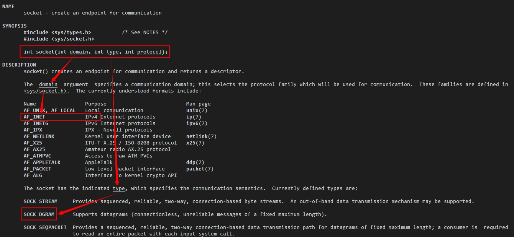
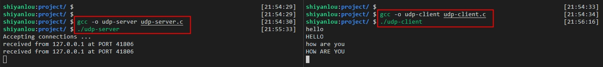
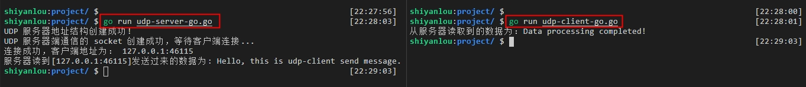
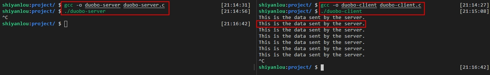
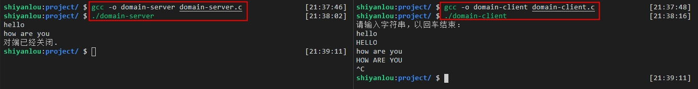

# UDP Socket 编程实现

## 实验介绍

本实验主要介绍什么是 UDP，以及 UDP Socket 编程的相关实现，主要有 UDP-C/S 模型、多播（组播）以及本地套接字的实现，同时会提供完整的示例代码给大家参考学习。

#### 知识点

- UDP 介绍
- UDP-C/S 模型实现
- 多播（组播）实现
- Socket IPC（本地套接字） 实现

## UDP 的介绍

#### 什么是 UDP

前面实验一网络编程基础已经介绍过什么是 UDP 了，如果不记得的同学可以回顾下，这里再对 UDP 进行简单的介绍：UDP 是一种面向无连接的传输层协议，它不保证数据传输的可靠性，每个 UDP 报文分为 UDP 报头和 UDP 数据两部分。

在 OSI 网络模型中，传输层主要应用的协议模型有两种，一种是 TCP 协议，另外一种则是 UDP 协议。TCP 协议在网络通信中占主导地位，网络中的绝大多数通信都是基于 TCP 协议进行数据传输的，同样 UDP 也是网络通信中不可或缺的一种重要通信协议。

#### UDP 与 TCP 的区别

相对于 TCP 来说，UDP 通信的方式更像是发短信，在数据传输之前不需要事先建立连接，数据传输后也不用维护连接，只需专心获取和传输数据就好，即在通信过程中无需建立三次握手的过程，通信速度和效率有较大的提升，但 UDP 通信的稳定性不可靠，正确率也不能很好的得到保证。所以，我们称 UDP 为面向无连接且不可靠的报文通信。

实验三我们已经讲到过 TCP 协议，TCP（Transmission Control Protocol，传输控制协议）是面向连接的一种传输层协议，也就是说在收发数据之前，必须和对端（客户端）建立可靠的连接，才能进行后续的通信，即必须要进行三次“握手”才能建立连接。在发送端，UDP 传输数据的速度是受限于应用程序生成数据的速度、 计算机的性能和传输带宽；在接收端，UDP 把每个消息报文段放在队列中，然后应用程序每次从队列中读取一个消息报文段。

UDP 主要有以下特点：

1. 由于在传输数据前无须建立连接，因此不存在维护连接状态一说，另外，一台服务端机子可以同时向多个客户端机子传输相同的消息；
2. UDP 程序结构较简单，数据信息包比较小，相对于 TCP 的来说对系统资源的额外开销小，数据传输速度快，多用于对实时性要求较高的通信场景；
3. 没有复杂的拥挤控制算法限制，但跟传输数据的生成速率、传输带宽还有主机的性能有关等。

UDP 也会有丢包的现象，UDP 也有可能出现缓冲区被填满后再接收数据时丢包的现象。由于它没有 TCP 滑动窗口的机制，通常采用如下两种方法解决：

1. 一般会在服务器应用层设计流量控制，主要是控制发送数据的速度。
2. 另一种方法则是使用 `setsockopt` 函数来改变接收缓冲区的大小。如下所示：

```c
#include <sys/socket.h>

int setsockopt(int sockfd, int level, int optname, const void *optval, socklen_t optlen);
int n = 4096
setsockopt(sockfd, SOL_SOCKET, SO_RCVBUF, &n, sizeof(n));
```

其中 SO_RCVBUF 表示接收缓冲区，n 表示缓冲区设置的大小。`setsockopt` 函数的参数说明在实验二端口复用的那一小节有讲到，这里就不再赘述了，忘记了的同学可以去看下。

## UDP-C/S 模型实现

#### 基于 C 语言实现

首先 UDP 相对 TCP 来说通信连接是少了三次握手，也就是说之前 TCP 在服务端的 listen() 和 accept() 函数可以不用了，在客户端的 connect() 函数也不用了，相关函数使用可以见上一实验说明。以下是基于 C 语言实现 UDP-C/S 模型通信。

- 服务端 server

```c
/*
    file: udp-server.c
*/

#include <string.h>
#include <stdio.h>
#include <unistd.h>
#include <arpa/inet.h>
#include <ctype.h>

#define SERV_PORT 8000  // 定义服务端的端口号为 8000

int main(void)
{
    struct sockaddr_in serv_addr, clie_addr;    // 创建服务端地址和客户端地址的结构体变量
    socklen_t clie_addr_len;
    int sockfd;
    char buf[BUFSIZ];           // buf 缓冲区，最大值为 BUFSIZ，系统默认设置 8192
    char str[INET_ADDRSTRLEN];  // IPV4 网络地址长度，INET_ADDRSTRLEN：16
    int i, n;

    // 创建套接字 socket，即文件描述符，AF_INET 参数表示IPV4，下面会解释说明
    // SOCK_STREAM 表示流式协议 TCP 用的，这里用 SOCK_DGRAM 表示报式协议 UDP 用
    sockfd = socket(AF_INET, SOCK_DGRAM, 0);

    // 清空地址结构、再进行地址相关赋值和转换，比如：地址族用 AF_INET 表示IPV4，htons 字节序转换，字节序相关可以参见前面的实验说明
    bzero(&serv_addr, sizeof(serv_addr));
    serv_addr.sin_family = AF_INET;
    serv_addr.sin_addr.s_addr = htonl(INADDR_ANY);
    serv_addr.sin_port = htons(SERV_PORT);

    // 绑定服务器地址
    bind(sockfd, (struct sockaddr *)&serv_addr, sizeof(serv_addr));

    printf("Accepting connections ...\n");
    while (1) {
        clie_addr_len = sizeof(clie_addr);
        // 在 TCP 是用 recv() 替换了原来使用的 read()，send()替换了write()，而在 UDP 是用 recvfrom() 和 sendto()
        // sockfd：套接字，buf：缓冲区地址，BUFSIZ：缓冲区大小，0：默认值，clie_addr：传出参数客户端（对端）地址结构，clie_addr_len：传出地址长度
        // 返回值：成功接收数据的字节数，失败：-1，0 的话表示对端关闭
        n = recvfrom(sockfd, buf, BUFSIZ, 0, (struct sockaddr *)&clie_addr, &clie_addr_len);
        if (n == -1)
            perror("recvfrom error");

        // 打印接收客户端的信息
        printf("received from %s at PORT %d\n", inet_ntop(AF_INET, &clie_addr.sin_addr, str, sizeof(str)), ntohs(clie_addr.sin_port));
        // 处理数据：小写转大写
        for (i = 0; i < n; i++)
            buf[i] = toupper(buf[i]);

        // 发送回给客户端
        // sockfd：套接字，buf：存储数据的缓冲区，n：数据长度，clie_addr：传入参数目标（对端）地址结构，sizeof(clie_addr)：地址结构长度
        // 返回值：成功写出的字节数，失败：-1
        n = sendto(sockfd, buf, n, 0, (struct sockaddr *)&clie_addr, sizeof(clie_addr));
        if (n == -1)
            perror("sendto error");
    }

    // 最后关闭文件描述符
    close(sockfd);

    return 0;
}
```

通过以上程序可以看到 UDP 服务端代码在实现上与上一实验 TCP 的代码实现有异曲同工之处，不同的地方前面也已经提到了，主要是 UDP 通信连接不需要进行三次握手了。  
以上 UDP 服务端代码相关说明已经写到了注释里，如果大家对函数的使用和参数说明还不是很清楚的，可以回顾前面实验所学的实现 TCP 通信的说明，或者可以通过以下的方式来查看函数说明。

`socket`函数里的参数可以通过命令`man socket`来查看，如下图所示：



可以看到里面的函数参数说明已经用箭头标出来了，大概意思看懂就行，当然也可以通过翻译工具去翻译查看。

同样 `recvfrom` 和 `sendto` 函数也可以通过命令 `man recvfrom` 或 `man sendto` 来查看参数说明，这里就不一一列举说明了。

- 客户端 client

```c
/*
    file: udp-client.c
*/

#include <stdio.h>
#include <string.h>
#include <unistd.h>
#include <arpa/inet.h>
#include <ctype.h>

#define SERV_PORT 8000

int main(int argc, char *argv[])
{
    // 定义相关结构和缓冲变量
    struct sockaddr_in servaddr;
    int sockfd, n;
    char buf[BUFSIZ];

    // 同样客户端也要创建套接字（文件描述符），参数说同服务器端
    sockfd = socket(AF_INET, SOCK_DGRAM, 0);

    // 清空地址结构，再对地址结构进行相关赋值
    bzero(&servaddr, sizeof(servaddr));
    servaddr.sin_family = AF_INET;
    inet_pton(AF_INET, "127.0.0.1", &servaddr.sin_addr);
    servaddr.sin_port = htons(SERV_PORT);

    // 绑定通信地址，客户端的 bind() 可有可无，因为下面 sendto() 函数的参数 &servaddr 已指定了服务器的地址结构了
    bind(sockfd, (struct sockaddr *)&servaddr, sizeof(servaddr));

    while (fgets(buf, BUFSIZ, stdin) != NULL) {
        // 发送数据给服务端
        n = sendto(sockfd, buf, strlen(buf), 0, (struct sockaddr *)&servaddr, sizeof(servaddr));
        if (n == -1)
            perror("sendto error");

        // 接收数据，参数NULL：表示不关心对端信息
        n = recvfrom(sockfd, buf, BUFSIZ, 0, NULL, 0);
        if (n == -1)
            perror("recvfrom error");

        write(STDOUT_FILENO, buf, n);
    }

    // 关闭文件描述符
    close(sockfd);

    return 0;
}
```

同样，UDP 的客户端相关函数使用跟服务端的大同小异，在服务端代码实现的注释里已经写得很详细了，客户端的代码解释可以参考服务端的，这里也不再一一说明了。

通过编译并执行以上的 UDP 服务端和客户端程序，编译服务端程序命令为 `gcc -o udp-server udp-server.c`，编译客户端命令为 `gcc -o udp-client udp-client.c`，编译后先运行服务端程序 `./udp-server`，再运行客户端程序 `./udp-client`，运行情况如下图所示：



以上 UDP 通信主要是实现：客户端终端输入字符串数据发送给服务端，服务端接收到数据后转换为大写，再发送回给客户端，客户端将接收到服务端处理后发回来的数据在终端打印出来。  
当然也可以开启多个客户端跟服务端进行通信，发送和接收数据。

接下来，我们再来看下用 Go 语言是如何实现 UDP-C/S 通信的。

#### 基于 Go 语言实现

- 服务端 server

```go
/*
    file: udp-server-go.go
*/
package main

import (
    "fmt"
    "net"
)

func main() {
    // 1、创建一个 *UDPAddr，即一个 udp 地址结构，传入 udp 协议并指定服务器的 IP 和 port，这里的端口为8000
    udpAddr, err := net.ResolveUDPAddr("udp", "127.0.0.1:8000")
    if err != nil {
        fmt.Printf("net.ResolveUDPAddr() 函数执行出错, 错误信息为: %v\n", err)
        return
    }
    fmt.Println("UDP 服务器地址结构创建成功!")

    // 2、创建服务端（用户通信）的 socket，将第一步创建的 *UDPAddr类型的参数传入
    udpSocket, err := net.ListenUDP("udp", udpAddr)
    if err != nil {
        fmt.Printf("net.ListenUDP()函数执行出错,错误为:%v\n", err)
        return
	}
	// 利用 defer 延迟关闭 udpSocket，即函数执行完后关闭
    defer udpSocket.Close()
    fmt.Println("UDP 服务器端通信的 socket 创建成功，等待客户端连接...")

    // 3、创建 buf 缓冲区存放读取客户端发送的数据
    buf := make([]byte, 4096)
    // ReadFromUDP()方法会返回三个值，分别是读取到的字节数、客户端的地址以及error；ReadFromUDP()方法会阻塞，直到客户端连接进来
	n, clientUDPAddr, err := udpSocket.ReadFromUDP(buf)
    if err != nil {
        fmt.Printf("ReadFromUDP()方法执行出错，错误信息为:%v\n", err)
        return
	}
	fmt.Println("连接成功，客户端地址为：", clientUDPAddr)

    // 4、模拟处理读取到客户端的数据
    fmt.Printf("服务器读到[%v]发送过来的数据为: %s", clientUDPAddr, buf[:n])

    // 5、处理完数据后，回写数据给客户端，这里随便写了一个字符串过去，使用 WriteToUDP() 方法
    _, err = udpSocket.WriteToUDP([]byte("Data processing completed!"), clientUDPAddr)
    if err != nil {
        fmt.Printf("WriteToUDP()方法执行出错，错误信息为:%v\n", err)
        return
    }
}
```

- 客户端 client

```go
/*
    file: udp-client-go.go
*/
package main

import (
    "fmt"
    "net"
)

func main() {
	// 1、创建客户端连接，返回创建的连接结构 conn，注意这里的端口要与服务端对应（8000）
    conn, err := net.Dial("udp", "127.0.0.1:8000")
    if err != nil {
        fmt.Printf("net.Dial()函数执行出错,错误信息为:%v\n", err)
        return
	}
	// 同样也是利用 defer 延迟关闭 udpSocket，即函数执行完后关闭
    defer conn.Close()

	// 2、客户端写数据到服务端
    conn.Write([]byte("Hello, this is udp-client send message."))

	// 3、发送完数据后创建一个缓冲区 buf 来存储从服务端读回来的数据
    buf := make([]byte, 4096)
    n, err := conn.Read(buf)
    if err != nil {
        fmt.Printf("Conn.Read()方法执行出错，错误信息为:%v\n", err)
        return
	}
	// 打印读取到的数据
    fmt.Printf("从服务器读取到的数据为：%s\n", buf[:n])
}
```

以上是用 Go 语言实现的 UDP 服务端和客户端程序，代码相关解释说明也已经写到注释里了，可以看到用 Go 语言实现相对用 C 语言实现 UDP-C/S 模型来说，会比较简洁，也比较容易理解。  
大家可以通过在终端执行命令 `go run udp-server-go.go` 和 `go run udp-client-go.go` 来运行以上程序，运行结果如下图所示：



服务器端和客户端地址大家可以根据实际情况做相应的修改，我这里用的是默认本地地址来举例。

## 多播（组播）的实现

在实现多播之前，我们先来了解下什么是多播以及多播存在的意义。

假设有这么一种情况，一台或多台主机可能需要同时向成千上万的用户端（客户端）传输相同的数据，如果我们还是用前面实验讲到的 TCP 通信传输方式来传输数据，这样每个用户端都需要传输一次，从传输机制和传输效率的角度来说是不合理的。因此，就引入了多播技术来解决这个问题，通过多播通信技术可以同时向大量用户端发送相同的数据。

多播技术的基本原理可以这么理解：有一个多播的组，在正常情况下，只要加入了这个组的所有客户端，都能收到服务端发送的数据，具体是怎么传输到多播组里的每个客户端是由路由完成的。

而单播主要是用于两台主机之间的点对点通信，广播是用于一台主机对整个局域网上的所有主机上的数据通信，可以理解为单播和广播是两个比较极端的通信应用，一个是对一台主机进行通信，一个则是对整个局域网上的主机进行通信。而实际情况下，经常需要对一组特定的主机进行通信，而不是对整个局域网上的所有主机，所以这就有了多播（组播）。

多播地址在 IPV4 中是一个 D 类的 IP 地址，其范围从 224.0.0.0 到 239.255.255.255，并被划分为局部链接多播地址、预留多播地址和管理权限多播地址三类：

1. 局部链接多播地址范围在 224.0.0.0 ~ 224.0.0.255，这是为路由协议和其它的用途保留的地址；
2. 预留多播地址范围在 224.0.1.0 ~ 238.255.255.255，可用于 Internet 或网络协议等；
3. 管理权限多播地址范围在 239.0.0.0 ~ 239.255.255.255，可供组织内部使用，可以看做为私有 IP 地址，不能用于 Internet，可限制多播范围。

接下来我们基于 C 语言来实现多播通信。实现方法有多种，这里只是列举其中一种。

#### 基于 C 语言实现

- 服务端 server

```C
/*
    file: duobo-server.c
*/

#include <stdio.h>
#include <stdlib.h>
#include <sys/types.h>
#include <sys/socket.h>
#include <string.h>
#include <unistd.h>
#include <arpa/inet.h>
#include <net/if.h>

#define SERVER_PORT 8888
#define CLIENT_PORT 9999
#define MAXLINE 4096        // 缓冲区 buf 大小
#define GROUP "239.0.0.6"   // 多播组IP地址 224.0.0.0 到 239.255.255.255

int main(void)
{
    // 定义相关变量
	int sockfd, i ;
	struct sockaddr_in serveraddr, clientaddr;
	char buf[MAXLINE] = "This is the data sent by the server.\n";
	char ipstr[INET_ADDRSTRLEN];
	socklen_t clientlen;
	ssize_t len;
	struct ip_mreqn group;

	// 创建用于 UDP 通信的套接字
	sockfd = socket(AF_INET, SOCK_DGRAM, 0);

    // 清空服务端地址结构、再进行地址相关赋值和转换，即初始化服务端地址
	bzero(&serveraddr, sizeof(serveraddr));
	serveraddr.sin_family = AF_INET;                // 表示 IPv4
	serveraddr.sin_addr.s_addr = htonl(INADDR_ANY); // 表示本地任意IP INADDR_ANY = 0
	serveraddr.sin_port = htons(SERVER_PORT);

	// 构造客户端 client 地址结构 IP+端口
	bzero(&clientaddr, sizeof(clientaddr));
	clientaddr.sin_family = AF_INET;        // 表示 IPv4
	inet_pton(AF_INET, GROUP, &clientaddr.sin_addr.s_addr);
	clientaddr.sin_port = htons(CLIENT_PORT);

	while (1) {
		// 每隔一秒，发送 buf 的数据出去
		sendto(sockfd, buf, strlen(buf), 0, (struct sockaddr *)&clientaddr, sizeof(clientaddr));
		sleep(1);
	}
    // 关闭 socket
	close(sockfd);
	return 0;
}
```

- 客户端 client

```c
/*
    file: duobo-client.c
*/

#include <netinet/in.h>
#include <stdio.h>
#include <sys/types.h>
#include <sys/socket.h>
#include <arpa/inet.h>
#include <string.h>
#include <stdlib.h>
#include <sys/stat.h>
#include <unistd.h>
#include <fcntl.h>
#include <net/if.h>

#define SERVER_PORT 8888
#define CLIENT_PORT 9999
#define MAXLINE 4096        // 缓冲区 buf 大小
#define GROUP "239.0.0.6"   // 这里 GROUP 要与服务端的 GROUP 要对应

// 主函数
int main(int argc, char *argv[])
{
    // 声明相关变量
	struct sockaddr_in serveraddr, localaddr;
	int confd;
	ssize_t len;
	char buf[MAXLINE];

	// 定义组播结构体 创建套接字
	struct ip_mreqn group;
	confd = socket(AF_INET, SOCK_DGRAM, 0);

	// 初始化本地端地址
	bzero(&localaddr, sizeof(localaddr));
	localaddr.sin_family = AF_INET;
	inet_pton(AF_INET, "0.0.0.0" , &localaddr.sin_addr.s_addr);
	localaddr.sin_port = htons(CLIENT_PORT);

    // 绑定套接字
	bind(confd, (struct sockaddr *)&localaddr, sizeof(localaddr));

	// 设置组地址
	inet_pton(AF_INET, GROUP, &group.imr_multiaddr);
	// 本地任意IP
	inet_pton(AF_INET, "0.0.0.0", &group.imr_address);
	// 设置 client 加入多播组
	setsockopt(confd, IPPROTO_IP, IP_ADD_MEMBERSHIP, &group, sizeof(group));

	while (1) {
        // 接收数据写到 buf, 在终端打印 buf 接收到的数据
		len = recvfrom(confd, buf, sizeof(buf), 0, NULL, 0);
		write(STDOUT_FILENO, buf, len);
	}
    // 关闭套接字
	close(confd);
	return 0;
}
```

以上多播通信的程序相对比较简单，相关代码说明也已经写到注释里了。  
通过编译以上服务端和客户端程序并运行编译后的文件（编译和执行命令可参考前面说明），得到结果如下图所示：



该多播通信主要实现服务端每隔一秒钟向加入多播组的客户端发送数据，这里发送的数据只写了一个固定字符串 `This is the data sent by the server.`，大家可自行修改需要发送的数据，而客户端循环接收服务端发出的数据并打印输出到终端。

## 本地套接字 domain（socket IPC）实现

本地套接字通信可以理解为本地同一台机器的内部通信，是通过 server 端设置的 socket 名来找到服务器的，从而建立本地连接。

socket API 原先的用意是为网络通讯设计的，但由于网络发展需要，后来在 socket 的设计上衍生出了一种 IPC 机制，即 UNIX Domain Socket，也就是本地套接字。虽然网络 socket 也可用于同一台主机的进程间通讯（通过地址 127.0.0.1），但是本地套接字通信更有效率，主要体现在：不需要经过网络协议栈，不需要打包和拆包，也无需维护序号和应答等，只是将应用层数据从一个进程拷贝到另一个进程即可。这是因为本地套接字通信本质上是可靠的通信，而网络协议是为不可靠的通信设计的。

UNIX Domain Socket 也提供面向流和面向数据包的两种 API 接口，类似于 TCP 和 UDP，但是面向消息的 UNIX Domain Socket 也是可靠的，消息既不会丢失也不会顺序错乱。另外 UNIX Domain Socket 是全双工的，相较与其它 IPC 机制来说有明显的优势，目前已成为使用最广泛的 IPC 机制。

使用 UNIX Domain Socket 的过程和网络与平时使用的 socket 十分相似，也要先调用 socket()创建一个 socket 文件描述符，address family 指定为 AF_UNIX，type 可以选择 SOCK_DGRAM 或 SOCK_STREAM，protocol 参数仍然指定为 0 即可。与网络 socket 编程最明显的不同在于地址格式不同，UNIX Domain Socket 是用结构体 sockaddr_un 来表示的，网络编程的 socket 地址是 IP 地址加端口号，而 UNIX Domain Socket 的地址是一个 socket 类型的文件在文件系统中的路径，这个 socket 文件由 bind()调用创建，如果调用 bind()时该文件已存在，则 bind()会返回错误，使用 bind()创建 socket 时要记得加创建成功与否的判断逻辑，从而决定是否继续往下走。

对比网络套接字地址结构和本地套接字地址结构，如下所示：

```c
// 网络套接字地址结构
struct sockaddr_in {
    __kernel_sa_family_t sin_family; 		/* Address family */  	地址结构类型
    __be16 sin_port;					 	/* Port number */		端口号
    struct in_addr sin_addr;				/* Internet address */	IP地址
};

// 本地套接字地址结构
struct sockaddr_un {
    __kernel_sa_family_t sun_family; 		/* AF_UNIX */			地址结构类型
    char sun_path[UNIX_PATH_MAX]; 		    /* pathname */		    socket文件名(含路径)
};
```

#### 基于 C 语言实现

- 服务端 server

```c
/*
    file: domain-server.c
*/

#include <stdlib.h>
#include <stdio.h>
#include <stddef.h>
#include <sys/socket.h>
#include <sys/un.h>
#include <sys/types.h>
#include <sys/stat.h>
#include <unistd.h>
#include <errno.h>
#include <ctype.h>

#define QLEN 10
/*
* 创建服务端套接字
* 创建成功则返回文件描述符，否则返回小于0的数
*/
int serv_listen(const char *name)
{
	int fd, len, err, rval;
	struct sockaddr_un un;

	/* 创建本地套接字流 */
	if ((fd = socket(AF_UNIX, SOCK_STREAM, 0)) < 0)
		return(-1);
	/* 已存在时释放 */
	unlink(name);

	/* 赋值地址结构 */
	memset(&un, 0, sizeof(un));
	un.sun_family = AF_UNIX;
	strcpy(un.sun_path, name);
	len = offsetof(struct sockaddr_un, sun_path) + strlen(name);

	/* 绑定文件描述符 */
	if (bind(fd, (struct sockaddr *)&un, len) < 0) {
		rval = -2;
		goto errout;
	}
    /* 监听文件描述符 */
	if (listen(fd, QLEN) < 0) {
		rval = -3;
		goto errout;
	}
    /* 返回文件描述符 */
	return(fd);

    errout:
        err = errno;
        close(fd);
        errno = err;
        return(rval);
}

// 服务端接收连接的建立
int serv_accept(int listenfd, uid_t *uidptr)
{
	int clifd, len, err, rval;
	time_t staletime;
	struct sockaddr_un un;
	struct stat statbuf;

	len = sizeof(un);
    // 接收连接
	if ((clifd = accept(listenfd, (struct sockaddr *)&un, &len)) < 0)
		return(-1);

	/* 从客户端的调用地址获取客户端的 uid */
	len -= offsetof(struct sockaddr_un, sun_path);
	un.sun_path[len] = 0;

    // 判断 socket 状态
	if (stat(un.sun_path, &statbuf) < 0) {
		rval = -2;
		goto errout;
	}
	if (S_ISSOCK(statbuf.st_mode) == 0) {
		rval = -3;
		goto errout;
	}
	if (uidptr != NULL)
		*uidptr = statbuf.st_uid;
	unlink(un.sun_path);
    // 返回接收到的客户端文件描述符
	return(clifd);

    // 报错输出错误码并关闭文件描述符
    errout:
        err = errno;
        close(clifd);
        errno = err;
        return(rval);
}

// 主函数
int main(void)
{
    // 初始化需要使用到的变量
	int lfd, cfd, n, i;
	uid_t cuid;
	char buf[1024];
    // 通过文件名 mylocal.socket 创建服务
	lfd = serv_listen("mylocal.socket");

    // 文件描述符 fd 小于0 返回相应报错信息
	if (lfd < 0) {
		switch (lfd) {
			case -3:perror("listen"); break;
			case -2:perror("bind"); break;
			case -1:perror("socket"); break;
		}
		exit(-1);
	}
    // 接收到了连接
	cfd = serv_accept(lfd, &cuid);
    // 如果 cfd 小于 0，输出相应的报错信息
	if (cfd < 0) {
		switch (cfd) {
			case -3:perror("非本地套接字"); break;
			case -2:perror("文件名有误"); break;
			case -1:perror("连接失败"); break;
		}
        // 退出
		exit(-1);
	}
    // 循环读取数据，并转大写（如果输入的是中文，返回的还是原句），再回写给客户端
	while (1) {
        r_again:
            // 读取客户端发送过来的数据并写到 buf
            n = read(cfd, buf, 1024);
            if (n == -1) {
                if (errno == EINTR)
                goto r_again;
            }
            else if (n == 0) {
                printf("对端已经关闭.\n");
                break;
            }
            // 在终端输出本地客户端发送过来的数据
            write(STDOUT_FILENO, buf, n);
            // 字符串转大写
            for (i = 0; i < n; i++)
            {
                buf[i] = toupper(buf[i]);
            }
            // 回写给客户端
            write(cfd, buf, n);
	}
    // 结束后，关闭客户端和服务端的文件描述符
	close(cfd);
	close(lfd);
	return 0;
}
```

- 客户端 client

```c
/*
    file: domain-client.c
*/

#include <stdio.h>
#include <stdlib.h>
#include <stddef.h>
#include <sys/stat.h>
#include <fcntl.h>
#include <unistd.h>
#include <sys/socket.h>
#include <sys/un.h>
#include <errno.h>

#define CLI_PATH "/var/tmp/"    /* 创建 socket 时的 PID 路径 */
/*
* 创建客户端套接字并连接到服务器
* 创建成功则返回文件描述符，否则返回小于0的数
*/
int cli_conn(const char *name)
{
	int fd, len, err, rval;
	struct sockaddr_un un;

	/* 创建本地套接字 */
	if ((fd = socket(AF_UNIX, SOCK_STREAM, 0)) < 0)
		return(-1);

	/* 用设置好的地址赋值套接字地址结构 */
	memset(&un, 0, sizeof(un));
	un.sun_family = AF_UNIX;
	sprintf(un.sun_path, "%s%05d", CLI_PATH, getpid());
	len = offsetof(struct sockaddr_un, sun_path) + strlen(un.sun_path);

	/* 地址已经绑定，则返回报错信息 */
	unlink(un.sun_path);
	if (bind(fd, (struct sockaddr *)&un, len) < 0) {
		rval = -2;
		goto errout;
	}

	/* 以服务器地址（文件名）创建连接 */
	memset(&un, 0, sizeof(un));
	un.sun_family = AF_UNIX;
	strcpy(un.sun_path, name);
	len = offsetof(struct sockaddr_un, sun_path) + strlen(name);
	if (connect(fd, (struct sockaddr *)&un, len) < 0) {
		rval = -4;
		goto errout;
	}
    return(fd);

    /* 报错输出，并关闭文件描述符 */
    errout:
        err = errno;
        close(fd);
        errno = err;
        return(rval);
}

// 主函数
int main(void)
{
	int fd, n;
	char buf[1024];

    // mylocal.socket：本地通信连接的名字
	fd = cli_conn("mylocal.socket");
    // fd 小于0 表示报错
	if (fd < 0) {
		switch (fd) {
			case -4:perror("connect"); break;
			case -3:perror("listen"); break;
			case -2:perror("bind"); break;
			case -1:perror("socket"); break;
		}
        // 退出
		exit(-1);
	}
    printf("请输入字符串，以回车结束：\n");
	while (fgets(buf, sizeof(buf), stdin) != NULL) {
		write(fd, buf, strlen(buf));
		n = read(fd, buf, sizeof(buf));
		write(STDOUT_FILENO, buf, n);
	}
    // 关闭文件描述符
	close(fd);
	return 0;
}
```

以上本地套接字服务端和客户端实现程序同样也是以前面讲到的字符串转大写为例，通过编译并运行编译后的文件，得到如下图所示的结果：



可以看到客户端输入字符串后，服务端在终端打印输出接收到的字符串，然后服务端转大写后发回给客户端，接着客户端将接收到已经转大写的字符串打印输出到终端。

## 实验总结

以上是 UDP Socket 编程的相关实现说明，通过学习完本实验，大家可以发现，大部分的代码实现是上一个实验有讲到过的，只有少部分的实现方式和用法有点不一样，注释里也有说明，换汤不换药，说明前面的实验学习对后面的实战实验有一定帮助的。本实验也通过几个不同的案例实现，来讲解 UDP 的实现原理和具体使用方法，在网络编程中跟 TCP 同样重要，所以也希望同学们可以跟着实验一步一步地在电脑上敲一遍案例代码，并修改相应的变量或参数来达到运行的效果，进一步的巩固。
