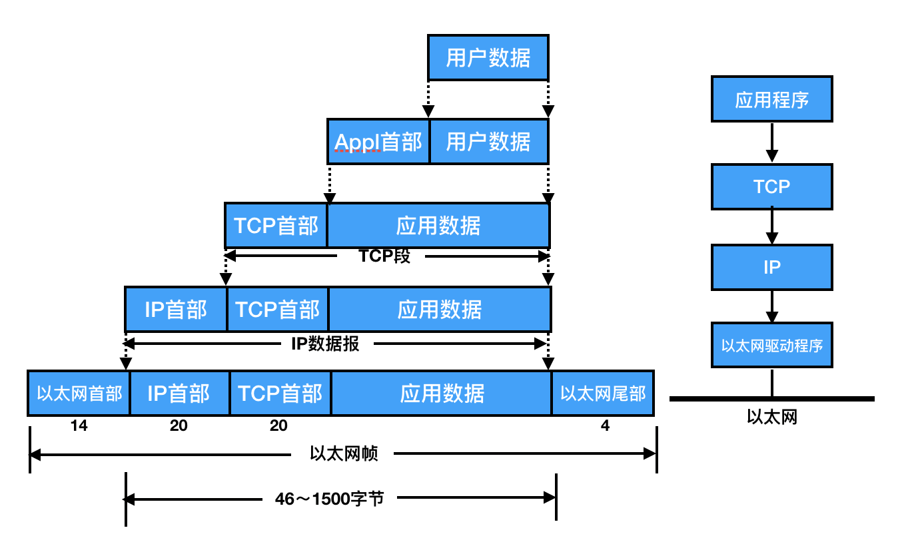
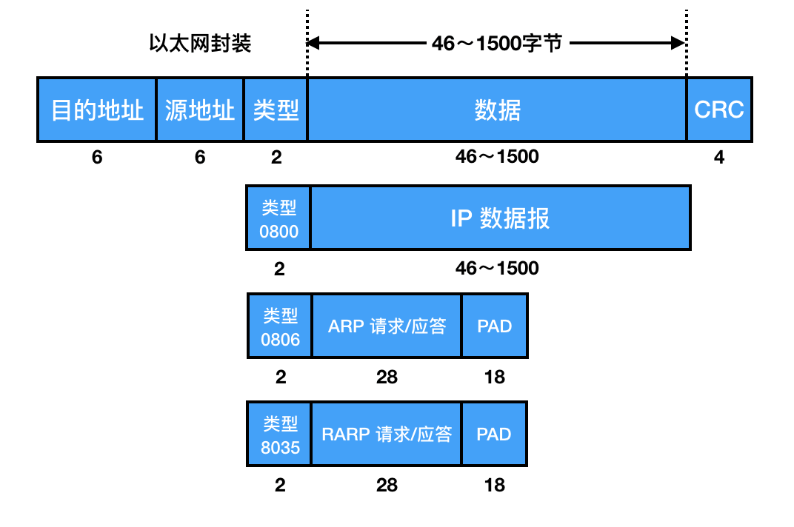
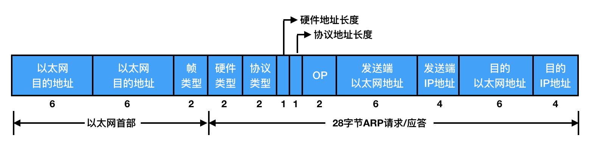
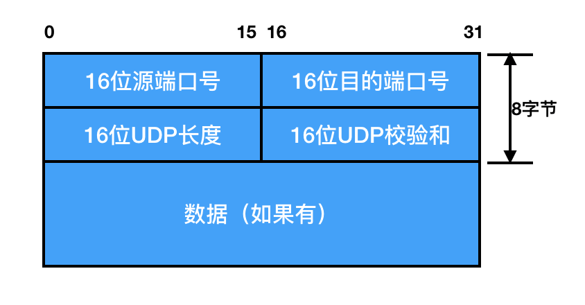
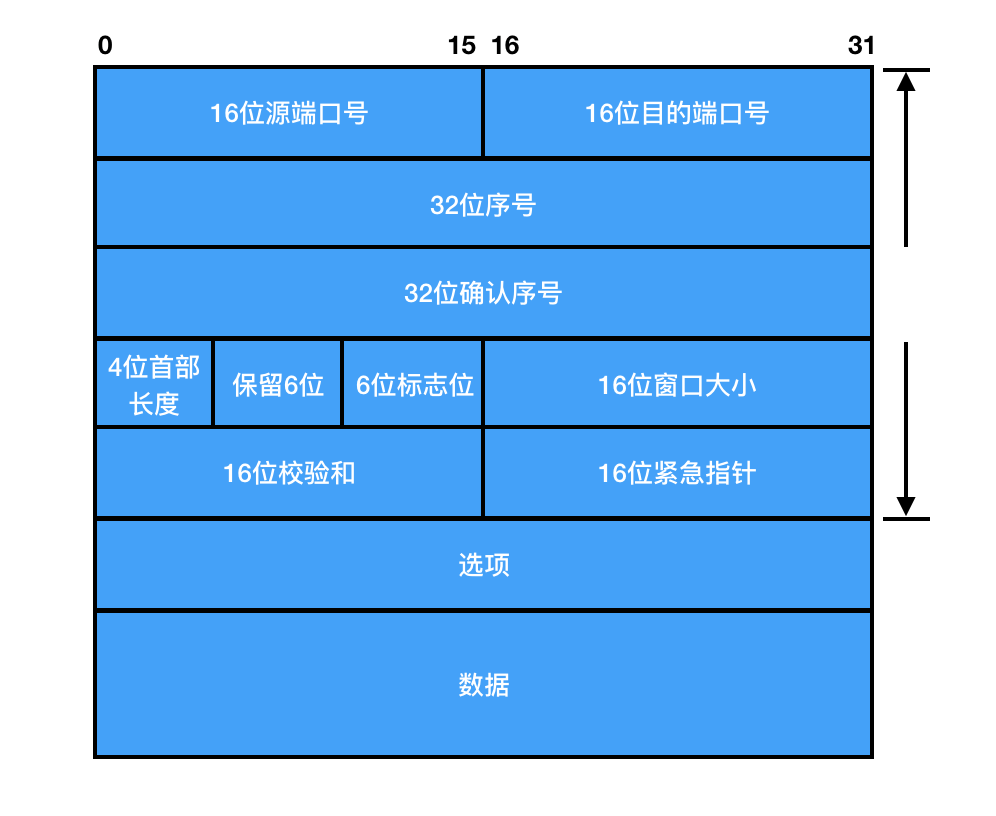
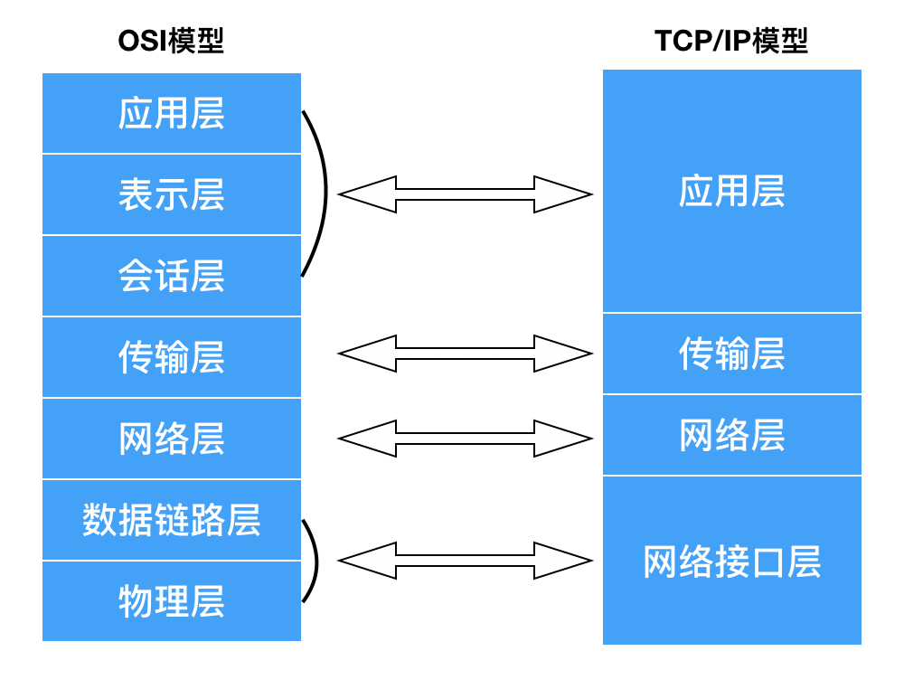
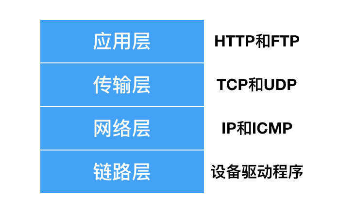
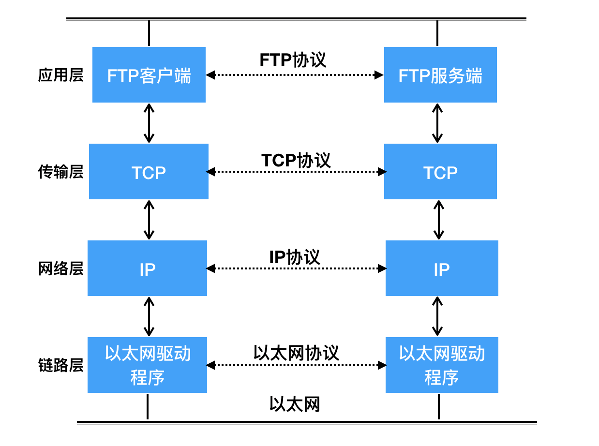
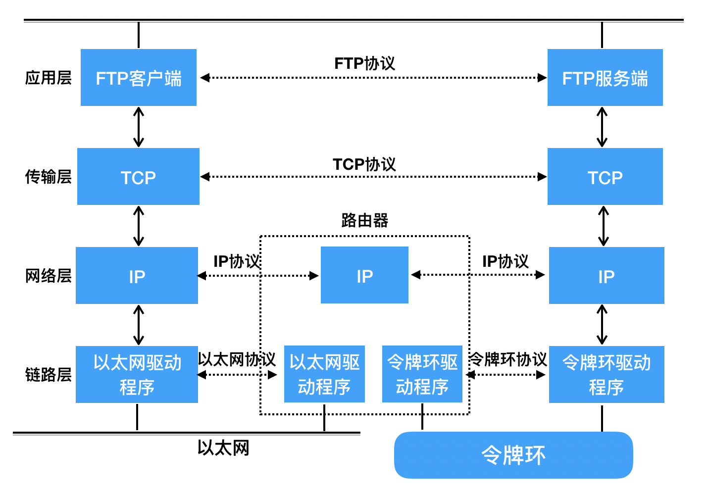

# 网络编程基本介绍

## 实验介绍

关于网络编程其实在互联网中应用是非常广泛的，本实验将从网络编程的基础知识入手，主要介绍网络中的典型协议、端口、网络分层模型以及通信过程，为后续的实验打下基础。

#### 知识点

- 了解协议和端口
- 网络应用程序设计模式
- 网络分层模型
- 网络通信过程

## 协议和端口介绍

#### 协议的介绍

- 什么是协议

从生活中的角度来解释，协议可理解为一种“契约”，是相互遵循的一种标准；同样，从网络应用的角度来看，协议可理解为数据传输和数据解释的一种规则。

举个例子，假设张三（发送方）想要传输文件给李四（接收方），需要遵循以下过程来进行：

1. 首先，发送方传输文件名过去，接收方收到文件名后，响应 OK 给发送方；
2. 然后，发送方发送文件的大小过去，接收方收到文件大小的数据后，再响应一个 OK 给发送方；
3. 最后，发送方发送文件的内容，同样，接收方接收完文件内容的数据后，响应最后的 OK 给发送方，表示文件已经接收成功。

由以上张三发送文件给李四的过程可知：当双方要发送文件时，需要遵循以上三个步骤来发送，即需要通过三次数据传输来完成，这样双方就形成了一个最简单的文件（数据）传输规则。双方都按此规则发送、接收数据，达成的这个相互遵守的规则即为协议。

上面的传输文件例子只是简单的解释什么是协议，主要是为了方便同学们好理解，有个初步的印象，而实际上我们在网络应用中的协议比这个要复杂的多，而且是标准化的。标准协议往往是被更多的人使用，在使用的过程中又会不断的优化和完善，最终形成一个稳定的、完整的数据传输协议。

- 典型协议

按网络分层协议分类，常见的典型协议有以下几种：

1. 我们常见的传输层协议一般有 TCP/UDP 协议。
2. 常见的应用层协议一般有 HTTP、FTP 协议。
3. 常见的网络层协议一般有 IP 和 ICMP 协议。
4. 常见的链路层协议一般有 ARP 协议、RARP 协议。

典型协议解释：

1. TCP 传输控制协议是一种面向连接的、基于字节流的传输层通信协议，其特点是可靠、有丢包重传机制。
2. UDP 是无连接的、面向报文但不保证可靠的传输层协议。
3. HTTP 是应用层的超文本传输协议，也是互联网中应用最为广泛的一种网络协议。
4. FTP 是网络应用层中的一种文件传输协议，主要用于网络上客户端和服务端之间进行文件传输。
5. ICMP 是控制消息报文协议，它是互联网协议族的核心协议之一，用于提供在通信环境中各种消息传递的控制和反馈。
6. ARP 是通过正向解析网络层的 IP，来寻找数据链路层地址的网络传输协议，即通过 IP 地址来解析寻找 MAC 地址。
7. RARP 是通过反向解析数据链路层中的 MAC 地址来确定 IP 地址的转换协议，即通过 MAC 地址来反向解析寻找 IP 地址。

- 协议格式

数据包封装：数据包在网络传输过程中，主要通过用户在应用层来控制进程，对通信数据包进行封装和数据解释，而在传输层及其以下的机制主要由内核来提供控制，传输层及其以下处理通信的过程其实是将数据从一台计算机通过一定的路径发送到另一台计算机。应用层数据通过协议栈发到网络上时，每层协议都要加上一个数据首部（header），称为封装，如下图所示：

不同的协议层对数据包有不同的称谓，在传输层叫做段（segment），在网络层叫做数据报（datagram），在链路层叫做帧（frame）。数据封装成帧后发到传输介质上，到达目的主机后每层协议再拆掉相应的首部，最后将应用层数据交给应用程序处理。

以太帧格式：以太网的帧格式如下图所示：

以太网帧中主要包括源地址和目的地址，其中的源地址和目的地址分别是指网卡的硬件地址（也叫 MAC 地址），长度是 48 位，通常是在网卡出厂的时候就已经固定的，当然是根据国际化标准来进行设置的。可以在 shell 中使用 ifconfig 命令来查看 MAC 地址，如下图所示：

其中圈起来的部分 `02:42:c0:a8:2a:04` 就是所谓的硬件地址（MAC 地址）。协议字段有三种值，分别对应 IP、ARP、RARP，也就是对应网络层和数据链路层的一些协议，相关协议介绍也在前面已经提到过，而帧尾的 CRC 校验序列字段顾名思义就是用于校验传输过程中帧的完整性。

通常以太网帧中的数据长度有一定的规范限制，根据网络数据包传输要求规定最小为 46 字节，最大为 1500 字节，如果 ARP 和 RARP 协议包的数据长度不够 46 字节的话，需要在其后面填充补位。其中以太网帧的数据长度最大值 1500 称为以太网中的最大传输单元（MTU），不同的网络类型有不同的 MTU。当一个数据包是从以太网路由到拨号链路上时，如果数据包的长度大于拨号链路的最大传输单元，则需要对数据包进行分片来进行传输。上面执行的 ifconfig 命令的输出结果中也有提到最大传输单元 `MTU:1500` 的字样。

ARP 数据报格式：前面介绍协议时说到，ARP 协议是通过正向解析网络层的 IP，来寻找数据链路层地址的网络传输协议，即通过 IP 地址来解析寻找 MAC 地址。在网络通信的过程中，数据包首先是从网卡接收，然后再往上层传输，遵循协议的定义，在期间进行相应的数据封装和处理，如果接收到的数据包的硬件地址与本机不符，则会被丢弃掉，因此在通信前必须先要获得传输时的目的主机的硬件地址，而 ARP 协议正是做这种工作的，但是 ARP 报文不是直接在网络层上发送的，它还是需要向下传输到数据链路层，所以当 ARP 报文传输到数据链路层之后，需要再次进行封装。ARP 数据报的格式如下所示：

源 MAC 地址、目的 MAC 地址在以太网首部和 ARP 请求中各出现一次，对于链路层为以太网的情况是多余的，但如果链路层是其它类型的网络则有可能是必要的。硬件类型指链路层网络类型，1 为以太网，协议类型指要转换的地址类型，0x0800 为 IP 地址，后面两个地址长度对于以太网地址和 IP 地址分别为 6 和 4 字节，op 字段为 1 表示 ARP 请求，op 字段为 2 表示 ARP 应答。

UDP 数据报格式：同样，前面介绍过 UDP 协议是无连接、也不保证传输的可靠性的，每个 UDP 报文分为 UDP 报头和 UDP 数据区两部分，客户端与服务器建立连接的其中一种通信方式就是基于 UDP 协议的，其数据报的格式如下图所示：

上图中的源端口号表示的是客户端的端口号，其占用 UDP 报文头的前 16 位，目的端口号是 TFTP 服务的知名端口号。UDP 报长度为 63 字节，包括 UDP 首部和 UDP 层的长度，其报文长度的校验和也是 16 位。

TCP 数据报格式：TCP 的数据报格式如下图所示：

与 UDP 协议一样也有源端口号和目的端口号，通信的双方由 IP 地址和端口号标识。TCP 有 32 位序号、32 位确认序号，4 位首部长度和 IP 协议头类似，表示 TCP 协议头的长度，以 4 字节为单位，因此 TCP 协议头最长可以是 4x15=60 字节，如果没有选项字段，TCP 协议头最短 20 字节，中间的 6 位标志位分别为 URG、ACK、PSH、RST、SYN、FIN，后续的实验将会解释 SYN、ACK、FIN、RST 四个位。

#### 端口的介绍

逻辑意义上的端口，一般是指 TCP/IP 协议中的端口，端口号的范围从 0 到 65535，比如用于浏览网页服务的 80 端口，用于 FTP 服务的 21 端口等。
端口号小于 256 的定义为常用端口，服务器一般都是通过端口号来识别后台进程的。
客户端只需保证该端口号在本机上是唯一的就可以了，客户端口号因存在时间很短暂又称临时端口号。
大多数 TCP/IP 实现给临时端口号分配 1024—5000 之间的端口号，大于 5000 的端口号是为其它服务器预留的。
我们应该在自定义使用端口时，尽量避免使用到知名的端口，比如：80、21、22 等。

## 网络应用程序设计模式

#### C/S 模式和 B/S 模式

C/S 模式：客户端/服务端模式。  
B/S 模式：浏览器/服务器模式。

平时所说的网络应用设计模式其实是指传统的网络应用程序设计模式：客户端/服务端模式，一种两层结构的系统，第一层在客户机上安装了客户机应用程序，第二层则在服务器上安装服务器管理程序，这种模式需要在通信双方各自的环境部署一套客户机和服务器来完成数据通信。

而浏览器/服务器的模式中则不一样，只需要在一方部署服务器，另外一方使用电脑都会配置有的浏览器即可完成数据的传输，是一种从传统的两层 C/S 模式发展起来的新的网络结构模式，其本质是三层结构的 C/S 模式。两种模式的优缺点及其如何选择下面会继续讲到。

#### 两种模式的优缺点

对于 C/S 模式来说，其优点明显：

1. 通常是将应用与服务分离，较具有灵活性和稳定性。
2. 性能方面，客户端位于目标主机上在一定程度上可以保证性能，将数据缓存至客户端本地，从而提高数据传输效率。
3. 一般来说客户端和服务器程序由一个开发团队开发，所以他们之间所采用的协议相对灵活，可以在标准协议的基础上根据需求进行增加扩展功能，因此，传统的网络应用程序及较大型的网络应用程序都首选 C/S 模式进行开发。
4. 另外，当网络通信的数据量比较大时，使用 C/S 模式可以提前在本地进行大量数据的缓存处理，从而提高渲染速度，对于游戏应用来说，会给用户带来比较好的即时观感体验。

同样，C/S 模式的缺点也较突出：

1. 由于客户端和服务器都需要有一个开发团队来完成开发，工作量将成倍提升，开发周期较长。
2. 另外，从安全性的角度出发，需要将客户端安插至用户主机上，对用户主机的安全性构成威胁，这也是很多用户不愿使用 C/S 模式应用程序的重要原因。

B/S 模式相比 C/S 模式而言，其优点有如下几点：

1. 每当服务器应用程序升级时，只要在服务器上升级服务应用程序即可，用户计算机上的浏览器软件不需要修改，所以在系统开发、维护、升级方面，就显得非常方便。
2. 由于它没有独立的客户端，使用标准浏览器作为客户端，其工作开发量较小，只需开发服务器端即可。
3. 另外，用户通过通用的浏览器进行访问，系统开放性好，而且由于其采用浏览器显示数据，移植性非常好，不受平台限制。

B/S 模式的缺点也较明显：

1. 由于使用第三方浏览器，因此网络应用支持有些会受限。
2. 其次，没有客户端放到对方主机上，缓存数据不尽如人意，从而传输数据量受到网络 I/O 限制，应用的即时体验大打折扣。
3. 另外，服务端必须与浏览器一样，采用标准 http 协议进行通信，协议选择没那么灵活。

因此在开发过程中，模式的选择由上述各自的特点决定，根据实际需求选择相应的应用程序设计模式。

## 分层模型

#### OSI 七层模型

互联网的逻辑实现被分为好几层，每一层都有自己的功能，就像建筑物一样，每一层都靠下一层支持。用户接触到的只是最上面的那一层，根本不会感觉到下面的几层，要理解互联网就需要自下而上理解每一层实现的功能。OSI 七层模型如下所示：

接下来我们一层一层的自底向上介绍每一层都是干什么的。

- 物理层

所谓物理层其实是用双绞线、光纤、无线电波等方式把电脑与网络连接起来的物理手段。可以把它理解为定义的物理设备标准。它的主要作用是传输比特流，用比较专业化的术语来说就是由 1、0 转化为电流强弱来进行传输，到达目的地后再转化为 1、0，也就是我们常说的数模转换与模数转换。

- 数据链路层

上面讲到的 0 和 1 比特流，如果单纯的说数字其实没有任何意义，我们使用者需要为其赋予一些特定的含义，比如定义了如何让格式化数据以帧为单位进行传输，以及如何让控制对物理介质的访问，也就是规定解读电信号的方式，这就是数据链路层。这一层通常还提供错误检测和纠正，以确保数据的可靠传输。

- 网络层

我们可以遵循以太网协议的规则，然后通过依靠 MAC 地址来向外发送数据，从理论上来说，依靠 MAC 地址的话，你电脑的网卡就可以找到另一个角落的一台电脑的网卡，但是这种做法有一个缺陷就是以太网采用广播的方式发送数据包，这种方式不仅效率低，而且发送的数据只能局限于发送方所在的子网络中，而网络层正式用于解决以上问题的，在位于不同地理位置的网络中的两台电脑系统之间提供连接和路径选择。互联网的发展使得从世界各站点访问信息的用户数大大增加，而网络层也正是用于管理这种连接的层。

- 传输层

传输层就是定义了一些传输数据的协议和端口号来标识网络数据包是属于哪个程序（进程）使用的。主要协议是 TCP 和 UDP 协议，TCP 传输控制协议，传输效率低，可靠性强，用于传输可靠性要求高，数据量大的数据，而 UDP 用户数据报协议与 TCP 特性恰恰相反，用于传输可靠性要求不高，数据量小的数据。 主要是将从下层接收的数据进行分段和传输，到达目的地址后再进行重组。

- 会话层

会话层在通过传输层建立数据传输的通路后，会借助系统之间的联系（协议）来发起会话或者接受会话的请求，从而向上层进行数据处理和传输。

- 表示层

表示层主要是作为应用层之间的一种介质，确保一个系统的应用层所发送的信息可以被另一个系统的应用层读取到。比如，两台计算机通信时进行数据传输的编码不一样，则表示层会通过使用一种通用格式来实现多种数据格式之间的转换来实现数据传输。

- 应用层

应用程序收到传输层的数据后，首先会对收到的数据进行解包，但是由于网络中的通信方式有很多，而且数据来源五花八门，所以需要事先规定好通信的数据格式，否则接收方根本无法获得真正发送的数据内容，而应用层的作用就是规定应用程序使用的数据格式，例如基于 TCP 协议之上常见的 Email、HTTP、FTP 等协议，这些协议就组成了互联网协议的应用层。

#### TCP/IP 四层模型

TCP/IP 网络协议栈分为应用层、传输层、网络层和链路层四层，一般在应用开发过程中，讨论最多的是 TCP/IP 模型。四层模型如下图所示：

## 通信过程

在网络中，通信的方式有很多种，其中通过 TCP/IP 传输协议通信的过程如下图所示：

上图的通信过程表示的是两台计算机在同一网段中的情况，但是在我们平时的网络通信中，往往不只是两台计算机之间的通信，通常会有比较负责的多台机子或服务器进行通信。

如果计算机在不同的网段中，那么数据需要从一台计算机到另一台计算机的传输过程中就要经过一个或多个路由器了，如下图所示：

一般链路层会有以太网、令牌环网等标准，它们主要负责网卡设备的驱动程序、帧同步、数据差错校验等工作。另外，交换机是工作在链路层的网络设备，可以在不同的链路层网络之间通过路由来转发数据帧，但是由于不同链路层的帧格式往往会有所不同，所以交换机需要先将传过来的数据包进行拆解，即拆包的过程，到了链路层之后，链路层的首部会重新封装后再进行转发。

而网络层的 IP 协议是构成整个互联网数据路由的基础。网络传输中的主机通常是通过 IP 地址来标识，网络传输中也会有大量路由器负责根据 IP 地址选择合适的路径转发数据包，而数据包从 Internet 上的源主机到目的主机往往要经过多个路由器，在路由器的路由转发下，可以在不同的链路层接口之间转发数据包，因此路由器需要将传输进来的数据包先进行拆包，经过网络层和链路层两层首部后，再进行重新封装。在网络层中的 IP 协议，它不保证传输的可靠性，数据包在传输过程中可能丢失，但可靠性可以在上层协议或应用程序中提供支持。

网络层负责点到点的传输（这里的“点”指主机或路由器），而传输层负责端到端的传输（这里的“端”指源主机或目的主机）。

而在传输层的 TCP 协议 是一种面向连接的、可靠的协议，有点像打电话，双方拿起电话互通身份之后就建立了连接，然后说话就行了，这边说的话那边保证听得到，并且是按说话的顺序听到的，说完话挂机断开连接。也就是说 TCP 传输的双方需要首先建立连接，之后由 TCP 协议保证数据收发的可靠性，丢失的数据包自动重发，上层应用程序收到的总是可靠的数据流，通讯之后关闭连接。

UDP 是无连接的传输协议，不保证可靠性，有点像寄信，信写好放到邮筒里，既不能保证信件在邮递过程中不会丢失，也不能保证信件寄送顺序。使用 UDP 协议的应用程序需要自己完成丢包重发、消息排序等工作。

在平时网络编程开发中，需要根据业务场景来进行选择 TCP 或 UDP 协议，而不是为了一味地使用而随便选择一种协议来进行开发。

## 实验总结

网络的核心基础是一系列协议，而网络编程则是基于这些协议，对网络中的数据进行处理传输等。掌握好网络编程的基础，意味着为后面实操网络编程的实验做准备，希望同学们能够沉下心来把基础打牢。
