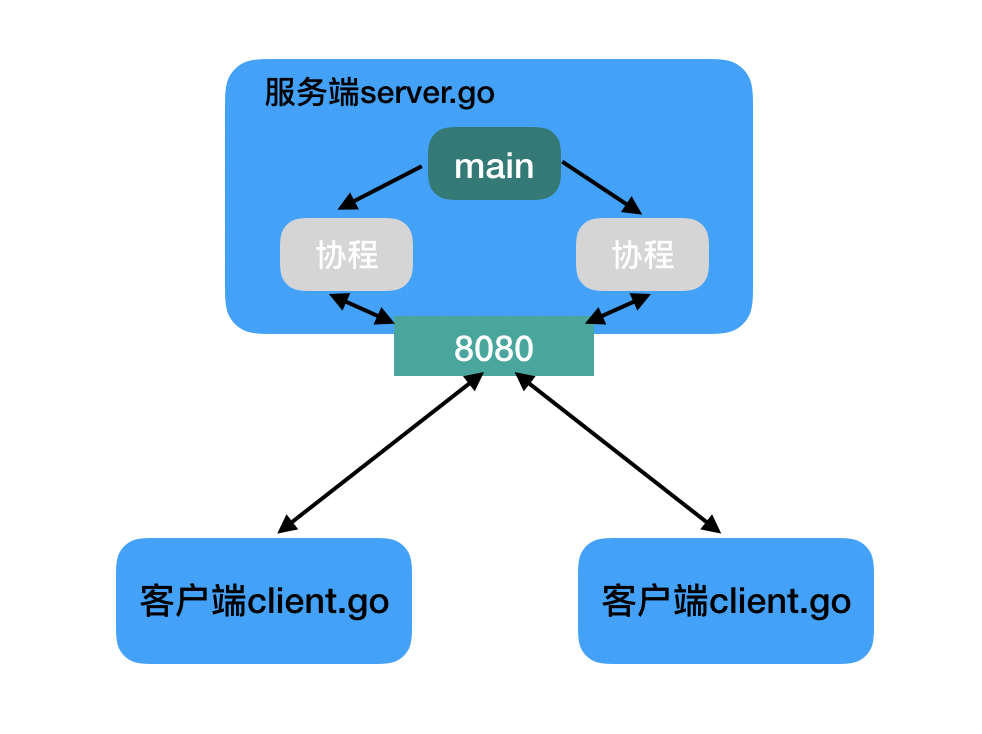
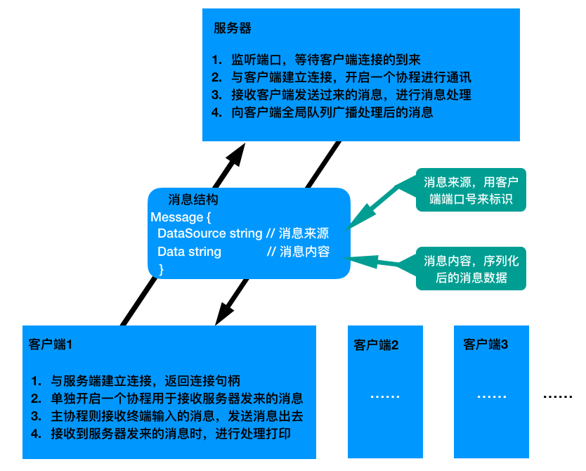
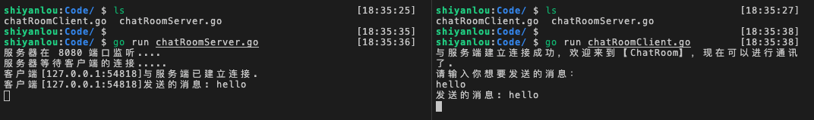
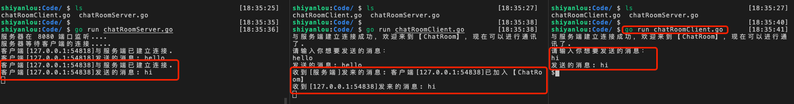
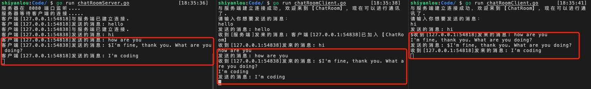
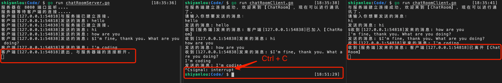

# 使用 Socket 实现并发通讯服务案例

## 实验介绍

本实验主要介绍基于 Go 语言如何用 Socket 编程知识实现并发通讯服务的案例，从而让大家巩固下前面所学的知识，达到学有所用的效果。另外本实验要求需要有 Go 语言的基础，对 Go 语言基本语法有一定的了解。

#### 知识点

- TCP Socket 编程简单回顾
- 并发通讯服务案例实现（基于 Go 语言）

## TCP Socket 编程的简单流程回顾

#### 服务端的简单处理流程

1. 监听端口，比如：8080
2. 建立客户端和服务的 TCP 连接
3. 创建协程（goroutine），处理客户端请求

#### 客户端的简单处理流程

1. 建立与服务端之间的连接
2. 发送请求数据
3. 接收服务端返回的结果
4. 关闭与服务端之间的连接

#### 简单程序流程示意图如下所示



以上示意图的代码实现已经在前面实验三“基于 Go 语言实现客户端/服务器端程序”的那小节讲过，这里就不再赘述了，忘记的同学可以回顾一下。

## 并发通讯服务案例实现（基于 Go 语言实现）

接下来我们通过一个案例来说明如何实现并发通讯服务。

#### 并发通讯服务案例的主要功能说明

实现一个服务端（通讯服务）与多个客户端（用户）之间建立连接，建立连接成功后，客户端之间可以在一个通讯服务（聊天室）里进行通讯，可以理解为在一个群里聊天了，而服务端就是一个群聊的后台服务，实时且并发的处理每个客户端发送的通讯消息（数据），从而实现并发的通讯服务案例。

#### 并发通讯服务流程示意图如下所示



#### 服务器端实现的主要流程

1. 打印提示监听端口的信息
2. 开始监听端口，这里的案例监听的是 8080 端口
3. 监听成功后，开始循环等待客户端连接的到来
4. 每一个客户端连接成功，都会将客户端加入客户端全局队列，其目的是后面会广播消息到该全局队列的所有客户端
5. 客户端加入通讯服务后，开始广播该客户端加入通讯服务的消息到客户端全局队列，即通知每个客户端有新的客户端加入（上线）了
6. 然后服务端会单独开启一个协程（微线程）处理与当前连接成功的客户端之间的通讯，即每一个客户端与服务端建立连接成功后，服务端都会开启一个协程对应处理它们之间的通讯

以上就是服务端实现并发通讯服务的主要流程，需要说明的是：

- 这里的客户端也可以理解为用户
- 协程、线程和进程的区别在前面实验五已经有解释说明，这里也不再赘述了

服务器端实现的主要流程代码实现如下：

```go
// 服务端主函数（入口函数）
func main() {
	// 1. 提示信息
	fmt.Println("服务器在 8080 端口监听....")
	// 2. 服务端监听端口 8080
	listen, err := net.Listen("tcp", "0.0.0.0:8080")
	defer listen.Close()
	if err != nil {
		fmt.Println("net.Listen err=", err)
		return
	}

	// 3. 一旦监听成功，就等待客户端连接的到来
	fmt.Println("服务器等待客户端的连接.....")
	for {
        // 客户端连接到来之前，会阻塞在这里，连接成功后才往下走
		conn, err := listen.Accept()
		if err != nil {
			fmt.Println("listen.Accept err=" ,err)
		}

		// 4. 连接进来的客户端加入  用户(客户端)全局队列
		// 后面用于广播消息到该队列所有的客户端
		clientAddr := conn.RemoteAddr().String()
		var userProcess UserProcess
		userProcess.Conn = conn		// 当前连接
		userProcess.UserAddr = clientAddr	// 当前连接的客户端地址
		userKey := strings.Split(clientAddr, ":")[1]    // 当前连接的客户端端口号，用与标识是哪个客户端
		userMgr.onlineUsers[userKey] = &userProcess

		// 打印建立连接的信息
		fmt.Printf("客户端[%s]与服务端已建立连接.\n", clientAddr)

		// 5. 客户端加入通讯室时，广播该客户端加入的消息
		JoinOrLeaveMsg(userKey, clientAddr, ClientJoin)

		// 6. 一旦连接建立成功，则单独启动一个协程和客户端保持通讯
		go Process(conn, userKey)
	}
}
```

由以上主流程代码实现可以知道，前 4 步跟 socket 编程一般的实现流程大同小异，都是需要先监听端口，然后等待客户端连接的到来，下面主要说下 JoinOrLeaveMsg 和 Process 函数的实现。

#### 加入或离开通讯服务的 JoinOrLeaveMsg 函数实现说明

```go
// 客户端加入或离开 ChatRoom，需要发送消息通知每个在线的客户端
func JoinOrLeaveMsg(userKey string, clientAddr string, msgType int) {
    // 根据 msgType 的类型来选择是加入还是离开的消息
	var msgStr string
	switch msgType {
	case 1:
		msgStr = "加入"
	case 2:
		msgStr = "离开"
	default:
		fmt.Println("JoinOrLeaveMsg type wrong!")
	}

	// 将客户端加入或离开通讯服务（即上线或下线）的消息广播出去
	var msg Message
	joinStr := fmt.Sprintf("客户端[%s]已%s【ChatRoom】", clientAddr, msgStr)
	msg.DataSource = "服务端"
    msg.Data = joinStr
    // 序列化需要发送的消息体
	joinMsg, err := json.Marshal(msg)
	if err != nil {
		fmt.Println("json.Marshal err=", err)
    }
    // 将消息广播出去
	SendMesToEachOnlineUser(userKey, joinMsg)
}
```

函数的参数 `userKey` 为客户端的 key，即客户端的端口号；参数 `clientAdd` 为客户端的地址，比如 `127.0.0.1:52670`；参数 `msgType` 为 消息类型，来说明客户端是加入还是离开，从而选择相应  的消息来发送，这里定义了两个常量用于区分是加入还是离开的消息类型，如下：

```go
const (
	ClientJoin = 1	// 客户端加入
	ClientLeave = 2	// 客户端离开
)
```

将消息广播出去的 SendMesToEachOnlineUser 函数实现：

```go
// 广播消息给每一个在线用户（客户端）
func SendMesToEachOnlineUser(userKey string, data []byte) {
	// 遍历在线用户（客户端）全局队列，给每一个在线用户（客户端）发消息
	for id, up := range userMgr.onlineUsers {
		// 排除掉本身（当前客户端）
		if id == userKey {
			continue
		}
		// 发送消息（数据）
		err := WriteData(up.Conn, data)
		// 发送出错时，打错误信息
		if err != nil {
			fmt.Printf("转发消息给[%s]客户端失败，失败信息为：%v\n", up.UserAddr, err)
		}
	}
}
```

发送消息的 WriteData 函数实现：

```go
// 写消息（数据）函数，入参为 连接句柄 和 需要发送到消息（数据）data
func WriteData(conn net.Conn, data []byte) (err error) {
	// 写（发送）数据
	_, err = conn.Write(data)
	if err != nil {
		fmt.Println("conn.Write fail", err)
		return
	}
	return
}
```

#### Process 函数实现说明

```go
// 处理和客户端的通讯，入参 连接句柄 conn 和 userKey
// userKey 其实为当前连接客户端的端口号，用于标识是哪个客户端
func Process(conn net.Conn, userKey string) {
	//这里需要延时关闭conn
	defer conn.Close()

	// 处理通讯
	err := SubProcess(conn, userKey)
	// 通讯出错时，打印错误信息
	if err != io.EOF {
		fmt.Printf("客户端[%v]和服务器协程[%v]通讯错误，错误信息为：%s\n",
			conn.RemoteAddr().String(), GetGID(), err)
	}
}
```

处理通讯的 SubProcess 函数实现：

```go
// 封装正式处理通讯的函数
func SubProcess(conn net.Conn, userKey string) (err error) {
	// 循环读取客户端发送过来的消息（数据）
	for {
		// 读取消息
        msg, err := ReadData(conn)
        
        // 报错或者客户端连接断开时，打印提示信息，并将该用户（客户端）在全局队列里剔除掉
        // 这里用 Go 语言内置的 delete 函数来进行剔除
		if err != nil {
			delete(userMgr.onlineUsers, userKey)
			if err == io.EOF {
				fmt.Printf("客户端[%s]退出，与服务器端的连接断开.\n", conn.RemoteAddr())
				// 将客户端离开通讯室的消息广播出去
				clientAddr := conn.RemoteAddr().String()
				JoinOrLeaveMsg(userKey, clientAddr, ClientLeave)
				return err
			} else {
				fmt.Println("ReadData err=", err)
				return err
			}
		}

		// 服务器处理与客户端通讯的消息
		err = ServerProcessMsg(userKey, &msg)
		if err != nil {
			return err
		}
	}
}
```

获取服务器协程 ID 的 GetGID 函数实现：

```go
// 获取协程 id，用于标识哪个协程
func GetGID() uint64 {
	b := make([]byte, 64)
	b = b[:runtime.Stack(b, false)]
	b = bytes.TrimPrefix(b, []byte("goroutine "))
	b = b[:bytes.IndexByte(b, ' ')]
	n, _ := strconv.ParseUint(string(b), 10, 64)
	return n
}
```

读取消息的 ReadData 函数实现：

```go
// 读取消息（数据）函数，入参为 连接句柄 conn，返回消息体 Message
func ReadData(conn net.Conn) (msg Message, err error) {
	// 定义一个缓存变量 buf，可以存放 4096 个字节
	buf := make([]byte, 4096)
	// 读取客户端发送的消息
	n, err := conn.Read(buf[:])
	if err != nil {
		return
	}

	// 将客户端地址和读取到的消息赋值到消息体结构
	msg.DataSource = conn.RemoteAddr().String()
	msg.Data = string(buf[:n])

	return
}
```

服务器处理与客户端通讯消息的 ServerProcessMsg 函数实现：

```go
// 服务端处理通讯消息函数，入参为 userKey 和 消息体地址 *Message
func ServerProcessMsg(userKey string, msg *Message) (err error) {
	// 打印提示信息
	fmt.Printf("客户端[%s]发送的消息: %s\n", msg.DataSource, msg.Data)
	// 序列化消息
	data, err := json.Marshal(msg)
	if err != nil {
		fmt.Println("json.Marshal err=", err)
		return
	}
	// 广播消息给每一个在线的用户（客户端），当前客户端除外
	SendMesToEachOnlineUser(userKey, data)
	return
}
```

#### 客户端主要流程

1. 与服务器端建立连接，返回连接句柄 conn
2. 打印提示建立连接成功的信息
3. 客户端与服务器端进行通讯：单独开启一个协程用于接收服务器端发送过来的数据，而主协程主要处理发送消息

客户端主要流程代码实现如下：

```go
// 客户端主函数（入口函数）
func main() {
    // 1. 与服务端建立连接，返回连接句柄 conn
    conn, err := GetConnect()
    if err != nil {
        fmt.Println("GetConnect err=", err)
    }
    // 2. 打印提示建立连接成功并可以进行通讯的信息
    fmt.Println("与服务端建立连接成功，欢迎来到【ChatRoom】，现在可以进行通讯了.")
    // 3. 客户端处理进程
    ClientProcess(conn)
}
```

与服务器端建立连接的 GetConnect 函数实现：
```go
// 与服务端建立连接，成功后返回连接句柄 conn
func GetConnect() (conn net.Conn, err error) {
	// 连接到服务器，这里用本地(localhost)举例，端口号为：8080，tcp 协议
    conn, err = net.Dial("tcp", "localhost:8080")
    // 建立连接报错时，打印报错信息
	if err != nil {
		fmt.Println("net.Dial err=", err)
		return
	}
	return
}
```

客户端处理通讯的 ClientProcess 函数实现：

```go
// 客户端处理函数，入参为：与服务端建立连接的句柄 conn
func ClientProcess(conn net.Conn) {
    // 3.1 单独开启一个协程用于接收服务端发送过来的数据
    go ClientReceiveMsg(conn)
    // 3.2 主协程处理发送数据
    ClientSendMsg(conn)
}
```

处理接收服务端发送过来消息的 ClientReceiveMsg 函数实现：

```go
// 客户端接收消息函数
func ClientReceiveMsg(conn net.Conn) {
	for {
		// 读取消息数据放到缓冲区 buf
		buf := make([]byte, 4096)
		n, err := conn.Read(buf[:])
		if err != nil {
			fmt.Println("conn.Read err: ", err)
			return
		}
		// 反序列化接收到的消息数据（buf里的数据）存到 msg
		var msg Message
		err = json.Unmarshal(buf[:n], &msg)
		if err != nil {
			fmt.Println("json.Unmarshal err: ", err)
		}
		// 打印接收到的消息
		fmt.Printf("收到[%s]发来的消息: %s\n",  msg.DataSource, msg.Data)
	}
}
```

处理发送消息的 ClientSendMsg 函数实现：

```go
// 客户端发送消息函数
func ClientSendMsg(conn net.Conn) {
	fmt.Println("请输入你想要发送的消息：")

	// 这里循环获取终端输入的消息
	for {
		// bufio 缓冲的方式获取终端输入的消息
		inputReader := bufio.NewReader(os.Stdin)
		// 读取到换行符就结束此次读取消息，并将消息存到 content 变量
		content, err := inputReader.ReadString('\n')
		if err != nil {
			fmt.Println("ReadString err=", err)
		}

		// 发送终端读取的消息 content 给服务器
        err = SendMsgToServer(conn, content)
        // 发送报错时，打印报错信息
		if err != nil {
			fmt.Println("SendGroupMes err=", err)
		}
	}
}
```

发送消息给服务器的 SendMsgToServer 函数实现：

```go
// 发送消息到服务端，入参为 连接句柄conn 和 发送消息内容 content
func SendMsgToServer(conn net.Conn, content string) (err error) {
	// 去掉多余到换行符，并打印需要发送的消息内容
	readContent := strings.Trim(content, "\n")
	fmt.Println("发送的消息:", readContent)

	// 发送消息的内容转换成 byte 的格式，并发送给服务器端
	data := []byte(readContent)
	_, err = conn.Write(data)
	if err != nil {
		fmt.Println("conn.Write err=", err.Error())
		return
	}
	return
}
```

#### 发送或接收消息的结构体

服务器端广播发送消息和客户端接收消息时使用到的消息体结构如下：

```go
// 消息结构体
type Message struct {
	DataSource string	`json:"data_source"` // 消息（数据）来源，这里用端口号来标识
	Data string	`json:"data"`				 // 消息（数据）内容
}
```

以上各个函数实现的功能，在代码注释里都有说明。代码实现主要是基于 Go 语言的，需要大家对 Go 语言的基本语法有一定的了解。当然如果对 Go 语言基本语法还不了解的也没关系，看代码注释也大概能看懂，只是后续实践起来没那么得心应手而已，相比较了解了 Go 语言基本语法的来说会有些许吃力。

接下来我们把以上分散的函数代码块整合在一起，分别把服务器端和客户端实现并发通讯服务的完整代码贴出来。

#### 服务器端实现并发通讯服务的完整代码如下

```go
/*
	file：chatRoomServer.go
	runCmd：go run chatRoomServer.go
*/

package main

import (
	"bytes"
	"encoding/json"
	"fmt"
	"io"
	"net"
	"runtime"
	"strconv"
	"strings"
)

// 保存连接用户（客户端）的全局变量
var (
	userMgr *UserMgr
)

const (
	ClientJoin = 1	// 客户端加入
	ClientLeave = 2	// 客户端离开
)

// 用户（客户端）结构体
type UserMgr struct {
	// 在线用户（客户端）变量，map 类型
	// key为客户端端口号，用于标识别哪个用户，
	onlineUsers map[string]*UserProcess
}

// 用户（客户端）连接进程信息
type UserProcess struct {
	// 连接句柄
	Conn net.Conn
	// RemoteAddr 字段，表示该Conn是哪个用户
	UserAddr string
}

// 消息结构体
type Message struct {
	DataSource string	`json:"data_source"`	// 消息（数据）来源
	Data string	`json:"data"`					// 消息（数据）内容
}

// 读取消息（数据）函数，入参为 连接句柄，返回消息体 Message
func ReadData(conn net.Conn) (msg Message, err error) {
	// 定义一个缓存变量 buf，可以存放 4096 个字节
	buf := make([]byte, 4096)
	// 读取客户端发送的消息
	n, err := conn.Read(buf[:])
	if err != nil {
		return
	}

	// 将客户端地址和读取到的消息赋值到消息体结构
	msg.DataSource = conn.RemoteAddr().String()
	msg.Data = string(buf[:n])

	return
}

// 写消息（数据）函数，入参为 连接句柄 和 需要发送到消息（数据）data
func WriteData(conn net.Conn, data []byte) (err error) {
	// 写（发送）数据
	_, err = conn.Write(data)
	if err != nil {
		fmt.Println("conn.Write fail", err)
		return
	}
	return
}

// 广播消息给每一个在线用户（客户端）
func SendMesToEachOnlineUser(userKey string, data []byte) {
	// 遍历在线用户（客户端）全局队列，给每一个在线用户（客户端）发消息
	for id, up := range userMgr.onlineUsers {
		// 排除掉本身（当前客户端）
		if id == userKey {
			continue
		}
		// 发送消息（数据）
		err := WriteData(up.Conn, data)
		// 发送出错时，打错误信息
		if err != nil {
			fmt.Printf("转发消息给[%s]客户端失败，失败信息为：%v\n", up.UserAddr, err)
		}
	}
}

// 服务端处理通讯消息函数
func ServerProcessMsg(userKey string, msg *Message) (err error) {
	// 打印提示信息
	fmt.Printf("客户端[%s]发送的消息: %s\n", msg.DataSource, msg.Data)
	// 序列化消息
	data, err := json.Marshal(msg)
	if err != nil {
		fmt.Println("json.Marshal err=", err)
		return
	}
	// 广播消息给每一个在线的用户（客户端），当前客户端除外
	SendMesToEachOnlineUser(userKey, data)
	return
}

// 封装正式处理通讯的函数
func SubProcess(conn net.Conn, userKey string) (err error) {
	// 循环读取客户端发送过来的消息（数据）
	for {
		// 读取消息
		msg, err := ReadData(conn)

		// 报错或者客户端连接断开时，打印提示信息，并将该用户（客户端）在全局队列里剔除掉
		// 这里用 Go 语言内置的 delete 函数来进行剔除
		if err != nil {
			delete(userMgr.onlineUsers, userKey)
			if err == io.EOF {
				fmt.Printf("客户端[%s]退出，与服务器端的连接断开.\n", conn.RemoteAddr())

				// 将客户端离开通讯室的消息广播出去
				clientAddr := conn.RemoteAddr().String()
				JoinOrLeaveMsg(userKey, clientAddr, ClientLeave)

				return err
			} else {
				fmt.Println("ReadData err=", err)
				return err
			}
		}

		// 服务器处理与客户端通讯的消息
		err = ServerProcessMsg(userKey, &msg)
		if err != nil {
			return err
		}
	}
}

// 客户端加入或离开 ChatRoom，需要发送消息通知每个在线的客户端
func JoinOrLeaveMsg(userKey string, clientAddr string, msgType int) {
	// 根据 msgType 的类型来选择是加入还是离开的消息
	var msgStr string
	switch msgType {
	case 1:
		msgStr = "加入"
	case 2:
		msgStr = "离开"
	default:
		fmt.Println("JoinOrLeaveMsg type wrong!")
	}

	// 将客户端加入或离开通讯服务（即上线或下线）的消息广播出去
	var msg Message
	joinStr := fmt.Sprintf("客户端[%s]已%s【ChatRoom】", clientAddr, msgStr)
	msg.DataSource = "服务端"
	msg.Data = joinStr
	joinMsg, err := json.Marshal(msg)
	if err != nil {
		fmt.Println("json.Marshal err=", err)
	}
	// 将消息广播出去
	SendMesToEachOnlineUser(userKey, joinMsg)
}

// 处理和客户端的通讯，入参 连接句柄和 userKey
// userKey 其实为当前连接客户端的端口号，用于标识是哪个客户端
func Process(conn net.Conn, userKey string) {
	//这里需要延时关闭conn
	defer conn.Close()

	// 处理通讯
	err := SubProcess(conn, userKey)
	// 通讯出错时，打印错误信息
	if err != io.EOF {
		fmt.Printf("客户端[%v]和服务器协程[%v]通讯错误，错误信息为：%s\n",
			conn.RemoteAddr().String(), GetGID(), err)
	}
}

// 获取协程 id，用于标识哪个协程
func GetGID() uint64 {
	b := make([]byte, 64)
	b = b[:runtime.Stack(b, false)]
	b = bytes.TrimPrefix(b, []byte("goroutine "))
	b = b[:bytes.IndexByte(b, ' ')]
	n, _ := strconv.ParseUint(string(b), 10, 64)
	return n
}

//完成对userMgr初始化工作
func init() {
	userMgr = &UserMgr{
		onlineUsers : make(map[string]*UserProcess, 1024),
	}
}

// 服务端主函数（入口函数）
func main() {
	// 1. 提示信息
	fmt.Println("服务器在 8080 端口监听....")
	// 2. 服务端监听端口 8080
	listen, err := net.Listen("tcp", "0.0.0.0:8080")
	defer listen.Close()
	if err != nil {
		fmt.Println("net.Listen err=", err)
		return
	}

	// 3. 一旦监听成功，就等待客户端连接的到来
	fmt.Println("服务器等待客户端的连接.....")
	for {
		// 客户端连接到来之前，会阻塞在这里，连接成功后才往下走
		conn, err := listen.Accept()
		if err != nil {
			fmt.Println("listen.Accept err=" ,err)
		}

		// 4. 连接进来的客户端加入  用户(客户端)全局队列
		// 后面用于广播消息到该队列所有的客户端
		clientAddr := conn.RemoteAddr().String()
		var userProcess UserProcess
		userProcess.Conn = conn		// 当前连接
		userProcess.UserAddr = clientAddr	// 当前连接的客户端地址
		userKey := strings.Split(clientAddr, ":")[1]	// 当前连接的客户端端口号，用与标识是哪个客户端
		userMgr.onlineUsers[userKey] = &userProcess

		// 打印建立连接的信息
		fmt.Printf("客户端[%s]与服务端已建立连接.\n", clientAddr)

		// 5. 客户端加入通讯室时，广播该客户端加入的消息
		JoinOrLeaveMsg(userKey, clientAddr, ClientJoin)

		// 6. 一旦连接建立成功，则单独启动一个协程和客户端保持通讯
		go Process(conn, userKey)
	}
}
```

#### 客户端实现并发通讯服务的完整代码如下

```go
/*
file：chatRoomClient.go
runCmd：go run chatRoomClient.go
*/

package main

import (
	"bufio"
	"encoding/json"
	"fmt"
	"net"
	"os"
	"strings"
)

// 消息结构体
type Message struct {
	DataSource string	`json:"data_source"`	// 消息（数据）来源
	Data string	`json:"data"`					// 消息（数据）内容
}

// 与服务端建立连接，成功后返回连接句柄 conn
func GetConnect() (conn net.Conn, err error) {
	// 链接到服务器，这里用本地(localhost)举例，端口号为：8080，tcp 协议
	conn, err = net.Dial("tcp", "localhost:8080")
	// 建立连接报错时，打印报错信息
	if err != nil {
		fmt.Println("net.Dial err=", err)
		return
	}
	return
}

// 发送消息到服务端，入参为 连接句柄conn 和 发送消息内容 content
func SendMsgToServer(conn net.Conn, content string) (err error) {
	// 去掉多余到换行符，并打印需要发送的消息内容
	readContent := strings.Trim(content, "\n")
	fmt.Println("发送的消息:", readContent)

	// 发送消息的内容转换成byte的格式，并发送给服务端
	data := []byte(readContent)
	_, err = conn.Write(data)
	if err != nil {
		fmt.Println("conn.Write err=", err.Error())
		return
	}
	return
}

// 客户端发送消息函数
func ClientSendMsg(conn net.Conn) {
	fmt.Println("请输入你想要发送的消息：")

	// 这里循环获取终端输入的消息
	for {
		// bufio 缓冲的方式获取终端输入的消息
		inputReader := bufio.NewReader(os.Stdin)
		// 读取到换行符就结束此次读取消息，并将消息存到 content 变量
		content, err := inputReader.ReadString('\n')
		if err != nil {
			fmt.Println("ReadString err=", err)
		}

		// 发送终端读取的消息 content 给服务器
		err = SendMsgToServer(conn, content)
		if err != nil {
			fmt.Println("SendGroupMes err=", err)
		}
	}
}

// 客户端接收消息函数
func ClientReceiveMsg(conn net.Conn) {
	for {
		// 读取消息数据放到缓冲区 buf
		buf := make([]byte, 4096)
		n, err := conn.Read(buf[:])
		if err != nil {
			fmt.Println("conn.Read err: ", err)
			return
		}
		// 反序列化接收到的消息数据（buf里的数据）存到 msg
		var msg Message
		err = json.Unmarshal(buf[:n], &msg)
		if err != nil {
			fmt.Println("json.Unmarshal err: ", err)
		}
		// 打印接收到的消息
		fmt.Printf("收到[%s]发来的消息: %s\n",  msg.DataSource, msg.Data)
	}
}

// 客户端处理函数，入参为：与服务端建立连接的句柄 conn
func ClientProcess(conn net.Conn) {
	// 单独开启一个协程用于接收服务端发送过来的数据
	go ClientReceiveMsg(conn)
	// 主协程处理发送数据
	ClientSendMsg(conn)
}

// 客户端主函数（入口函数）
func main() {
	// 1. 与服务端建立连接，返回连接句柄 conn
	conn, err := GetConnect()
	if err != nil {
		fmt.Println("GetConnect err=", err)
	}
	// 2. 打印提示建立连接成功并可以进行通讯的信息
	fmt.Println("与服务端建立连接成功，欢迎来到【ChatRoom】，现在可以进行通讯了.")
	// 3. 客户端处理进程
	ClientProcess(conn)
}
```

接下来我们分别运行服务端和客户端的程序来看下实现的效果。

首先打开两个终端，一个用来运行服务端程序，另外一个用来运行客户端程序。在两个终端分别进入到代码目录下，分别运行服务端和客户端程序，运行的命令分别为 `go run chatRoomServer.go` 和 `go run chatRoomClient.go`，然后在运行客户端程序的终端发送 `hello` 的消息，运行结果如下图所示：



可以看到运行服务端程序的终端打印输出了客户端建立连接成功和客户端发送消息的信息，客户端也在终端打印了需要发送的消息（hello）。

接下来再另外打开一个终端，运行客户端程序，然后发送 `hi` 消息，效果如下图所示：



可以看出新加入的客户端端口号为 `54838`，当有新客户端程序运行（加入通讯服务）时，服务器端会打印客户端加入的消息，并广播（通知）给其它客户端；另外，客户端发送的消息也会广播给其它客户端，相当于客户端之间可以进行通讯了，如下图所示：



当然有客户端退出时，服务器端也会通知到其它客户端。我们可以在其中一个运行了客户端程序的终端按 `Ctrl+C` 退出正在运行的客户端程序，然后其它客户端会收到服务器端发送过来的通知。运行效果如下图所示：



至此并发通讯服务案例的实现已经完成了，大家可以开启多个终端分别运行客户端程序来模拟有多个用户加入了通讯服务（ChatRoom），客户端之间可以进行通讯发消息了。其实并发的本质体现在 Go 语言的协程（Goroutine），即每一个客户端的加入，服务器端均会开启一个协程（Goroutine）来与之进行通讯。

## 实验总结

以上是基于 Go 语言实现并发通讯服务的案例。通过学习完本实验，大家可以知道如何用 Go 语言的 Socket 编程来实现多用户（客户端）进行通讯了，其实大家可以理解为一个聊天室。后续如果能力可以的话，大家可以在该基础上，用 redis 数据库替换以上说到的客户端全局队列，实现用户的登录、注册以及用户在线列表等，学会举一反三，达到学有所用的效果。本实验代码相对前面实验来说比较简洁，实现流程也比较简单，其中最经典、也最值得学习的就是 Go 语言的协程（Goroutine），希望同学们可以理解到协程使用的精髓。
