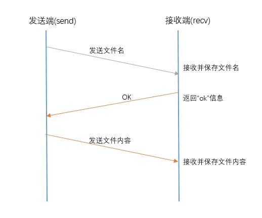

# 使用 Socket 编程实现文件传输案例

## 实验介绍

本实验主要介绍如何用 Socket 编程实现文件传输的案例，从而让大家巩固下前面所学的知识。

#### 知识点

- 文件传输的发送端实现
- 文件传输的接收端实现

## Socket 实现文件传输（基于 Go 语言实现）

#### 文件属性获取

所谓使用 Socket 编程实现文件传输，其实就是借助 TCP 完成文件的传输，基本思路大概如下:

1. 发送方(客户端)向服务端发送文件名，服务端接收并创建客户端发过来的文件名；
2. 接收方(服务端)接收文件名成功后，向客户端写回一个OK消息，表示接收文件名保存成功；
3. 发送方(客户端)收到服务端写回的OK消息后，继续向服务端发送文件数据（文件内容）；
4. 接收方(服务端)将接收到的文件内容，写入到前面保存好的文件中；
5. 由于文件传输需要稳定可靠的连接，所以采用 TCP 方式完成网络文件传输功能。

之所以选择用TCP方式实现文件传输功能的原因，是由于文件传输需要稳定可靠的连接。

想要获取文件名，需要借助Go语言中标准库 os 包中的 stat()函数来获取文件属性的信息，在函数返回的文件属性中就已经包含了文件名和文件大小。Stat() 的参数 name 传入的是文件访问的绝对路径。FileInfo 中的 Name()函数可以将文件名单独提取出来。如下所示：

```go
func Stat(name string) (fi FileInfo, err error)
```

Stat 返回一个描述 name 指定的文件对象的 FileInfo。如果指定的文件对象是一个符号链接，返回的 FileInfo 描述该符号链接指向的文件的信息，本函数会尝试跳转该链接。如果出错，返回的错误值为\*PathError 类型。

我们通过源码可以得知 FileInfo 是一个接口，要实现这个接口就必须实现这个接口的如下所有方法：

```go
// A FileInfo describes a file and is returned by Stat and Lstat.
type FileInfo interface {
	Name() string       // base name of the file
	Size() int64        // length in bytes for regular files; system-dependent for others
	Mode() FileMode     // file mode bits
	ModTime() time.Time // modification time
	IsDir() bool        // abbreviation for Mode().IsDir()
	Sys() interface{}   // underlying data source (can return nil)
}
```

实现网络文件传输实质上是借助了本地文件复制和 TCP 网络编程相关知识，可以先看看 Go 语言复制文件和 Go 网络编程了解相关内容。

所以关于使用 TCP 实现文件传输大致步骤可以归结为如下步骤：



#### 实现文件传输服务端（接收端）

接收端实现的步骤:

1. 创建监听 listener，程序结束时关闭。
2. 阻塞等待客户端连接 conn，程序结束时关闭 conn。
3. 读取客户端发送文件名。保存 fileName。
4. 回发“ok”。
5. 封装函数 RecvFile 接收客户端发送的文件内容。传参 fileName 和 conn
6. 按文件名 Create 文件，结束时 Close
7. 循环 Read 发送端网络文件内容，当读到 0 说明文件读取完毕。
8. 将读到的内容原封不动 Write 到创建的文件中

服务端（接收端）实现代码如下：

```go
/*
	file: fileTranServer.go
	runCmd: go run fileTranServer.go
*/
package main

import (
	"fmt"
	"io"
	"net"
	"os"
)

const (
	MAXBUF = 4096 			// buf缓存区大小
	TCP = "tcp"				// tcp 协议
	ADDR = "127.0.0.1:8080"	// 监听地址
)

// 处理接收文件内容
func recvFileContent(conn net.Conn, fileName string) {
	// 根据文件名创建新文件
	file, err := os.Create(fileName)
	if err != nil {
		fmt.Printf("os.Create()函数执行错误，错误信息为:%v\n", err)
		return
	}
	// 延迟关闭文件句柄
	defer file.Close()

	// 循环接收客户端发过来的数据，然后写入上面创建的文件
	for {
		buf := make([]byte, MAXBUF)
		n, err := conn.Read(buf)
		// 读到的数据写入文件
		file.Write(buf[:n])
		if err != nil {
			if err == io.EOF {	// io.EOF 表示读取完文件内容
				fmt.Println("接收文件内容完成.")
			} else {
				fmt.Printf("conn.Read()方法执行出错，错误信息为:%v\n", err)
			}
			return
		}
	}
}

// 服务端（接收端）主函数
func main() {
	// 创建监听的套接字 socket，使用 tcp 协议，端口号8080
	listener, err := net.Listen(TCP, ADDR)
	if err != nil {
		fmt.Printf("net.Listen()方法执行错误，错误信息为:%v\n", err)
		return
	}
	// 延迟关闭监听套接字 listenner
	defer listener.Close()

	// 阻塞监听，等待客户端连接的到来
	conn, err := listener.Accept()
	if err != nil {
		fmt.Printf("listener.Accept()方法执行错误，错误信息为:%v\n", err)
		return
	}
	// 延迟关闭连接套接字 conn
	defer conn.Close()

	// 定义一个缓冲区变量 buf，用于存储接收到的数据
	// 此处用于保存客户端传过来的文件名
	buf := make([]byte, 4096)
	n, err := conn.Read(buf)
	if err != nil {
		fmt.Printf("conn.Read()方法执行错误，错误信息为:%v\n", err)
		return
	}
	// 文件名前缀加"server"，重新定义为一个新文件
	// 在本地测试时，为了区分是服务端还是客户端的文件
	fileName := "server" + string(buf[:n])

	// 接收文件名信息成功后，回写ok给客户端（发送端）
	n, err = conn.Write([]byte("ok"))
	if err != nil {
		fmt.Printf("conn.Write()方法执行错误，错误信息为:%v\n", err)
		return
	}

	// 单独封装一个函数来处理获取文件的内容
	recvFileContent(conn, fileName)
}
```

#### 实现文件传输客户端（发送端）

发送端实现的步骤:

1. 提示用户使用命令行参数输入文件名。接收文件名 filepath（含访问路径）
2. 使用 os.Stat(）获取文件属性，得到纯文件名 fileName（去除访问路径）
3. 主动发起连接服务器请求，结束时关闭连接。
4. 发送文件名到接收端 conn.Write()
5. 读取接收端回发的确认数据 conn.Read()
6. 判断是否为“ok”。如果是，封装函数 SendFile() 发送文件内容。传参 filePath 和 conn
7. 只读 Open 文件, 结束时 Close 文件
8. 循环读本地文件，读到 EOF，读取完毕。
9. 将读到的内容原封不动 conn.Write 给接收端（服务器）

客户端（发送端）实现代码如下：

```go
/*
	file: fileTranClient.go
	runCmd: go run fileTranClient.go
*/
package main

import (
	"fmt"
	"io"
	"net"
	"os"
)

// 发送文件内容
func sendFileContent(conn net.Conn, fileName string) {
	// 打开文件，默认是以只读的方式打开
	file, err := os.Open(fileName)
	if err != nil {
		fmt.Printf("os.Open()函数执行出错，错误信息为:%v\n", err)
		return
	}
	// 延迟关闭文件句柄
	defer file.Close()

	buf := make([]byte, 4096)
	for {
		// 读取文件内容写到缓冲区
		n, err := file.Read(buf)
		if err != nil {
			if err == io.EOF {
				fmt.Println("发送文件结束")
			} else {
				fmt.Printf("file.Read()方法执行错误,错误信息为:%v\n", err)
			}
			return
		}
		// 将文件内容发送给服务端(接收端)
		_, err = conn.Write(buf[:n])
	}
}

// 客户端（发送端）主函数
func main() {

	// 使用go语言的标准库os.Args获取命令行参数，返回的是字符串列表
	args := os.Args

	// 参数数量判断
	if len(args) != 2 {
		fmt.Printf("格式为: go run fileTranClient.go fileName\n")
		return
	}

	// 获取文件名参数
	filePath := args[1]

	// 获取文件属性
	fileAttr, err := os.Stat(filePath)
	if err != nil {
		fmt.Printf("os.Stat()函数执行出错，错误信息为:%v\n", err)
		return
	}

	// 发起连接请求，tcp协议，端口号8080，注意这里的端口号要与服务端（接收端）的对应上
	conn, err := net.Dial("tcp", "127.0.0.1:8080")
	if err != nil {
		fmt.Printf("net.Dial()函数执行出错，错误信息为:%v\n", err)
		return
	}
	// 延迟关闭连接套接字
	defer conn.Close()

	// 发送文件名给服务端（接收端）
	_, err = conn.Write([]byte(fileAttr.Name()))

	// 读取服务端（接收端）回发的数据
	buf := make([]byte, 4096)
	n, err := conn.Read(buf)
	if err != nil {
		fmt.Printf("conn.Read()方法执行出错，错误信息为:%v\n", err)
		return
	}

	// 如果收到服务端（接收端）的应答为"ok"，则写文件内容给服务端
	if string(buf[:n]) == "ok" {
		sendFileContent(conn, filePath)
	}
}
```

## 实验总结

以上是并发服务编程实现的相关说明，通过学习本实验，大家将学会如何用多进程、多线程、多协程序以及多路 IO 转接实现并发服务。本实验代码量比较多，也是比较经典的实现案例，希望同学们可以耐心学习完，坚持到最后。只有理论与实践相结合，才能取得好的效果；同样网络编程也是需要网络理论与编程实践相结合，学起来才比较得心应手。
