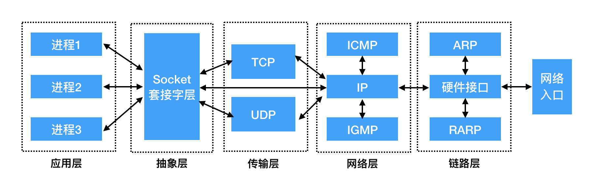
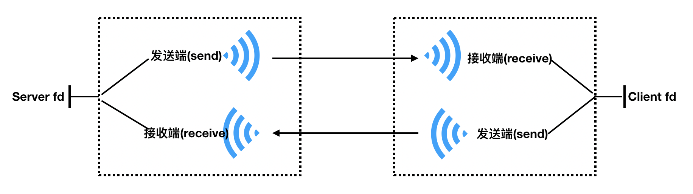

# TCP Socket 编程实现

## 实验介绍

关于网络编程其实在互联网中应用是非常广泛的，本实验将从网络编程的基础知识入手，主要介绍网络中的典型协议、端口、网络分层模型以及通信过程，为后续的实验打下基础。

#### 知识点

- 网络套接字
- 网络字节序
- Socket 模型创建流程
- TCP-C/S 模型实现

## 网络套接字

#### 套接字 Socket 的介绍

- 什么是 Socket

Socket 本身有“插座“的意思，在 Linux 环境下，用于表示进程间网络通信的特殊文件类型。本质为内核借助缓冲区形成的伪文件。
既然是文件，那么理所当然的，我们可以使用文件描述符引用套接字。与管道类似的，Linux 系统将其封装成文件的目的是为了统一接口，使得读写套接字和读写文件的操作一致。区别是管道主要应用于本地进程间通信，而套接字多应用于网络进程间数据的传递。
套接字的内核实现较为复杂，不宜在学习初期深入学习。
在 TCP/IP 协议中，“IP 地址+TCP 或 UDP 端口号”唯一标识网络通讯中的一个进程。“IP 地址+端口号”就对应一个 socket。欲建立连接的两个进程各自有一个 socket 来标识，那么这两个 socket 组成的 socket pair 就唯一标识一个连接。因此可以用 Socket 来描述网络连接的一对一关系。

Socket 的中文翻译过来就是“套接字”。套接字是什么，我们先来看看它的英文含义：插座。

Socket 就像一个电话插座，负责连通两端的电话，进行点对点通信，让电话可以进行通信，端口就像插座上的孔，端口不能同时被其他进程占用。而我们建立连接就像把插头插在这个插座上，创建一个 Socket 实例开始监听后，这个电话插座就时刻监听着消息的传入，谁拨通我这个“IP 地址和端口”，我就接通谁。

实际上，Socket 是在应用层和传输层之间的一个抽象层，它把 TCP/IP 层复杂的操作抽象为几个简单的接口，供应用层调用实现进程在网络中的通信。Socket 起源于 UNIX，在 Unix 一切皆文件的思想下，进程间通信就被冠名为文件描述符（file desciptor），Socket 是一种“打开—读/写—关闭”模式的实现，服务器和客户端各自维护一个“文件”，在建立连接打开后，可以向文件写入内容供对方读取或者读取对方内容，通讯结束时关闭文件。

另外我们经常说到的 Socket 所在位置如下图：



#### 网络套接字通信原理

在网络通信中，套接字一定是成对出现的。一端的发送缓冲区对应对端的接收缓冲区。我们使用同一个文件描述符索发送缓冲区和接收缓冲区。
TCP/IP 协议最早在 BSD UNIX 上实现，为 TCP/IP 协议设计的应用层编程接口称为 socket API。

套接字 Socket 的通信原理大致如下图所示：



## 网络字节序

#### 网络字节序的介绍

我们已经知道，内存中的多字节数据相对于内存地址有大端和小端之分，磁盘文件中的多字节数据相对于文件中的偏移地址也有大端小端之分。网络数据流同样有大端小端之分，那么如何定义网络数据流的地址呢？发送主机通常将发送缓冲区中的数据按内存地址从低到高的顺序发出，接收主机把从网络上接到的字节依次保存在接收缓冲区中，也是按内存地址从低到高的顺序保存，因此，网络数据流的地址应这样规定：先发出的数据是低地址，后发出的数据是高地址。

TCP/IP 协议规定，网络数据流应采用大端字节序，即低地址高字节。例如上一节的 UDP 段格式，地址 0-1 是 16 位的源端口号，如果这个端口号是 1000（0x3e8），则地址 0 是 0x03，地址 1 是 0xe8，也就是先发 0x03，再发 0xe8，这 16 位在发送主机的缓冲区中也应该是低地址存 0x03，高地址存 0xe8。但是，如果发送主机是小端字节序的，这 16 位被解释成 0xe803，而不是 1000。因此，发送主机把 1000 填到发送缓冲区之前需要做字节序的转换。同样地，接收主机如果是小端字节序的，接到 16 位的源端口号也要做字节序的转换。如果主机是大端字节序的，发送和接收都不需要做转换。同理，32 位的 IP 地址也要考虑网络字节序和主机字节序的问题。
为使网络程序具有可移植性，使同样的 C 代码在大端和小端计算机上编译后都能正常运行，可以调用以下库函数做网络字节序和主机字节序的转换。

```c
#include <arpa/inet.h>

uint32_t htonl(uint32_t hostlong);
uint16_t htons(uint16_t hostshort);
uint32_t ntohl(uint32_t netlong);
uint16_t ntohs(uint16_t netshort);
```
h表示host，n表示network，l表示32位长整数，s表示16位短整数。
如果主机是小端字节序，这些函数将参数做相应的大小端转换然后返回，如果主机是大端字节序，这些函数不做转换，将参数原封不动地返回。

现代 CPU 的累加器一次能装载至少 4 字节，即一个整数。那么这 4个 字节在内存中的排列的顺序将影响它被累加器装载成的整数的值，这就是字节序问题。字节序分为大端字节序 (即大端模式，Big endian) 和 小端字节序 (即小端模式，Little endian)。

大端字节序：整数的高位字节存储在内存的低地址处，低位字节存储在内存的高地址处。
小端字节序：整数的高位字节存储在内存的高地址处，而低位字节存储在内存的低地址处。


## 网络套接字 Socket 模型

#### 模型的创建流程


#### 模型的函数解析

TCP/IP 网络协议栈分为应用层、传输层、网络层和链路层四层，一般在应用开发过程中，讨论最多的是 TCP/IP 模型。四层模型如下图所示：

## TCP-C/S 模型实现

#### 基于 C 语言实现

- 服务端 server

- 客户端 client

#### 基于 Go 语言实现

- 服务端 server

- 客户端 client

## TCP 粘包

#### 粘包的介绍

#### 粘包示例代码（Go 语言实现）

#### 解决粘包的方法

## 实验总结

网络的核心基础是一系列协议，而网络编程则是基于这些协议，对网络中的数据进行处理传输等。掌握好网络编程的基础，意味着为后面实操网络编程的实验做准备，希望同学们能够沉下心来把基础打牢。
