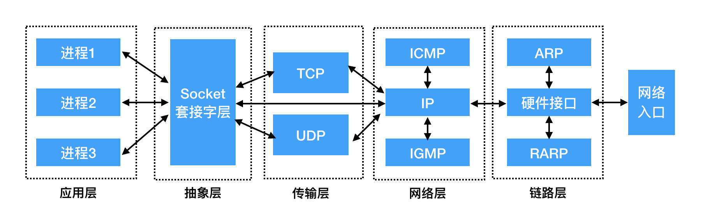
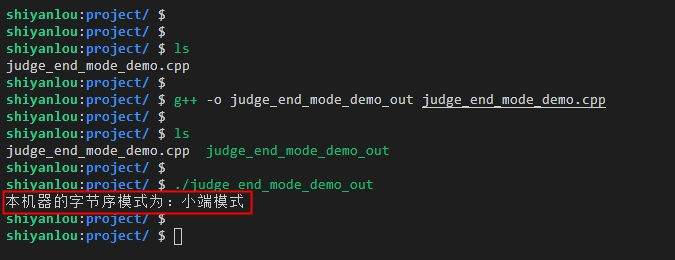
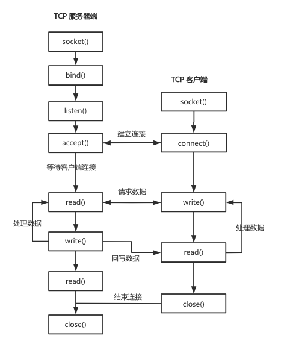
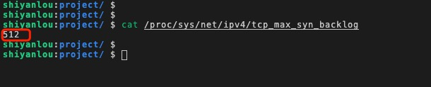
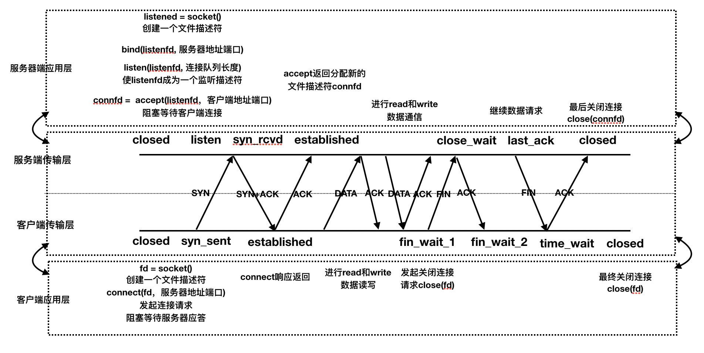
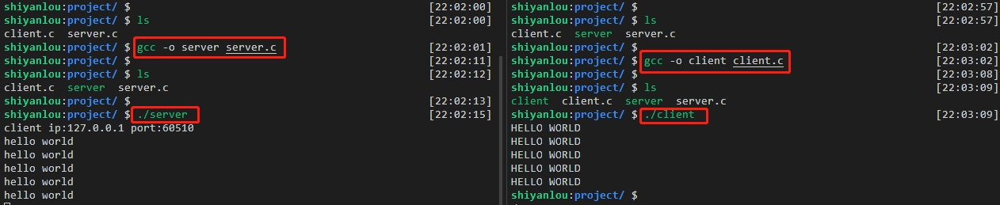
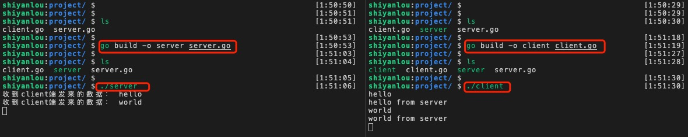
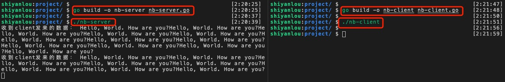

# TCP Socket 编程实现

## 实验介绍

本实验主要介绍网络套接字（Socket）和网络字节序，以及 Socket 网络模型的创建流程，最后分别通过 C 语言和 Go 语言来实现 TCP-C/S 模型，同时会提供完整的示例代码供大家学习和实操。

#### 知识点

- 网络套接字
- 网络字节序
- Socket 模型创建流程
- TCP-C/S 模型实现

## 网络套接字

#### 套接字 Socket 的介绍

- 什么是 Socket

我们从英文的翻译可以知道 Socket 本身表示插座的意思。顾名思义，插座是可以用来充电的，而插孔就像端口一样，同一时间不能被其它进程占用，而我们建立网络连接就像把插头插在这个插座上一样，可以创建一个 Socket 实例来使用，从而进行网络中的数据传递。

在网络环境中，其实 Socket 就是我们平时所说的“套接字”，主要用于表示程序进程间网络通信的一种特殊文件类型。在 Linux 环境下，一切皆为文件，而 Socket 的本质则是内核中在缓冲区形成的一种伪文件。Socket 的类型既然是属于文件，那么理所当然的，我们就可以使用文件描述符来引用 Socket。

由于 Socket 可以应用于网络进程间的通信（数据的传递），所以 Linux 系统内核为了对外统一接口调用，已经将 Socket 封装成了文件，对于开发者来说，读写 Socket 的操作就像跟读写文件的操作一样，有点类似与 Linux 环境中的管道，区别就是管道主要应用于本地进程间的通信，而 Socket 应用于网络进程间的数据传递比较多。

在 TCP/IP 协议的描述中，网络应用中的一个进程是由 `IP 地址+TCP 或 UDP` 中的端口号来唯一标识的，即 `IP:PORT` 表示，也可以把该进程理解为一个 Socket。同样，如果要想在两个进程间建立连接来进行通信，则需要在两个进程各自创建一个 Socket 来标识，这样两个进程中的 Socket 就组成了一个 Socket 对，那么这个 Socket 对也就唯一标识了一个网络连接，因此也就可以用 Socket 来描述网络连接的一对一关系了。

我们经常说到的 Socket 在网络通信中的位置可以参考下图：



事实上，Socket 是一个封装好的抽象层，主要作用于应用层和传输层之间。也可以把 Socket 看作是应用层和传输层之间的通信介质，它把网络中数据传递的复杂操作抽象为几个简单的函数或者说是接口（API），提供给应用层和传输层使用，实现网络进程间的通信（数据传递）。

Socket 的由来可以说是起源于 UNIX，前面提到过，在 Unix 环境一切皆文件的设计思想下，进程间的通信就可以理解为对文件描述符之间的一些操作。Socket 是一种类似可以操作文件那样：打开—读/写—关闭模式的实现，放到网络编程的中，就是服务器和客户端各自需要维护一个文件描述符，即图中提到的 ServerFd 和 ClientFd，在两端建立连接成功后，可以向“文件”写入内容供对方读取或者读取对方的内容，通信结束时就关闭“文件”，连接断开。

#### 网络套接字通信原理

通常不同机器上的应用程序（进程）之间是通过 Socket 来发送数据报文，从而来达到通信的目的。在网络通信过程中，Socket 是应用层和传输层之间的一道门，开发者可以操作应用层往传输层传递数据，Socket 在数据传递时会进行相应的处理，比如对数据进行包封装等。

服务器和客户端建立连接并能够进行通信，必须要具备以下两个条件才可以：

1. 服务器端的程序（进程）和客户端程序（进程）不能处于休眠状态，即需要处于运行的状态；
2. 服务器端的程序（进程）和客户端程序（进程）必须创建有套接字（Socket）。

套接字 Socket 的通信原理可以大致用下图的流程表示：


由以上 Socket 通信图可知，在网络通信过程中，套接字需要是成对存在的，否则进程间将不能进行通信。一端（服务端）的发送缓冲区对应另一端（客户端）的接收缓冲区，各自都会维护的一个文件描述符来进行网络操作。

## 网络字节序

#### 网络字节序的介绍

网络字节序，从字面的意思理解就是在网络中字节存储的顺序，而在网络编程中实际指的就是大于一个字节类型的数据在内存中的存放顺序。

我们知道，内存地址有高地址位和低地址位之分，平时开发中操作内存地址时，多字节数据相对于内存地址会有大端和小端之分，同样，在网络中数据流存放也有大端和小端之分，那么什么是大端，什么又是小端呢？

一般不同的电脑主机会有不同的网络字节序，确切的说不同的 CPU 会有不同的字节序类型，这些字节序是指数据在内存中保存的顺序，这个也叫做主机序。最常见的主机序有以下两种：

1. 小端字节序（Little endian）：将高位字节存储在内存的高地址处，而低位字节存储在内存的低地址处。
2. 大端字节序（Big endian）：将高位字节存储在内存的低地址处，低位字节存储在内存的高地址处。

另外，网络传输的数据流是按照这么个顺序发送和接收的：发送主机通常会按内存地址从低到高将发送存放区（缓冲区）中的数据发送出去，接收主机则也会按内存地址从低到高的顺序把从网络中接收到的数据，以字节的形式保存在接收缓冲区中，因此，网络数据流通常规定低地址先发出数据，高地址后发出数据。

但是，需要注意的是，在网络程序开发亦或是在跨平台开发时，应当尽可能的保持只用一种字节序，否则网络通信双方对数据的解析就会有所不一样，从而会产生问题。
实际上，在平时程序开发中，大多数人都很少会直接操作字节序，因为有已经封装好相应的库来间接的操作字节序，而且在跨平台以及网络程序开发中，字节序才会被考虑应用进来。

为了在开发中使网络程序更具有通用性和可移植性，在编写 C 代码时，可以使用以下封装好的库函数来做主机字节序和网络字节序之间的转换，这样无论在大端和小端的机器上编译后，都可以正常运行。

```c
#include <arpa/inet.h>

uint32_t htonl(uint32_t hostlong);      // 将 long 类型从主机序转换为网络序
uint16_t htons(uint16_t hostshort);     // 将 short 类型从主机序转换为网络序
uint32_t ntohl(uint32_t netlong);       // 将 long 类型从网络序转换为主机序
uint16_t ntohs(uint16_t netshort);      // 将 short 类型从网络序转换为主机序
```

以上的库函数也比较好记，htonl 的前缀 h 表示主机（host）的意思，ntohl 的前缀 n 表示网络（network）的意思，这两个函数的后缀 l 表示长整数（long），s 则表示短整数（short）。

那么怎么查看自己的机器是大端模式还是小端模式呢，下面通过一个小案例来给大家讲解下：

先来看看以下的一段示例代码（c++）：

```c++
/*
    文件名：judge_end_mode_demo.cpp
*/

#include <iostream>
using namespace std;

// 判断大小端函数
void judge_big_little_end()
{
    cout << "本机器的字节序模式为：";   // 打印输出
    int i = 1;                     // 定义 int 变量 i
    char c = *(char*)&i;          // 将 i 的地址强转为 char* 类型，为了能够拿到 i 的地址

    // 如果 c 为 1，则为小端存储模式，否则为大端模式
    if (c)
    {
        cout << "小端模式" <<endl;
    }
    else
    {
        cout << "大端模式" <<endl;
    }
}

// 主函数
int main()
{
    // 调用判断大小端的函数
    judge_big_little_end();
    return 0;
}
```

通过代码的注释可以知道，判断是大端还是小端模式可以简单总结为以下步骤：

1. 定义一个整型（int）变量 i，赋值为 1;
2. 将 i 的地址拿到后（&i），强制转为 char\* 类型，此时就可以拿到 i 的低地址了；
3. 然后再进行判断，如果低地址是 1 ，则就是小端模式存放，如果是 0 ，则就是大端模式了。

编译以上示例代码，并运行编译后的文件，可以看到会输出如下图所示的结果：



可以归纳为以下几个说明：

- 其中源文件为：`judge_end_mode_demo.cpp`；  
- 编译后的目标文件为：`judge_end_mode_demo_out`；  
- 编译源文件的命令为：`g++ -o judge_end_mode_demo_out judge_end_mode_demo.cpp`。  
- 可以看到上图中运行编译后的文件 `./judge_end_mode_demo_out` 后，输出的结果为：“本机器的字节序模式为：小端模式”，说明该机器用的是小端模式。

## 网络套接字 Socket 模型

#### 模型的创建流程

首先我们来看下 Socket 模型的创建流程，如下图所示：



根据以上 socket 模型的创建流程，可以简单归纳为以下几个步骤：

1. 首先服务器会根据编写程序时定义的协议、地址类型（ipv4 或 ipv6）和套接字类型（TCP 流或 UDP 数据报）来创建 socket。
2. 服务器为 socket 绑定 ip 地址和端口号，这样可以标识为一个进程，实际上是进行本地和套接字的捆绑。
3. 服务器绑定好地址之后，就会用 socket 实时监听前面绑定好的端口号，准备就绪的接收客户端从该端口发来的请求连接，但是此时的服务器的 socket 并没有被打开。
4. 同样，客户端也需要创建 socket，其创建流程和原理跟服务器端类似，也都是调用封装好的库函数 socket()来创建，传入的参数类型下面到函数解析时会讲到。
5. 在客户端创建好 socket 后，会打开 socket，然后根据服务器的 ip 地址和端口号，尝试连接到服务器的 socket。
6. 由于前面的服务器已经处于监听状态，当有客户端连接进来时，服务器的 socket 就会接收到客户端 socket 的请求，此时就会被动打开，开始接收客户端请求，然后执行建立连接的过程（实际上就是实验二讲到的三次握手的过程），连接建立好后，客户端会返回连接信息，这时候 socket 进入阻塞状态，即调用 accept()函数直到客户端响应返回信息后才会返回就绪状态，然后又开始接收下一个客户端的连接请求。
7. 当客户端连接成功后，会向服务器发送连接状态信息，然后服务器 accept 函数返回，从而也连接成功。
8. 服务器和客户端双方连接成功后，客户端向 socket 写入信息，服务器读取信息，或者服务器向 socket 发送信息，客户端接收信息。
9. 最后双方发送和接收完信息后，就会断开连接（实验二讲到的四次握手的过程），服务器端和客户端就会关闭。

#### 模型的函数解析

- 创建套接字 -- socket()函数

socket()函数主要是根据程序设置的地址族、数据类型和协议来创建一个套接字（文件描述符）及分配其所依赖的资源信息。
实际上是绑定一个地址并监听一个网络端口，如果监听成功的话，就会返回一个套接字（文件描述符），网络应用程序可以像读写文件一样使用 read()和 write()函数在网络中读写数据。

先来看下 socket()函数原型：

```c
#include <sys/socket.h>
int socket(int domain, int type, int protocol);
```

socket 函数有三个参数，而且都是整型（int）类型。  
其中 domain 表示套接字选择使用的协议族，我们平时一般常用的有以下几种：

1. AF_INET 比较常用的一种 socket 协议类型，表示创建的套接字选择用 TCP 或 UDP 来传输（即用 ipv4 的地址）；
2. AF_INET6 与上面的 AF_INET 比较相似，不同的是 AF_INET 用的是 ipv4 地址，而 AF_INET6 则是用 ipv6 的地址；
3. AF_UNIX 表示本地协议，在 Unix 或 Linux 系统环境上使用的比较多，我们平时在本地开发调试时，一般会将客户端和服务器放在同一台机器上，这样就可以选择 AF_UNIX 来使用了。

type 参数表示套接字类型，常用的类型有：

1. SOCK_STREAM（TCP 协议）这种套接字类型是面向连接、有顺序、可靠的，且数据传输是基于字节流的，另外，具有拥塞控制机制（流量控制），因此，这种套接字类型是最常被选择使用的；
2. SOCK_DGRAM（UDP 协议）这个协议是面向无连接的、不可靠的、而且有固定长度的传输调用；
3. SOCK_SEQPACKET 该协议是双线路的、可靠的连接，发送的数据包在进行传输时一般有固定长度，有个特点就是需要将当前发送的这个包完整的接收后才能进行读取；
4. SOCK_RAW 该套接字类型属于单一的网络访问协议，我们通常所说的 ICMP 协议就是属于这类型，比如：ping 命令就是使用了该协议。

protocol 参数表示真正使用的协议：传 0 值表示使用默认的协议。

socket() 函数有返回值，返回值的类型为整型（int），请求成功时：会返回指向新创建的套接字，即文件描述符，失败时：返回-1，即会设置 errno。

- 绑定地址和端口 -- bind()函数

bind()函数主要是将本地地址与 socket（套接字）绑定。在 socket()创建套接字成功后，会在一个名字空间（地址族）中存放，然后 bind()函数会分配一个本地名字给一个未命名的 socket，这样就可以让套接字建立本地绑定来，其实就是前面提到的 IP 地址和端口号的绑定。
比如上面 socket()函数的 domain 参数对应的 AF_INET、AF_INET6 就是把一个 ipv4 或者 ipv6 的地址和端口号绑定赋值给套接字了。

bind()函数原型如下所示：

```c
#include <sys/socket.h>
int bind(int sockfd, const struct sockaddr *addr, socklen_t addrlen);
```

bind()函数也有三个参数，分别为：sockfd，addr 和 addrlen。

1. 其中参数 sockfd 表示 socket()函数创建套接字成功后返回的文件描述符，唯一标识一个套接字；
2. addr 参数是一个常量结构体类型的指针，表示要绑定的地址和端口号；
3. 第三个参数 addrlen 表示地址 addr 的长度，即 sizeof(addr)。

返回值跟 socket 函数类似：成功返回 0，失败返回-1, 也会设置 errno。

- 监听和建立套接字连接 -- listen()、accept()函数

listen()函数原型：

```c
#include <sys/socket.h>
int listen(int sockfd, int backlog);
```

listen()函数有两个 int 类型参数：sockfd 和 backlog。

1. 同样，sockfd 表示 socket 文件描述符，是已经创建但尚未连接的套接字，服务器会在该文件描述符的基础上接收请求的到来；
2. backlog 参数表示服务器端允许请求连接队列的最大值，用于通知 socket 在忙于处理前面一个请求时，还可以允许接收多少个请求的到来，换言之，这就是决定连接队列的上限数，主要用于限制连接队列排队请求的个数。

可以通过命令： `cat /proc/sys/net/ipv4/tcp_max_syn_backlog` 来查看系统默认的 backlog 的大小，如下图所示：



服务器端调用 listen()函数后，sockfd 则处于监听状态，而且最多允许有 backlog 个客户端来请求连接，连接成功后会处于连接待状态，如果超过 backlog 个请求过来，则超过部分的连接请求将会被忽略。同样，listen()成功返回 0，失败返回-1。

另外，服务器程序可以同时为多个客户端提供服务，当有客户端发起连接时，服务器调用的 accept()返回并接受这个连接，如果有大量的客户端发起连接而服务器来不及处理，尚未 accept 的客户端就处于连接等待状态，

accept()函数原型：

```c
#include <sys/socket.h>
int accept(int sockfd, struct sockaddr *addr, socklen_t *addrlen);
```

accept() 函数有三个参数，分别为：sockfd，addr 和 addrlen，其中 addr 和 addrlen 为传出参数。

1. 参数 sockdf 也是跟上面说的一样，表示 socket 文件描述符；
2. addr 表示地址的传出参数，返回连接客户端的地址信息，包括客户端的 IP 地址和端口号；
3. addrlen 表示传入传出 sizeof(addr)参数，传入的地址长度，函数返回时真正接收到地址结构体的大小。

函数返回值：成功时返回一个新创建的 socket 文件描述符（sockfd），用于和客户端进行通信，失败时返回-1，并设置 errno。

在服务器端和客户端进行三次握手建立连接后，服务器端会调用 accept() 函数来接收客户端的请求，如果服务器端调用 accept() 时，客户端还没有连接请求到来，则服务端就会阻塞等待，直到有客户端请求连接过来。服务端连接请求成功后，accept() 函数返回时会传出客户端的地址和端口号，即上面提到的 addr 参数，是一个传出地址参数。

- 连接函数 -- connect() 函数

connect()函数原型：

```c
#include <sys/socket.h>
int connect(int sockfd, const struct sockaddr *addr, socklen_t addrlen);
```

connect()函数参数说明：

1. sockfd 文件描述符；
2. addr 传入参数，指定服务器端地址信息，含 IP 地址和端口号；
3. addrlen 传入参数，传入 sizeof(addr)的大小。

函数返回值：也是成功返回 0，失败返回 -1，并设置 errno。  
客户端需要调用 connect()连接服务器，connect()和 bind()的参数格式一致，区别在于 bind()函数的参数是自身的地址，而 connect()函数的参数是连接对方的地址。

总的来说，服务器端调用 socket()、bind()、listen() 函数之后，就会主动监听指定的 socket() 地址，然后客户端依次调用 socket()、connect()函数成功之后，就向服务器发送一个连接请求，服务器监听到有请求到来之后，就会调用 accept()函数来接收请求，这样的一个过程，服务器端和客户端的连接就建立好了，之后就可以进行相应的网络读写（I/O）操作了，就类似于普通文件的读写 I/O 操作一样。

## TCP-C/S 模型实现

#### 基于 TCP 协议的服务器端/客户端的通信流程

服务器端和客户端基于 TCP 协议通信的流程如下图所示：



根据上面的流程，服务器端建立连接阶段会分别调用 socket()、bind()和 listen()函数完成初始化，然后会调用 accept()函数，监听地址和端口号，阻塞等待客户端请求的到来；客户端调用 socket()函数初始化创建文件描述符后，调用 connect()函数发出 SYN 请求标志信号，同时会阻塞等待服务器的应答，当服务器应答一个 SYN+ACK 报文段后，客户端会接收到服务器端的响应返回，即 connect()函数的返回，同时客户端也会应答一个 ACK 报文段回去，服务器端收到后会从 accept()函数返回。

下面我们来讲讲服务器端和客户端数据传输的过程：

1. 首先，客服端和服务器端建立连接后，由于是基于 TCP 协议的，所以会提供全双工的通信服务，通常客户端和服务器程序建立连接的流程是由客户端主动发起请求的，服务器端则被动接收和处理请求，双方是以请求和应答的方式来进行数据传输的。
2. 其次，服务器端执行 accept()函数返回后，接着会立刻调用 read()函数，读 socket 文件描述符传过来的数据，当没有数据到达时，就阻塞等待，如果这时客户端调用 write()发送请求给服务器，服务器接收到后从 read()函数读取返回，对客户端的请求进行相应的处理，在这过程中，客户端依然会调用 read()阻塞等待服务器的应答，然后服务器调用 write()函数处理数据，处理完后将结果发回给客户端，再次调用 read(函数阻塞等待下一条请求的到来，客户端又收到从 read()返回的数据后，如果还需要发送数据，则会接着发送下一条请求，如此循环下去。
3. 如果客户端没有更多的请求了，就会调用 close()函数来关闭连接，就像写数据端关闭的管道一样，如果服务器端的 read()返回值 0，这样服务器端就知道客户端已经关闭了连接，此时服务器端也调用 close()关闭连接。

需要注意的是：无论服务器端还是客户端，任何一端调用 close()函数后，连接的接收和发送这两个传输方向都会关闭，不能再发送数据了，如果有一端调用了 shutdown()函数，则连接是处于半关闭（time_wait）状态，此时还可接收对方发来的数据。

#### 基于 C 语言实现客户端/服务器端程序

- 服务端 server 实现

1. 把需要用到的头文件 include 进来

```c
#include <stdio.h>
#include <ctype.h>
#include <sys/socket.h>
#include <arpa/inet.h>
#include <stdlib.h>
#include <unistd.h>
```

2. 服务器端口的宏定义

```c
#define SERV_PORT 8899  // 宏定义服务器端口为：8899
```

3. 在主函数开头地方定义一些用于套接字连接的变量

```c
// 定义用于套接字连接和接收返回数据的一些变量
int listenfd = 0, coonfd = 0;
int read_ret, i;
char buf[BUFSIZ], client_IP[1024];
```

4. 定义客户端和服务端结构体地址结构

```c
struct sockaddr_in server_addr, client_addr;
socklen_t client_addr_len;
```

5. 服务器端创建套接字

```c
listenfd = socket(AF_INET, SOCK_STREAM, 0);
```

6. 服务器端绑定地址结构并设置监听上限

```c
bind(listenfd, (struct sockaddr *)&server_addr, sizeof(server_addr));
listen(listenfd, 256);
```

7. 服务器端阻塞等待客户端请求连接的到来

```c
coonfd = accept(listenfd, (struct sockaddr *)&client_addr, &client_addr_len);
```

8. 服务器端数据读写处理

```c
read_ret = read(coonfd, buf, sizeof(buf));
write(coonfd, buf, read_ret);
```

服务器端（server.c）完整示例如下所示：

```c
/*
    file: server.c
    desc: 服务器端的作用是从客户端读取字符数据，然后将每个字符转为大写并发回给客户端。
*/

#include <stdio.h>
#include <ctype.h>
#include <sys/socket.h>
#include <arpa/inet.h>
#include <stdlib.h>
#include <unistd.h>

#define SERV_PORT 8899  // 宏定义服务器端口为：8899

// 主函数
int main(int argc, char *argv[])
{
    int listenfd = 0, coonfd = 0;                       // 定义用于套接字连接变量
    int read_ret, i;
    char buf[BUFSIZ], client_IP[1024];

    struct sockaddr_in server_addr, client_addr;        // 定义服务器和客户端地址结构：server_addr，client_addr
    socklen_t client_addr_len;				            // 客户端地址结构大小

    server_addr.sin_family = AF_INET;				    // 表示使用 IPv4 协议
    server_addr.sin_port = htons(SERV_PORT);		    // 将端口号转为网络字节序
    server_addr.sin_addr.s_addr = htonl(INADDR_ANY);	// 获取本机的任意有效IP，并转网络字节序

    listenfd = socket(AF_INET, SOCK_STREAM, 0);		    // 创建一个套接字 socket
    if (listenfd == -1) {                               // listenfd 为 -1 表示创建失败
        perror("socket error!");                        // 打印错误信息
	    exit(1);                                        // 并退出
    }

    // 给服务器 socket 绑定地址结构（IP+port)
    bind(listenfd, (struct sockaddr *)&server_addr, sizeof(server_addr));

    listen(listenfd, 256);					            // 设置监听上限，这里设置为 256

    client_addr_len = sizeof(client_addr);	            // 获取客户端地址结构大小

    // 调用 accept() 阻塞等待客户端连接请求，返回 coonfd 为-1 的话，表示失败
    coonfd = accept(listenfd, (struct sockaddr *)&client_addr, &client_addr_len);
    if (coonfd == -1)
    {
        perror("accept error!");                        // 打印错误信息
	    exit(1);                                        // 并退出
    }

    // 请求成功后，打印连接进来的客户端信息：根据 accept 传出参数，获取客户端 ip 地址 和 port 端口号
    printf("client ip:%s port:%d\n", inet_ntop(AF_INET, &client_addr.sin_addr.s_addr,
            client_IP, sizeof(client_IP)), ntohs(client_addr.sin_port));

    // 循环处理数据
    while (1) {
        read_ret = read(coonfd, buf, sizeof(buf));		// 读客户端发过来的数据
        write(STDOUT_FILENO, buf, read_ret);			// 将读取到的数据写到标准输出

        for (i = 0; i < read_ret; i++)
        {
            buf[i] = toupper(buf[i]);                   // 小写转大写逻辑处理
        }

        write(coonfd, buf, read_ret);					// 转大写后，写回给客户端
    }

    // 关闭套接字文件描述符
    close(listenfd);
    close(coonfd);

    return 0;
}

```

- 客户端 client 实现

1. 同样，也是把需要用到的头文件 include 进来

```c
#include <stdio.h>
#include <sys/socket.h>
#include <arpa/inet.h>
#include <stdlib.h>
#include <unistd.h>
```

2. 定义一些地址、协议和端口的变量

```c
struct sockaddr_in serv_addr;                // 定义服务器地址结构
serv_addr.sin_family = AF_INET;              // 表示使用 IPv4 协议
serv_addr.sin_port = htons(SERV_PORT);       // 将端口号转为网络字节序
```

3. 创建客户端套接字

```c
clientfd = socket(AF_INET, SOCK_STREAM, 0);
```

4. 客户端与服务器端建立连接

```c
int conn_ret= connect(clientfd, (struct sockaddr *)&serv_addr, sizeof(serv_addr));
```

5. 连接成功后，进行读写数据

```c
write(clientfd, "hello world\n", 12);
write(STDOUT_FILENO, buf, conn_ret);
```

6. 最后，如果程序退出了的话，就关闭文件描述符（套接字）

```c
close(clientfd);
```

客户端（client.c）的完整示例代码如下所示：

```c
/*
    file: client.c
    desc: 客户端的作用是发送一个字符串（hello world）给服务器端，然后接收服务器处理后的字符串，并打印出来。
*/

#include <stdio.h>
#include <sys/socket.h>
#include <arpa/inet.h>
#include <stdlib.h>
#include <unistd.h>

#define SERV_PORT 8899  // 宏定义服务器端口为：8899

// 主函数
int main(int argc, char *argv[])
{
    struct sockaddr_in serv_addr;                // 定义服务器地址结构

    serv_addr.sin_family = AF_INET;              // 表示使用 IPv4 协议
    serv_addr.sin_port = htons(SERV_PORT);       // 将端口号转为网络字节序
    inet_pton(AF_INET, "127.0.0.1", &serv_addr.sin_addr);

    int clientfd;
    clientfd = socket(AF_INET, SOCK_STREAM, 0);  // 创建客户端套接字
    if (clientfd == -1)                          // 套接字为-1 表示失败
    {
        perror("socket error!");                 // 打印错误信息
	    exit(1);                                 // 并退出
    }

    // 传入相关参数，连接到服务器
    int conn_ret= connect(clientfd, (struct sockaddr *)&serv_addr, sizeof(serv_addr));
    if (conn_ret!= 0)
    {
        perror("connect error!");                 // 打印错误信息
	    exit(1);                                  // 并退出
    }

    char buf[BUFSIZ];
    int counter = 6;                                // 6 次计数，配合下面的每次睡眠 1 秒
    while (--counter) {                             // 则相当于发送 6 次数据，即打印 6 次 hello world
        write(clientfd, "hello world\n", 12);       // 发送 hello world 给服务器端
        conn_ret= read(clientfd, buf, sizeof(buf)); // 读取服务器端返回的数据
        write(STDOUT_FILENO, buf, conn_ret);        // 将读取到的内容写到标准输出
        sleep(1);                                   // 睡眠 1 秒
    }

    close(clientfd);                                // 关闭客户端文件描述符

	return 0;
}

```

最后运行服务端和客户端程序，观察输出的结果，如下图所示：



1. 首先在命令行分别执行命令 `gcc -o server server.c` 和 `gcc -o client client.c`，编译服务器端程序和客户端程序；
2. 然后在命令行分别执行编译后的服务器端和客户端程序：`./server` 和 `./client`；
3. 最后可以观察到程序运行后的结果，服务器端和客户端会每间隔 1 秒输出打印一句“hello world”，分别打印 6 行，区别是服务器端打印的是小写，而客户端打印的是大写，观察到的现象符合程序的实现逻辑。

#### 基于 Go 语言实现客户端/服务器端程序

- 服务端 server 实现

Go 语言的 net 包中已经封装好了实现网络操作的函数，使用起来非常方便和高效。

TCP 服务器端程序的处理流程分为以下三步：

1. 首先需要绑定 IP 地址并监听端口；
2. 然后就可以接收客户端的请求来建立连接；
3. 建立连接后，调用处理函数来处理相应的逻辑。

绑定 IP 地址和监听端口号，此次绑定的是本地地址和 6666 端口号：

```go
listen, err := net.Listen("tcp", "127.0.0.1:6666")
```

调用 Accept()函数建立连接：

```go
conn, err := listen.Accept()
```

调用 Accept()函数建立连接：

```go
conn, err := listen.Accept()
```

调用处理数据逻辑的函数，此处自己封装了数据处理逻辑的 dataProcess()函数：

```go
process(conn)
```

我们使用 Go 语言实现 TCP 服务器端的完整示例代码如下所示：

```go
package main

import (
	"bufio"
	"fmt"
	"net"
)

// 处理数据函数
func process(conn net.Conn) {
	defer conn.Close() 			// 延迟关闭连接（函数执行完就关闭连接）
	for {
		reader := bufio.NewReader(conn)	// 创建带缓冲的读句柄
		var buf [128]byte
		n, err := reader.Read(buf[:])  // 读取数据

		// 如果有错，则打印报错信息，并退出 for 循环
		if err != nil {
			fmt.Println("read from client failed, err:", err)
			break
		}

		// 读取到的字节流数据转字符串，然后打印出来
		recvStr := string(buf[:n])
		fmt.Println("收到client端发来的数据：", recvStr)

		// 将收到的数据拼接 “from server” 字符串后发送回客户端
		conn.Write([]byte(recvStr + " from server"))
	}
}

// 主函数
func main() {
	// 绑定本地地址和端口号，使用 tcp 协议
	listen, err := net.Listen("tcp", "127.0.0.1:20000")
	// 如果有错，则打印报错信息
	if err != nil {
		fmt.Println("listen failed, err:", err)
		return
	}

	// for 循环监听请求到了
	for {
		conn, err := listen.Accept() // 建立连接
		if err != nil {
			fmt.Println("accept failed, err:", err)
			continue
		}
		process(conn) // 调用处理函数，执行处理数据逻辑
	}
}
```

- 客户端 client 实现

TCP 客户端程序的处理流程如下：

1. 创建与服务器端的连接；
2. 连接成功后就可以进行数据接收和发送了；
3. 数据处理完后，关闭连接。

客户端与服务器端创建连接用到的是 net 包下的 Dial()函数:

```go
conn, err := net.Dial("tcp", "127.0.0.1:6666")
```

数据接收和发送使用到的函数：

```go
n, err := conn.Read(buf[:])            // 接收数据
_, err = conn.Write([]byte(inputInfo)) // 发送数据
```

我们使用 Go 语言实现 TCP 客户端的完整示例代码如下所示：

```go
package main

import (
	"bufio"
	"fmt"
	"net"
	"os"
	"strings"
)

// 客户端主函数
func main() {
	// 创建与服务器端连接
	conn, err := net.Dial("tcp", "127.0.0.1:6666")
	if err != nil {
		fmt.Println("err :", err)
		return
	}
	defer conn.Close() 							 // 延迟关闭连接（函数执行完就关闭连接）

	inputReader := bufio.NewReader(os.Stdin)	 // 创建带缓冲的系统标准输入的句柄
	for {
		input, _ := inputReader.ReadString('\n') // 读取用户输入的内容
		inputInfo := strings.Trim(input, "\r\n") // 去掉换行符
		if strings.ToUpper(inputInfo) == "Q" {   // 如果输入q就退出
			return
		}
		_, err = conn.Write([]byte(inputInfo))   // 向服务端发送数据
		if err != nil {
			return
		}

		buf := [512]byte{}
		n, err := conn.Read(buf[:])				// 接收数据
		if err != nil {
			fmt.Println("recv failed, err:", err)
			return
		}
		fmt.Println(string(buf[:n]))			// 打印接收到的数据
	}
}

```

将上面的服务器端和客户端程序代码分别编译成 `server` 和 `client` 可执行文件，然后先启动服务器端再启动客户端，在客户端命令行输入任意内容回车之后就能够在服务器端看到客户端发送的数据，最后服务器端也会向客户端发送接收到的内容拼接上“from server”字符串回去 从而实现 TCP 服务端和客户端之间的通信。如下图所示：



## TCP 粘包

#### 粘包的介绍

在网络传输中，为什么会出现粘包的情况呢？其主要原因是基于 tcp 的数据传输模式是流模式的，也就是以比特流的方式来传输，在保持长连接的时候可以进行多次的接收和发送，在这过程中，我们可能会遇到各种各样的问题，从而导致数据在网络传输中出现异常，我们平时比较常见的就是发生 time_out（网络超时）的情况，网络超时或者有网络延迟都会导致服务端收到的数据的时间有偏差或不完整，然后就会导致数据接收数据的时间不一致等。

“粘包”可能发生在服务器端，也可能发生在客户端：

1. 由 Nagle 算法造成的发送端的粘包：Nagle 算法是一种改善网络传输效率的算法，简而言之就是当我们提交一段数据给 TCP 发送时，TCP 并不立刻发送此段数据，而是等待一小段时间看看在等待期间是否还有要发送的数据，若有则会一次把这两段数据发送出去。
2. 客户端接收不及时造成的接收端粘包：TCP 会把接收到的数据存在自己的缓冲区中，然后通知应用层来取数据，当应用层由于某些原因不能及时的把 TCP 的数据取出来，就会造成 TCP 缓冲区中存放了几段数据，从而导致粘包。

#### 粘包示例代码（Go 语言实现）

粘包示例的服务端代码如下（与上面说的服务器端程序类似）：

```go
package main

import (
	"bufio"
	"fmt"
	"io"
	"net"
)

func process(conn net.Conn) {
	defer conn.Close()
	reader := bufio.NewReader(conn)
	var buf [1024]byte
	for {
		n, err := reader.Read(buf[:])
		if err == io.EOF {
			break
		}
		if err != nil {
			fmt.Println("read from client failed, err:", err)
			break
		}
		recvStr := string(buf[:n])
		fmt.Println("收到client发来的数据：", recvStr)
	}
}

func main() {
	listen, err := net.Listen("tcp", "127.0.0.1:8888")
	if err != nil {
		fmt.Println("listen failed, err:", err)
		return
	}
	defer listen.Close()
	for {
		conn, err := listen.Accept()
		if err != nil {
			fmt.Println("accept failed, err:", err)
			continue
		}
		go process(conn)
	}
}
```

粘包示例的客户端代码如下：

```go
package main

import (
	"fmt"
	"net"
)

func main() {
	conn, err := net.Dial("tcp", "127.0.0.1:8888")
	if err != nil {
		fmt.Println("dial failed, err", err)
		return
	}
	defer conn.Close()
	// 分 20 次发送 msg
	for i := 0; i < 20; i++ {
		msg := `Hello, World. How are you?`
		conn.Write([]byte(msg))
	}
}
```

将上面的服务端客户端代码保存后，分别编译，然后先启动服务端编译后的可执行文件，再启动客户端编译后的可执行文件，可以看到服务端输出结果如下图所示：



客户端代码实现是分 20 次发送 msg 的数据，然而在服务器端并没有成功的输出 20 次，而是有多条数据“粘”到了一起发送。

#### 解决粘包的方法

出现”粘包”的关键在于接收方不确定将要传输的数据包的大小，因此我们可以对数据包进行封包和拆包的操作。  
封包：就是给一段发送的数据加上包头，这样一来数据包就分为包头和包体两部分内容了。包头部分的长度是固定的，并且它存储了包体的长度，根据包头长度固定以及包头中含有包体长度的变量就能正确的拆分出一个完整的数据包了。总的来说就是加一个协议头和一个数据包长度。

## 实验总结

通过学习完本实验，可以让大家了解到什么是套接字（Socket）、网络字节序和粘包等，另外，在介绍 TCP 网络 C/S 模型的同时，会提供示例代码的讲解以及运行结果的描述，帮助大家更好的理解和熟悉。TCP 网络编程是整个网络编程实验的核心，希望同学们可以跟着实验一步一个脚印的坚持学习下去，实验中的每个示例代码都跟着在机子上敲一遍，运行查看结果，并学会举一反三。
