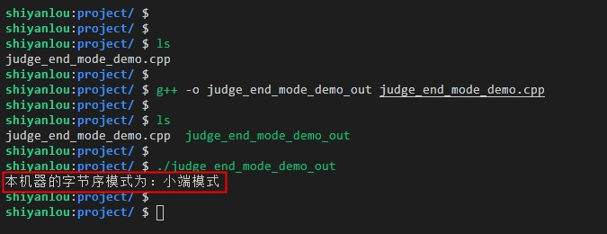

# TCP Socket 编程实现

## 实验介绍

关于网络编程其实在互联网中应用是非常广泛的，本实验将从网络编程的基础知识入手，主要介绍网络中的典型协议、端口、网络分层模型以及通信过程，为后续的实验打下基础。

#### 知识点

- 网络套接字
- 网络字节序
- Socket 模型创建流程
- TCP-C/S 模型实现

## 网络套接字

#### 套接字 Socket 的介绍

- 什么是 Socket

我们从英文的翻译可以知道 Socket 本身表示插座的意思。顾名思义，插座是可以用来充电的，而插孔就像端口一样，同一时间不能被其它进程占用，而我们建立网络连接就像把插头插在这个插座上一样，可以创建一个 Socket 实例来使用，从而进行网络中的数据传递。

在网络环境中，其实 Socket 就是我们平时所说的“套接字”，主要用于表示程序进程间网络通信的一种特殊文件类型。在 Linux 环境下，一切皆为文件，而 Socket 的本质则是内核中在缓冲区形成的一种伪文件。Socket 的类型既然是属于文件，那么理所当然的，我们就可以使用文件描述符来引用 Socket。

由于 Socket 可以应用于网络进程间的通信（数据的传递），所以 Linux 系统内核为了对外统一接口调用，已经将 Socket 封装成了文件，对于开发者来说，读写 Socket 的操作就像跟读写文件的操作一样，有点类似与 Linux 环境中的管道，区别就是管道主要应用于本地进程间的通信，而 Socket 应用于网络进程间的数据传递比较多。

在 TCP/IP 协议的描述中，网络应用中的一个进程是由 IP 地址+TCP 或 UDP 中的端口号来唯一标识的，即`IP:PORT`表示，也可以把该进程理解为一个 Socket。同样，如果要想在两个进程间建立连接来进行通信，则需要在两个进程各自创建一个 Socket 来标识，这样两个进程中的 Socket 就组成了一个 Socket 对，那么这个 Socket 对也就唯一标识了一个网络连接，因此也就可以用 Socket 来描述网络连接的一对一关系了。

我们经常说到的 Socket 在网络通信中的位置可以参考下图：


事实上，Socket 是一个封装好的抽象层，主要作用于应用层和传输层之间。也可以把 Socket 看作是应用层和传输层之间的通信介质，它把网络中数据传递的复杂操作抽象为几个简单的函数或者说是接口（API），提供给应用层和传输层使用，实现网络进程间的通信（数据传递）。

Socket 的由来可以说是起源于 UNIX，前面提到过，在 Unix 环境一切皆文件的设计思想下，进程间的通信就可以理解为对文件描述符之间的一些操作。Socket 是一种类似可以操作文件那样：打开—读/写—关闭模式的实现，放到网络编程的中，就是服务器和客户端各自需要维护一个文件描述符，即图中提到的 ServerFd 和 ClientFd，在两端建立连接成功后，可以向“文件”写入内容供对方读取或者读取对方的内容，通信结束时就关闭“文件”，连接断开。

#### 网络套接字通信原理

通常不同机器上的应用程序（进程）之间是通过 Socket 来发送数据报文，从而来达到通信的目的。在网络通信过程中，Socket 是应用层和传输层之间的一道门，开发者可以操作应用层往传输层传递数据，Socket 在数据传递时会进行相应的处理，比如对数据进行包封装等。

服务器和客户端建立连接并能够进行通信，必须要具备以下两个条件才可以：

1. 服务器端的程序（进程）和客户端程序（进程）不能处于休眠状态，即需要处于运行的状态；
2. 服务器端的程序（进程）和客户端程序（进程）必须创建有套接字（Socket）。

套接字 Socket 的通信原理可以大致用下图的流程表示：


由以上 Socket 通信图可知，在网络通信过程中，套接字需要是成对存在的，否则进程间将不能进行通信。一端（服务端）的发送缓冲区对应另一端（客户端）的接收缓冲区，各自都会维护的一个文件描述符来进行网络操作。

## 网络字节序

#### 网络字节序的介绍

网络字节序，从字面的意思理解就是在网络中字节存储的顺序，而在网络编程中实际指的就是大于一个字节类型的数据在内存中的存放顺序。

我们知道，内存地址有高地址位和低地址位之分，平时开发中操作内存地址时，多字节数据相对于内存地址会有大端和小端之分，同样，在网络中数据流存放也有大端和小端之分，那么什么是大端，什么又是小端呢？

一般不同的电脑主机会有不同的网络字节序，确切的说不同的 CPU 会有不同的字节序类型，这些字节序是指数据在内存中保存的顺序，这个也叫做主机序。最常见的主机序有以下两种：

1. 小端字节序（Little endian） ：将高位字节存储在内存的高地址处，而低位字节存储在内存的低地址处。
2. 大端字节序（Big endian） ：将高位字节存储在内存的低地址处，低位字节存储在内存的高地址处。

另外，网络传输的数据流是按照这么个顺序发送和接收的：发送主机通常会按内存地址从低到高将发送存放区（缓冲区）中的数据发送出去，接收主机则也会按内存地址从低到高的顺序把从网络中接收到的数据，以字节的形式保存在接收缓冲区中，因此，网络数据流通常规定低地址先发出数据，高地址后发出数据。

但是，需要注意的是，在网络程序开发亦或是在跨平台开发时，应当尽可能的保持只用一种字节序，否则网络通信双方对数据的解析就会有所不一样，从而会产生问题。
实际上，在平时程序开发中，大多数人都很少会直接操作字节序，因为有已经封装好相应的库来间接的操作字节序，而且在跨平台以及网络程序开发中，字节序才会被考虑应用进来。

为了在开发中使网络程序更具有通用性和可移植性，在编写 C 代码时，可以使用以下封装好的库函数来做主机字节序和网络字节序之间的转换，这样无论在大端和小端的机器上编译后，都可以正常运行。

```c
#include <arpa/inet.h>

uint32_t htonl(uint32_t hostlong);      // 将 long 类型从主机序转换为网络序
uint16_t htons(uint16_t hostshort);     // 将 short 类型从主机序转换为网络序
uint32_t ntohl(uint32_t netlong);       // 将 long 类型从网络序转换为主机序
uint16_t ntohs(uint16_t netshort);      // 将 short 类型从网络序转换为主机序
```

以上的库函数也比较好记，htonl 的前缀 h 表示主机（host）的意思，ntohl 的前缀 n 表示网络（network）的意思，这两个函数的后缀 l 表示长整数（long），s 则表示短整数（short）。

那么怎么查看自己的机器是大端模式还是小端模式呢，下面通过一个小案例来给大家讲解下：

先来看看以下的一段示例代码（c++）：

```c++
/*
    文件名：judge_end_mode_demo.cpp
*/

#include <iostream>
using namespace std;

// 判断大小端函数
void judge_big_little_end()
{
    cout << "本机器的字节序模式为：";   // 打印输出
    int i = 1;                     // 定义 int 变量 i
    char c = *(char*)&i;          // 将 i 的地址强转为 char* 类型，为了能够拿到 i 的地址

    // 如果 c 为 1，则为小端存储模式，否则为大端模式
    if (c)
    {
        cout << "小端模式" <<endl;
    }
    else
    {
        cout << "大端模式" <<endl;
    }
}

// 主函数
int main()
{
    // 调用判断大小端的函数
    judge_big_little_end();
    return 0;
}
```

通过代码的注释可以知道，判断是大端还是小端模式可以简单总结为以下步骤：

1. 定义一个整型（int）变量 i，赋值为 1;
2. 将 i 的地址拿到后（&i），强制转为 char\* 类型，此时就可以拿到 i 的低地址了；
3. 然后再进行判断，如果低地址是 1 ，则就是小端模式存放，如果是 0 ，则就是大端模式了。

编译以上示例代码，并运行编译后的文件，可以看到会输出如下图所示的结果：



其中源文件为：`judge_end_mode_demo.cpp`，编译后的目标文件为：`judge_end_mode_demo_out`，编译源文件的命令为：`g++ -o judge_end_mode_demo_out judge_end_mode_demo.cpp`。  
可以看到上图中运行编译后的文件 `./judge_end_mode_demo_out` 后，输出的结果为：“本机器的字节序模式为：小端模式”，说明该机器用的是小端模式。

## 网络套接字 Socket 模型

#### 模型的创建流程

首先我们来看下 Socket 模型的创建流程，如下图所示：


根据以上 socket 模型的创建流程，可以简单归纳为以下几个步骤：

1. 首先服务器会根据编写程序时定义的协议、地址类型（ipv4 或 ipv6）和套接字类型（TCP 流或 UDP 数据报）来创建 socket。
2. 服务器为 socket 绑定 ip 地址和端口号，这样可以标识为一个进程，实际上是进行本地和套接字的捆绑。
3. 服务器绑定好地址之后，就会用 socket 实时监听前面绑定好的端口号，准备就绪的接收客户端从该端口发来的请求连接，但是此时的服务器的 socket 并没有被打开。
4. 同样，客户端也需要创建 socket，其创建流程和原理跟服务器端类似，也都是调用封装好的库函数 socket()来创建，传入的参数类型下面到函数解析时会讲到。
5. 在客户端创建好 socket 后，会打开 socket，然后根据服务器的 ip 地址和端口号，尝试连接到服务器的 socket。
6. 由于前面的服务器已经处于监听状态，当有客户端连接进来时，服务器的 socket 就会接收到客户端 socket 的请求，此时就会被动打开，开始接收客户端请求，然后执行建立连接的过程（实际上就是实验二讲到的三次握手的过程），连接建立好后，客户端会返回连接信息，这时候 socket 进入阻塞状态，即调用 accept()函数直到客户端响应返回信息后才会返回就绪状态，然后又开始接收下一个客户端的连接请求。
7. 当客户端连接成功后，会向服务器发送连接状态信息，然后服务器 accept 函数返回，从而也连接成功。
8. 服务器和客户端双方连接成功后，客户端向 socket 写入信息，服务器读取信息，或者服务器向 socket 发送信息，客户端接收信息。
9. 最后双方发送和接收完信息后，就会断开连接（实验二讲到的四次握手的过程），服务器端和客户端就会关闭。

#### 模型的函数解析

- 创建套接字 -- socket()函数

socket()函数用于根据指定的地址族，数据类型和协议来分配一个套接字的描述字及其所用的资源。  
先来看下 socket()函数原型：

```c
#include <sys/socket.h>
int socket(int domain, int type, int protocol);
```

socket 函数有三个参数，而且都是整型（int）类型。  
其中 domain 表示套接字选择使用的协议族，我们平时一般常用的有以下几种：

1. AF_INET 比较常用的一种 socket 协议类型，表示创建的套接字选择用 TCP 或 UDP 来传输（即用 ipv4 的地址）；
2. AF_INET6 与上面的 AF_INET 比较相似，不同的是 AF_INET 用的是 ipv4 地址，而 AF_INET6 则是用 ipv6 的地址；
3. AF_UNIX 表示本地协议，在 Unix 或 Linux 系统环境上使用的比较多，我们平时在本地开发调试时，一般会将客户端和服务器放在同一台机器上，这样就可以选择 AF_UNIX 来使用了。

type 参数表示套接字类型，常用的类型有：

1. SOCK_STREAM（TCP 协议）这种套接字类型是面向连接、有顺序、可靠的，且数据传输是基于字节流的，另外，具有拥塞控制机制（流量控制），因此，这种套接字类型是最常被选择使用的；
2. SOCK_DGRAM（UDP协议）这个协议是面向无连接的、有固定长度的传输调用。该协议是不可靠的，使用 UDP 来进行它的连接。
3. SOCK_SEQPACKET 该协议是双线路的、可靠的连接，发送固定长度的数据包进行传输。必须把这个包完整的接受才能进行读取。
4. SOCK_RAW socket 类型提供单一的网络访问，这个 socket 类型使用 ICMP 公共协议。（ping、traceroute 使用该协议）

protocol 参数表示真正使用的协议：传 0 值表示使用默认的协议。

返回值：
成功：返回指向新创建的 socket 的文件描述符，失败：返回-1，设置 errno

## TCP-C/S 模型实现

#### 基于 C 语言实现

- 服务端 server

- 客户端 client

#### 基于 Go 语言实现

- 服务端 server

- 客户端 client

## TCP 粘包

#### 粘包的介绍

#### 粘包示例代码（Go 语言实现）

#### 解决粘包的方法

## 实验总结

网络的核心基础是一系列协议，而网络编程则是基于这些协议，对网络中的数据进行处理传输等。掌握好网络编程的基础，意味着为后面实操网络编程的实验做准备，希望同学们能够沉下心来把基础打牢。
