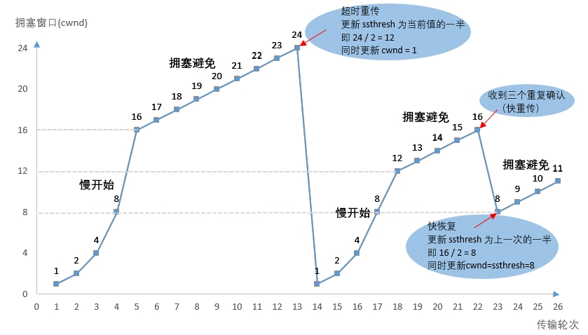

# TCP 原理详解

## 实验介绍

在此撰写实验介绍内容。

#### 知识点

- TCP 通信时序
- TCP 流量和拥塞控制
- TCP 通信过程状态转换
- TCP 半关闭状态
- TIME_WAIT 和 2MSL

## TCP 通信时序

#### TCP 通信时序图

TCP 连接建立和断开的过程中，就包括大家所熟知的三次握手和四次握手。一次 TCP 通信的时序如下图所示：


在这个例子中，首先客户端主动发起连接、发送请求，然后服务器端响应请求，然后客户端主动关闭连接。两条竖线表示通讯的两端，从上到下表示时间的先后顺序，注意，数据从一端传到网络的另一端也需要时间，所以图中的箭头都是斜的。双方发送的段按时间顺序编号为 1-10，各段中的主要信息在箭头上标出，例如段 2 的箭头上标着 SYN, 8000(0), ACK1001, ，表示该段中的 SYN 位置 1，32 位序号是 8000，该段不携带有效载荷（数据字节数为 0），ACK 位置 1，32 位确认序号是 1001，带有一个 mss（Maximum Segment Size，最大报文长度）选项值为 1024。

建立连接（三次握手）的过程：

1. 客户端发送一个带 SYN 标志的 TCP 报文到服务器。这是三次握手过程中的段 1。
   客户端发出段 1，SYN 位表示连接请求。序号是 1000，这个序号在网络通讯中用作临时的地址，每发一个数据字节，这个序号要加 1，这样在接收端可以根据序号排出数据包的正确顺序，也可以发现丢包的情况，另外，规定 SYN 位和 FIN 位也要占一个序号，这次虽然没发数据，但是由于发了 SYN 位，因此下次再发送应该用序号 1001。mss 表示最大段尺寸，如果一个段太大，封装成帧后超过了链路层的最大帧长度，就必须在 IP 层分片，为了避免这种情况，客户端声明自己的最大段尺寸，建议服务器端发来的段不要超过这个长度。
2. 服务器端回应客户端，是三次握手中的第 2 个报文段，同时带 ACK 标志和 SYN 标志。它表示对刚才客户端 SYN 的回应；同时又发送 SYN 给客户端，询问客户端是否准备好进行数据通讯。
   服务器发出段 2，也带有 SYN 位，同时置 ACK 位表示确认，确认序号是 1001，表示“我接收到序号 1000 及其以前所有的段，请你下次发送序号为 1001 的段”，也就是应答了客户端的连接请求，同时也给客户端发出一个连接请求，同时声明最大尺寸为 1024。
3. 客户必须再次回应服务器端一个 ACK 报文，这是报文段 3。
   客户端发出段 3，对服务器的连接请求进行应答，确认序号是 8001。在这个过程中，客户端和服务器分别给对方发了连接请求，也应答了对方的连接请求，其中服务器的请求和应答在一个段中发出，因此一共有三个段用于建立连接，称为“三方握手（three-way-handshake）”。在建立连接的同时，双方协商了一些信息，例如双方发送序号的初始值、最大段尺寸等。

在 TCP 通讯中，如果一方收到另一方发来的段，读出其中的目的端口号，发现本机并没有任何进程使用这个端口，就会应答一个包含 RST 位的段给另一方。例如，服务器并没有任何进程使用 8080 端口，我们却用 telnet 客户端去连接它，服务器收到客户端发来的 SYN 段就会应答一个 RST 段，客户端的 telnet 程序收到 RST 段后报告错误。

数据传输的过程：

1. 客户端发出段 4，包含从序号 1001 开始的 20 个字节数据。
2. 服务器发出段 5，确认序号为 1021，对序号为 1001-1020 的数据表示确认收到，同时请求发送序号 1021 开始的数据，服务器在应答的同时也向客户端发送从序号 8001 开始的 10 个字节数据，这称为 piggyback。
3. 客户端发出段 6，对服务器发来的序号为 8001-8010 的数据表示确认收到，请求发送序号 8011 开始的数据

在数据传输过程中，ACK 和确认序号是非常重要的，应用程序交给 TCP 协议发送的数据会暂存在 TCP 层的发送缓冲区中，发出数据包给对方之后，只有收到对方应答的 ACK 段才知道该数据包确实发到了对方，可以从发送缓冲区中释放掉了，如果因为网络故障丢失了数据包或者丢失了对方发回的 ACK 段，经过等待超时后 TCP 协议自动将发送缓冲区中的数据包重发。

关闭连接（四次握手）的过程：

由于 TCP 连接是全双工的，因此每个方向都必须单独进行关闭。这原则是当一方完成它的数据发送任务后就能发送一个 FIN 来终止这个方向的连接。收到一个 FIN 只意味着这一方向上没有数据流动，一个 TCP 连接在收到一个 FIN 后仍能发送数据。首先进行关闭的一方将执行主动关闭，而另一方执行被动关闭。

1. 客户端发出段 7，FIN 位表示关闭连接的请求。
2. 服务器发出段 8，应答客户端的关闭连接请求。
3. 服务器发出段 9，其中也包含 FIN 位，向客户端发送关闭连接请求。
4. 客户端发出段 10，应答服务器的关闭连接请求。

建立连接的过程是三方握手，而关闭连接通常需要 4 个段，服务器的应答和关闭连接请求通常不合并在一个段中，因为有连接半关闭的情况，这种情况下客户端关闭连接之后就不能再发送数据给服务器了，但是服务器还可以发送数据给客户端，直到服务器也关闭连接为止。

## TCP 流量和拥塞控制

#### TCP 流量控制（滑动窗口）

介绍 UDP 时我们描述了这样的问题：如果发送端发送的速度较快，接收端接收到数据后处理的速度较慢，而接收缓冲区的大小是固定的，就会丢失数据。TCP 协议通过“滑动窗口（Sliding Window）”机制解决这一问题。看下图的通讯过程：

1. 发送端发起连接，声明最大段尺寸是 1460，初始序号是 0，窗口大小是 4K，表示“我的接收缓冲区还有 4K 字节空闲，你发的数据不要超过 4K”。接收端应答连接请求，声明最大段尺寸是 1024，初始序号是 8000，窗口大小是 6K。发送端应答，三方握手结束。
2. 发送端发出段 4-9，每个段带 1K 的数据，发送端根据窗口大小知道接收端的缓冲区满了，因此停止发送数据。
3. 接收端的应用程序提走 2K 数据，接收缓冲区又有了 2K 空闲，接收端发出段 10，在应答已收到 6K 数据的同时声明窗口大小为 2K。
4. 接收端的应用程序又提走 2K 数据，接收缓冲区有 4K 空闲，接收端发出段 11，重新声明窗口大小为 4K。
5. 发送端发出段 12-13，每个段带 2K 数据，段 13 同时还包含 FIN 位。
6. 接收端应答接收到的 2K 数据（6145-8192），再加上 FIN 位占一个序号 8193，因此应答序号是 8194，连接处于半关闭状态，接收端同时声明窗口大小为 2K。
7. 接收端的应用程序提走 2K 数据，接收端重新声明窗口大小为 4K。
8. 接收端的应用程序提走剩下的 2K 数据，接收缓冲区全空，接收端重新声明窗口大小为 6K。
9. 接收端的应用程序在提走全部数据后，决定关闭连接，发出段 17 包含 FIN 位，发送端应答，连接完全关闭。

上图在接收端用小方块表示 1K 数据，实心的小方块表示已接收到的数据，虚线框表示接收缓冲区，因此套在虚线框中的空心小方块表示窗口大小，从图中可以看出，随着应用程序提走数据，虚线框是向右滑动的，因此称为滑动窗口。
从这个例子还可以看出，发送端是一 K 一 K 地发送数据，而接收端的应用程序可以两 K 两 K 地提走数据，当然也有可能一次提走 3K 或 6K 数据，或者一次只提走几个字节的数据。也就是说，应用程序所看到的数据是一个整体，或说是一个流（stream），在底层通讯中这些数据可能被拆成很多数据包来发送，但是一个数据包有多少字节对应用程序是不可见的，因此 TCP 协议是面向流的协议。而 UDP 是面向消息的协议，每个 UDP 段都是一条消息，应用程序必须以消息为单位提取数据，不能一次提取任意字节的数据，这一点和 TCP 是很不同的

#### TCP 拥塞控制

在某段时间，若对网络中某一资源的需求超过了该资源所能提供的可用部分，网络性能就要变坏。这种情况就叫做拥塞。在计算机网络中的链路带宽、交换节点中的缓存和处理机制等，都属于网络的资源。

若出现拥塞而不进行控制，整个网络的吞吐量将随输入负荷的增大而下降。这一点我们并不难理解，我们生活中就有这样的例子，比如某个没有交通灯控制的十字路口，出现了轻微的堵车（阻塞），如果没有交警的疏导，随着进入该公路的车流量的增大，拥堵情况就会越来越严重，甚至导致该路口被彻底堵死。

下面我们来看一个图，说明拥塞控制所起的作用：


图中横坐标是提供的负荷，表示单位时间内输入给网络的分组数量；纵坐标是吞吐量，表示单位时间内从网络输出的吞吐数量。

具有理想拥塞控制的网络，在吞吐量达到饱和之前，吞吐量约等于所输入的负荷；当输入的负荷超过某一限度时，由于网络资源受限，吞吐量就不再增长而保持水平线，也就是吞吐量达到饱和，这就表明有一部分输入的负荷开始损失掉了，但是，在这种情况下，网络中的吞吐量仍能维持其所能达到的最大值。

然而，实际中的网络情况就没那么理想了，我们先来看无拥塞控制的那条曲线，随着输入负荷的增大，网络中的吞吐量的增长率（曲线的斜率）逐渐减小，也就是该网络吞吐量还未达到饱和时，就已经有一部分的输入分组被丢弃了。当网络的吞吐量明显的小于理想的吞吐量时，就开始出现拥塞了，更值得注意的是，当输入负荷到达某一数值时，网络的吞吐量反而随输入负荷的增大而下降，这时就出现网络拥塞状态，如果输入的负荷仍继续增大，网络的吞吐量就会下降到 0，此时网络就无法工作了。

因此，进行拥塞控制是很有必要的，它是一个动态的过程：发送方维持一个拥塞窗口 cwnd 的状态变量，其值的大小取决于网络的拥塞程度，并且动态地在变化。

拥塞窗口 cwnd 的控制原则是：只要网络没有出现拥塞，拥塞窗口就再增大一些，以便把更多的分组发送出去；但只要网络出现拥塞，拥塞窗口就减小一些，以减少输入到网络中的分组数。

下面我们来看看 TCP 发送端和接收端数据传输的过程，如下图所示：


发送端将拥塞窗口作为发送窗口，即 swnd = cwnd，并维护一个慢开始门限 ssthresh 状态变量：

- 当 cwnd < ssthresh 时，使用慢开始算法；

- 当 cwnd > ssthresh 时，停止使用慢开始算法而改用拥塞避免算法；

- 当 cwnd = ssthresh 时，既可使用慢开始算法，也可使用拥塞控制避免算法。

TCP 拥塞控制的几种算法介绍：

- 慢开始

当主机开始发送数据时，如果立即将大量数据字节注入到网络，那么就有可能引起网络拥塞，因为现在并不清楚网络的负荷情况。因此，较好的方法是先探测一下，即由小到大逐渐增大发送窗口，也就是说，由小到大逐渐增大拥塞窗口数值。

通常在刚刚开始发送报文段时，先把拥塞窗口 cwnd 设置为一个最大报文段 MSS 的数值。而在每收到一个对新的报文段的确认后，把拥塞窗口增加至多一个 MSS 的数值。用这样的方法逐步增大发送方的拥塞窗口 cwnd ，可以使分组注入到网络的速率更加合理。

- 拥塞避免

让拥塞窗口 cwnd 缓慢地增大，即每经过一个往返时间 RTT 就把发送方的拥塞窗口 cwnd 加 1，而不是加倍。这样拥塞窗口 cwnd 按线性规律缓慢增长，比慢开始算法的拥塞窗口增长速率缓慢得多。

无论在慢开始阶段还是在拥塞避免阶段，只要发送方判断网络出现拥塞（其根据就是没有收到确认），就要把慢开始门限 ssthresh 设置为出现拥塞时的发送 方窗口值的一半（但不能小于 2）。然后把拥塞窗口 cwnd 重新设置为 1，执行慢开始算法。这样做的目的就是要迅速减少主机发送到网络中的分组数，使得发生 拥塞的路由器有足够时间把队列中积压的分组处理完毕。

- 快重传

快重传算法首先要求接收方每收到一个失序的报文段后就立即发出重复确认（为的是使发送方及早知道有报文段没有到达对方）而不要等到自己发送数据时才进行捎带确认。
接收方收到了 M1 和 M2 后都分别发出了确认。现在假定接收方没有收到 M3 但接着收到了 M4。

显然，接收方不能确认 M4，因为 M4 是收到的失序报文段。根据 可靠传输原理，接收方可以什么都不做，也可以在适当时机发送一次对 M2 的确认。

但按照快重传算法的规定，接收方应及时发送对 M2 的重复确认，这样做可以让 发送方及早知道报文段 M3 没有到达接收方。发送方接着发送了 M5 和 M6。接收方收到这两个报文后，也还要再次发出对 M2 的重复确认。这样，发送方共收到了 接收方的四个对 M2 的确认，其中后三个都是重复确认。

快重传算法还规定，发送方只要一连收到三个重复确认就应当立即重传对方尚未收到的报文段 M3，而不必 继续等待 M3 设置的重传计时器到期。

由于发送方尽早重传未被确认的报文段，因此采用快重传后可以使整个网络吞吐量提高约 20%。

- 快恢复

与快重传配合使用的还有快恢复算法，其过程有以下两个要点：
当发送方连续收到三个重复确认，就执行“乘法减小”算法，把慢开始门限 ssthresh 减半。
与慢开始不同之处是现在不执行慢开始算法（即拥塞窗口 cwnd 现在不设置为 1），而是把 cwnd 值设置为 慢开始门限 ssthresh 减半后的数值，然后开始执行拥塞避免算法（“加法增大”），使拥塞窗口缓慢地线性增大。

几种算法在 TCP 拥塞控制过程的应用，如下图所示：



## TCP 通信过程状态转换

#### TCP 状态转换图


#### 通信过程各状态解析

- CLOSED：表示初始状态。
- LISTEN：该状态表示服务器端的某个 SOCKET 处于监听状态，可以接受连接。
- SYN_SENT：这个状态与 SYN_RCVD 遥相呼应，当客户端 SOCKET 执行 CONNECT 连接时，它首先发送 SYN 报文，随即进入到了 SYN_SENT 状态，并等待服务端的发送三次握手中的第 2 个报文。SYN_SENT 状态表示客户端已发送 SYN 报文。
- SYN_RCVD：d 该状态表示接收到 SYN 报文，在正常情况下，这个状态是服务器端的 SOCKET 在建立 TCP 连接时的三次握手会话过程中的一个中间状态，很短暂。此种状态时，当收到客户端的 ACK 报文后，会进入到 ESTABLISHED 状态。
- ESTABLISHED：表示连接已经建立，即数据传输过程中。
- TIME_WAIT: 表示收到了对方的 FIN 报文，并发送出了 ACK 报文，等 2MSL 后即可回到 CLOSED 可用状态。如果 FIN_WAIT 状态下，收到对方同时带 FIN 标志和 ACK 标志的报文时，可以直接进入到 TIME_WAIT 状态。
- CLOSING：这种状态较特殊，属于一种较罕见的状态。正常情况下，当你发送 FIN 报文后，按理来说是应该先收到（或同时收到）对方的 ACK 报文，再收到对方的 FIN 报文。但是 CLOSING 状态表示你发送 FIN 报文后，并没有收到对方的 ACK 报文，反而却也收到了对方的 FIN 报文。什么情况下会出现此种情况呢？如果双方几乎在同时 close 一个 SOCKET 的话，那么就出现了双方同时发送 FIN 报文的情况，也即会出现 CLOSING 状态，表示双方都正在关闭 SOCKET 连接。
- CLOSE_WAIT：此种状态表示在等待关闭。当对方关闭一个 SOCKET 后发送 FIN 报文给自己，系统会回应一个 ACK 报文给对方，此时则进入到 CLOSE_WAIT 状态。接下来呢，察看是否还有数据发送给对方，如果没有可以 close 这个 SOCKET，发送 FIN 报文给对方，即关闭连接。所以在 CLOSE_WAIT 状态下，需要关闭连接。
- LAST_ACK：该状态是被动关闭一方在发送 FIN 报文后，最后等待对方的 ACK 报文。当收到 ACK 报文后，即可以进入到 CLOSED 可用状态。

## TCP 半关闭状态

在 TCP 通信连接中，主动关闭端（一般为客户端）发送 FIN 请求关闭，被动关闭端（一般为服务器端）回应 ACK 后，服务器端没有立即发送 FIN 给客户端时，则客户端处于半关闭状态，此时客户端还可以接收服务器端发送的数据，但是客户端已不能再向服务器端发送数据了，相当于把文件描述符的写缓冲区操作关闭了。半关闭状态通常发生在主动关闭端。

有以下两点需要注意:

1. 如果有多个进程共享一个套接字，close 每被调用一次，计数减 1，直到计数为 0 时，也就是所用进程都调用了 close，套接字将被释放。
2. 在多进程中如果一个进程调用了 shutdown(sfd, SHUT_RDWR)后，其它的进程将无法进行通信。但，如果一个进程 close(sfd)将不会影响到其它进程。

## TIME_WAIT 和 2MSL

#### MSL 代表的含义

MSL 表示报文段最大生存时间，它是任何报文段被丢弃前在网络内的最长时间

#### 为什么 TIME_WAIT 等待的是 2MSL

TIME_WAIT 状态等待时间为 2MSL 的理由：

- 让 4 次握手关闭流程更加可靠：4 次握手的最后一个 ACK 是由主动关闭方发送出去的，若这个 ACK 丢失，被动关闭方会再次发一个 FIN 过来。若主动关闭方能够保持一个 2MSL 的 TIME_WAIT 状态，则有更大的机会让丢失的 ACK 被再次发送出去。
- 如果主机 1 直接 CLOSED，然后又再向主机 2 发起一个新连接，我们不能保证这个新连接与刚关闭的连接的端口号是不同的。也就是说有可能新连接和老连接的端口号是相同的。一般来说不会发生什么问题，但是还是有特殊情况出现：假设新连接和已经关闭的老连接端口号是一样的，如果前一次连接的某些数据仍然滞留在网络中，这些延迟数据在建立新连接之后才到达主机 2，由于新连接和老连接的端口号是一样的，TCP 协议就认为那个延迟的数据是属于新连接的，这样就和真正的新连接的数据包发生混淆了。所以 TCP 连接还要在 TIME_WAIT 状态等待 2 倍 MSL，这样可以保证本次连接的所有数据都从网络中消失。

#### TIME_WAIT 状态 TCP 连接过多的问题

一般高并发的场景会出现批量的 TIME_WAIT 的 TCP 连接，短时间后，所有的 TIME_WAIT 全都消失，被回收，端口包括服务，均正常。即，在高并发的场景下，TIME_WAIT 连接存在，属于正常现象。

Nginx 作为反向代理时，大量的短链接，可能导致 Nginx 上的 TCP 连接处于 time_wait 状态：

1. 每一个 time_wait 状态，都会占用一个「本地端口」，上限为 65535(16 bit，2 Byte)；
2. 当大量的连接处于 time_wait 时，新建立 TCP 连接会出错，address already in use : connect 异常。

统计 TCP 连接的状态：


大量的 TIME_WAIT 状态 TCP 连接存在，其本质原因是什么？

1. 大量的短连接存在
2. 特别是 HTTP 请求中，如果 connection 头部取值被设置为 close 时，基本都由「服务端」发起主动关闭连接
3. 而 TCP 四次挥手关闭连接机制中，为了保证 ACK 重发和丢弃延迟数据，设置 time_wait 为 2 倍的 MSL（报文最大存活时间）

解决上述 time_wait 状态大量存在，导致新连接创建失败的问题，一般解决办法：

1. 客户端，HTTP 请求的头部，connection 设置为 keep-alive，保持存活一段时间：现在的浏览器，一般都这么进行了
2. 服务器端允许 time_wait 状态的 socket 被重用，缩减 time_wait 时间，设置为 1 MSL（即，2 mins）

#### 端口复用

在 server 的 TCP 连接没有完全断开之前不允许重新监听是不合理的。因为，TCP 连接没有完全断开指的是 connfd（127.0.0.1:6666）没有完全断开，而我们重新监听的是 lis-tenfd（0.0.0.0:6666），虽然是占用同一个端口，但 IP 地址不同，connfd 对应的是与某个客户端通讯的一个具体的 IP 地址，而 listenfd 对应的是 wildcard address。解决这个问题的方法是使用 setsockopt()设置 socket 描述符的选项 SO_REUSEADDR 为 1，表示允许创建端口号相同但 IP 地址不同的多个 socket 描述符。
在 server 代码的 socket()和 bind()调用之间插入如下代码：
```c
int opt = 1;
setsockopt(listenfd, SOL_SOCKET, SO_REUSEADDR, &opt, sizeof(opt));
```

## 实验总结

在此撰写实验总结内容。
