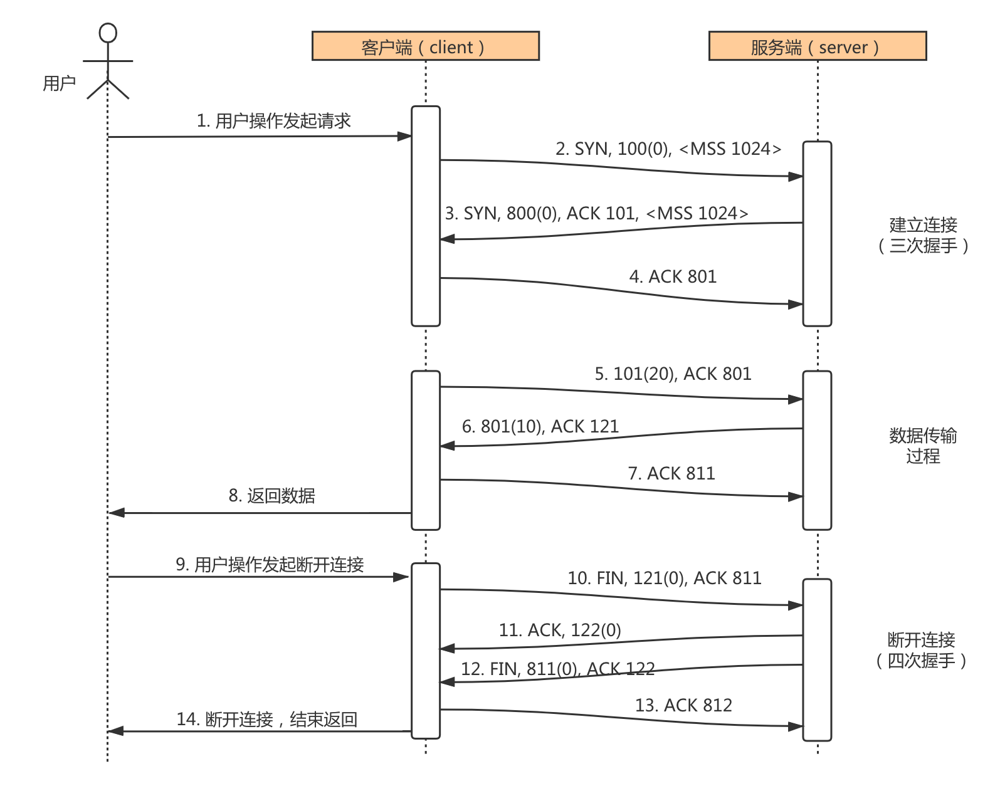

# TCP 原理详解

## 实验介绍

在此撰写实验介绍内容。

#### 知识点

- TCP 通信时序
- TCP 拥塞控制
- TCP 通信过程状态转换
- TCP 半关闭状态
- TIME_WAIT 和 2MSL

## TCP 通信时序

#### TCP 通信时序图

TCP 连接建立和断开的过程中，就包括大家所熟知的三次握手和四次握手。一次 TCP 通信的时序如下图所示：

在这个例子中，首先客户端主动发起连接、发送请求，然后服务器端响应请求，然后客户端主动关闭连接。两条竖线表示通讯的两端，从上到下表示时间的先后顺序，注意，数据从一端传到网络的另一端也需要时间，所以图中的箭头都是斜的。双方发送的段按时间顺序编号为 1-10，各段中的主要信息在箭头上标出，例如段 2 的箭头上标着 SYN, 8000(0), ACK1001, ，表示该段中的 SYN 位置 1，32 位序号是 8000，该段不携带有效载荷（数据字节数为 0），ACK 位置 1，32 位确认序号是 1001，带有一个 mss（Maximum Segment Size，最大报文长度）选项值为 1024。

建立连接（三次握手）的过程：

1. 客户端发送一个带 SYN 标志的 TCP 报文到服务器。这是三次握手过程中的段 1。
   客户端发出段 1，SYN 位表示连接请求。序号是 1000，这个序号在网络通讯中用作临时的地址，每发一个数据字节，这个序号要加 1，这样在接收端可以根据序号排出数据包的正确顺序，也可以发现丢包的情况，另外，规定 SYN 位和 FIN 位也要占一个序号，这次虽然没发数据，但是由于发了 SYN 位，因此下次再发送应该用序号 1001。mss 表示最大段尺寸，如果一个段太大，封装成帧后超过了链路层的最大帧长度，就必须在 IP 层分片，为了避免这种情况，客户端声明自己的最大段尺寸，建议服务器端发来的段不要超过这个长度。
2. 服务器端回应客户端，是三次握手中的第 2 个报文段，同时带 ACK 标志和 SYN 标志。它表示对刚才客户端 SYN 的回应；同时又发送 SYN 给客户端，询问客户端是否准备好进行数据通讯。
   服务器发出段 2，也带有 SYN 位，同时置 ACK 位表示确认，确认序号是 1001，表示“我接收到序号 1000 及其以前所有的段，请你下次发送序号为 1001 的段”，也就是应答了客户端的连接请求，同时也给客户端发出一个连接请求，同时声明最大尺寸为 1024。
3. 客户必须再次回应服务器端一个 ACK 报文，这是报文段 3。
   客户端发出段 3，对服务器的连接请求进行应答，确认序号是 8001。在这个过程中，客户端和服务器分别给对方发了连接请求，也应答了对方的连接请求，其中服务器的请求和应答在一个段中发出，因此一共有三个段用于建立连接，称为“三方握手（three-way-handshake）”。在建立连接的同时，双方协商了一些信息，例如双方发送序号的初始值、最大段尺寸等。

在 TCP 通讯中，如果一方收到另一方发来的段，读出其中的目的端口号，发现本机并没有任何进程使用这个端口，就会应答一个包含 RST 位的段给另一方。例如，服务器并没有任何进程使用 8080 端口，我们却用 telnet 客户端去连接它，服务器收到客户端发来的 SYN 段就会应答一个 RST 段，客户端的 telnet 程序收到 RST 段后报告错误。

数据传输的过程：

1. 客户端发出段 4，包含从序号 1001 开始的 20 个字节数据。
2. 服务器发出段 5，确认序号为 1021，对序号为 1001-1020 的数据表示确认收到，同时请求发送序号 1021 开始的数据，服务器在应答的同时也向客户端发送从序号 8001 开始的 10 个字节数据，这称为 piggyback。
3. 客户端发出段 6，对服务器发来的序号为 8001-8010 的数据表示确认收到，请求发送序号 8011 开始的数据

在数据传输过程中，ACK 和确认序号是非常重要的，应用程序交给 TCP 协议发送的数据会暂存在 TCP 层的发送缓冲区中，发出数据包给对方之后，只有收到对方应答的 ACK 段才知道该数据包确实发到了对方，可以从发送缓冲区中释放掉了，如果因为网络故障丢失了数据包或者丢失了对方发回的 ACK 段，经过等待超时后 TCP 协议自动将发送缓冲区中的数据包重发。

关闭连接（四次握手）的过程：

由于 TCP 连接是全双工的，因此每个方向都必须单独进行关闭。这原则是当一方完成它的数据发送任务后就能发送一个 FIN 来终止这个方向的连接。收到一个 FIN 只意味着这一方向上没有数据流动，一个 TCP 连接在收到一个 FIN 后仍能发送数据。首先进行关闭的一方将执行主动关闭，而另一方执行被动关闭。

1. 客户端发出段 7，FIN 位表示关闭连接的请求。
2. 服务器发出段 8，应答客户端的关闭连接请求。
3. 服务器发出段 9，其中也包含 FIN 位，向客户端发送关闭连接请求。
4. 客户端发出段 10，应答服务器的关闭连接请求。

建立连接的过程是三方握手，而关闭连接通常需要 4 个段，服务器的应答和关闭连接请求通常不合并在一个段中，因为有连接半关闭的情况，这种情况下客户端关闭连接之后就不能再发送数据给服务器了，但是服务器还可以发送数据给客户端，直到服务器也关闭连接为止。

## TCP 用塞控制

介绍UDP时我们描述了这样的问题：如果发送端发送的速度较快，接收端接收到数据后处理的速度较慢，而接收缓冲区的大小是固定的，就会丢失数据。TCP协议通过“滑动窗口（Sliding Window）”机制解决这一问题。看下图的通讯过程：

1. 发送端发起连接，声明最大段尺寸是 1460，初始序号是 0，窗口大小是 4K，表示“我的接收缓冲区还有 4K 字节空闲，你发的数据不要超过 4K”。接收端应答连接请求，声明最大段尺寸是 1024，初始序号是 8000，窗口大小是 6K。发送端应答，三方握手结束。
2. 发送端发出段 4-9，每个段带 1K 的数据，发送端根据窗口大小知道接收端的缓冲区满了，因此停止发送数据。
3. 接收端的应用程序提走 2K 数据，接收缓冲区又有了 2K 空闲，接收端发出段 10，在应答已收到 6K 数据的同时声明窗口大小为 2K。
4. 接收端的应用程序又提走 2K 数据，接收缓冲区有 4K 空闲，接收端发出段 11，重新声明窗口大小为 4K。
5. 发送端发出段 12-13，每个段带 2K 数据，段 13 同时还包含 FIN 位。
6. 接收端应答接收到的 2K 数据（6145-8192），再加上 FIN 位占一个序号 8193，因此应答序号是 8194，连接处于半关闭状态，接收端同时声明窗口大小为 2K。
7. 接收端的应用程序提走 2K 数据，接收端重新声明窗口大小为 4K。
8. 接收端的应用程序提走剩下的 2K 数据，接收缓冲区全空，接收端重新声明窗口大小为 6K。
9. 接收端的应用程序在提走全部数据后，决定关闭连接，发出段 17 包含 FIN 位，发送端应答，连接完全关闭。

上图在接收端用小方块表示 1K 数据，实心的小方块表示已接收到的数据，虚线框表示接收缓冲区，因此套在虚线框中的空心小方块表示窗口大小，从图中可以看出，随着应用程序提走数据，虚线框是向右滑动的，因此称为滑动窗口。
从这个例子还可以看出，发送端是一 K 一 K 地发送数据，而接收端的应用程序可以两 K 两 K 地提走数据，当然也有可能一次提走 3K 或 6K 数据，或者一次只提走几个字节的数据。也就是说，应用程序所看到的数据是一个整体，或说是一个流（stream），在底层通讯中这些数据可能被拆成很多数据包来发送，但是一个数据包有多少字节对应用程序是不可见的，因此 TCP 协议是面向流的协议。而 UDP 是面向消息的协议，每个 UDP 段都是一条消息，应用程序必须以消息为单位提取数据，不能一次提取任意字节的数据，这一点和 TCP 是很不同的

## 实验总结

在此撰写实验总结内容。
