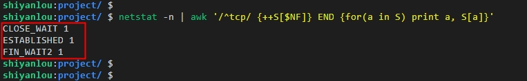

# TCP 原理详解

## 实验介绍

通过实验一的基本介绍，相信大家对网络编程有了初步的认识。接下来本实验将以 TCP 通信的过程和状态解析为例，继续介绍网络编程，好让大家对网络编程的实现原理有更进一步的理解，其目的是希望大家可以做到知其然而知其所以然。

#### 知识点

- TCP 通信时序
- TCP 流量和拥塞控制
- TCP 通信过程状态转换
- TCP 半关闭状态
- TIME_WAIT 和 2MSL

## TCP 通信时序

#### TCP 通信时序图

在 TCP 连接建立和断开的过程中，就包括大家所熟知的三次握手和四次握手，先来看下进行一次 TCP 通信过程的时序图，如下所示：


通过上面的 TCP 通信时序图可以知道，首先用户通过操作客户端主动发起连接请求，然后服务器端响应连接请求，建立连接后（三次握手成功），客户端和服务器端就可以进行数据传输了，待传输完成，客户端主动发起关闭连接请求，然后服务器端响应关闭连接请求，双方断开连接（四次握手完成）。

所谓时序图是有先后顺序的，客户端和服务器端通信传输由上到下表示时间的先后顺序，另外，通信过程从一端传输到网络的另一端（即发送端传到接收端）也是需要时间的，可以看到图中的箭头不是平行的，而且发送端和接收端的箭头（报文段）标有按顺序编号 1 ～ 14 的数字，各段中的主要信息在箭头上标出，比如编号 3 的箭头上标着 SYN、800(0)、ACK101，表示该报文段中的 SYN 标志位为 1，序列号为 800 而且不携带有效数据（数据字节数为 0），ACK 应答位置为 1，确认序号为 101，带有一个 MSS（最大报文长度）值为 1024。

总的来说可以归结为三个过程：建立连接（三次握手）、数据传输和断开连接（四次握手），下面分别讲一下这三个过程。

建立连接（三次握手）的过程：

1. 客户端发送一个带 SYN 标志的 TCP 报文到服务器端。  
   客户端发出编号 2 的请求连接报文段（用户操作编号 1 的段忽略），SYN 标志位表示连接请求，序列号为 100，这个序列号在网络通信中作为连接报文的开始，通常可以作为临时地址用，当发送一个数据字节时，这个序列号就要加 1，这样的目的是在接收端可以根据序列号来确定数据包的正确顺序，另外也可以根据序列号来发现是否有丢包的情况。上面提到的 MSS 表示最大报文段，如果发送的一个报文段太大，封装成帧后超过了链路层的最大帧长度，则就会在 IP 层分片，所以为了避免这种情况，通常在传输过程中会声明自己可以接收的最大报文段大小，意思是建议通信对端发来的报文段不要超过这个长度。
2. 服务器端响应客户端，是三次握手中的第二次握手，服务器端应答的同时会带 ACK 标志和 SYN 标志。  
   服务器发出编号 3 的响应报文段，带有 SYN 标志位，同时置 ACK 应答位为 1，表示对客户端 SYN 的确认，确认序号为 101，表示服务器端接收到序号 100 及其以前所有的报文段，客户端如果下次再发送报文段的话，需要将序号标为 101 的段，至此，服务器端应答了客户端的连接请求，同时也给客户端发出一个连接请求（SYN 位），同时声明最大报文段尺寸为 1024。
3. 客户端再次回应服务器端一个 ACK 报文，此时进行第三次握手。  
   客户端发出编号为 4 的响应报文段，对服务器端的连接请求进行应答，确认序号是 801。在这个过程中，客户端和服务器端分别给对方发了连接请求，也响应了对方的连接请求，其中服务器的请求和应答在一个报文段（第二次握手）中发出，因此建立连接一共需要有三个报文段，即需要进行三次握手。在建立连接的同时，客服端和服务器端会根据协议来进行约束一些信息，比如发送的初始序列号的值、可以接收的最大报文段等。

需要注意的是：在 TCP 通信过程中，如果接收方收到发送方发来的报文段，拿到其中的目的端口号后，发现本机并没有任何进程使用这个端口，则就会应答一个包含 RST 标志位的报文段给对方。比如服务器端收到客户端发过来的目的端口号为 6666，在本机并没有任何进程使用 6666 端口，则服务器端收到客户端发来的 SYN 报文段就会响应一个 RST 位的段回去，客户端的程序收到 RST 标志位的报文段后就会提示响应的错误信息。

数据传输的过程：

1. 客户端发出编号 5 的报文段，包含从序列号 101 开始的 20 个字节数据。
2. 服务器端发出编号 6 的确认报文段，确认序号为 121，表示对序列号为 101 ～ 120 的数据进行确认收到，同时请求发送序列号 121 开始的数据，服务器端在应答的同时也向客户端发送从序列号 801 开始的 10 个字节数据。
3. 客户端发出编号 7 的报文段，表示对服务器端发来的序号为 801 ～ 810 的数据进行确认收到。

在数据传输过程中，ACK 应答标志位和确认序号是非常重要的，网络应用程序交给 TCP 协议发送的数据会暂存在 TCP 层的发送缓冲区中，在发送数据包给接收方之后，只有收到接收方响应的 ACK 报文段才表示该数据包确实发送给到了对方，这样就可以从发送缓冲区中释放掉了，如果因为网络故障丢失了数据包或者丢失了对方应答的 ACK 报文段，在经过等待超时之后，TCP 协议会自动将发送缓冲区中的数据包重新发送出去，这个过程就涉及到丢包重传机制了，后面会讲到。

关闭连接（四次握手）的过程：

由于 TCP 连接是全双工的，因此每个方向都需要单独进行关闭，即当一方完成它的数据发送且收到对方的应答后，就可以发送一个 FIN 报文段（断开连接请求）来断开这个方向的连接了。特别注意的是：一方发送一个 FIN 报文段只意味着这一方向上没有数据发送了，而接收端还是可以发送数据的，换句话说主动关闭端发送 FIN 段后不能再发送数据，被动关闭端收到一个 FIN 后是仍能发送数据的。

1. 客户端发出编号 10 的报文段，FIN 标志位表示关闭连接的请求。
2. 服务器端发出编号 11 的报文段，ACK 标志位表示应答客户端的关闭连接请求。
3. 服务器端再发出编号 12 的报文段，该报文段包含 FIN 标志位，表示向客户端发送关闭连接请求。
4. 客户端发出编号 13 的报文段，最后的 ACK 表示应答服务器端的关闭连接请求。

建立连接的过程是三次握手，而关闭连接通常是需要四次握手，服务器端的应答和关闭连接请求通常不会发在一个报文段中，因为有半关闭状态的连接情况（半关闭状态后面会讲到），这种情况下客户端关闭连接之后就不能再发送数据给服务器端了，但是服务器端还是可以发送数据给客户端，直到服务器也关闭连接为止，其实就是上面提到的主动关闭和被动关闭的情况。

## TCP 流量和拥塞控制

#### TCP 流量控制（滑动窗口）

我们先看这样一个问题：如果发送端发送数据的速度比较快，接收端接收到数据后，由于处理需要时间导致接收的速度比较慢，而接收缓冲区的大小是固定的，这样就会丢失数据。TCP 协议是通过流量控制（滑动窗口）的机制解决这一问题的。看下图的通讯过程：

1. 发送端发起连接请求，声明最大报文段尺寸是 1460，初始序号为 0，窗口大小为 4K，表示“我的接收缓冲区还有 4K 字节空闲，你发的数据不要超过 4K”。接收端应答连接请求，声明最大段尺寸是 1024，初始序号是 8000，窗口大小是 6K。发送端应答，三方握手结束。
2. 发送端发出段 4-9，每个段带 1K 的数据，发送端根据窗口大小知道接收端的缓冲区满了，因此停止发送数据。
3. 接收端的应用程序提走 2K 数据，接收缓冲区又有了 2K 空闲，接收端发出段 10，在应答已收到 6K 数据的同时声明窗口大小为 2K。
4. 接收端的应用程序又提走 2K 数据，接收缓冲区有 4K 空闲，接收端发出段 11，重新声明窗口大小为 4K。
5. 发送端发出段 12-13，每个段带 2K 数据，段 13 同时还包含 FIN 位。
6. 接收端应答接收到的 2K 数据（6145-8192），再加上 FIN 位占一个序号 8193，因此应答序号是 8194，连接处于半关闭状态，接收端同时声明窗口大小为 2K。
7. 接收端的应用程序提走 2K 数据，接收端重新声明窗口大小为 4K。
8. 接收端的应用程序提走剩下的 2K 数据，接收缓冲区全空，接收端重新声明窗口大小为 6K。
9. 接收端的应用程序在提走全部数据后，决定关闭连接，发出段 17 包含 FIN 位，发送端应答，连接完全关闭。

上图在接收端用小方块表示 1K 数据，实心的小方块表示已接收到的数据，虚线框表示接收缓冲区，因此套在虚线框中的空心小方块表示窗口大小，从图中可以看出，随着应用程序提走数据，虚线框是向右滑动的，因此称为滑动窗口。
从这个例子还可以看出，发送端是一 K 一 K 地发送数据，而接收端的应用程序可以两 K 两 K 地提走数据，当然也有可能一次提走 3K 或 6K 数据，或者一次只提走几个字节的数据。也就是说，应用程序所看到的数据是一个整体，或说是一个流（stream），在底层通讯中这些数据可能被拆成很多数据包来发送，但是一个数据包有多少字节对应用程序是不可见的，因此 TCP 协议是面向流的协议。而 UDP 是面向消息的协议，每个 UDP 段都是一条消息，应用程序必须以消息为单位提取数据，不能一次提取任意字节的数据，这一点和 TCP 是很不同的

#### TCP 拥塞控制

先给大家讲下什么叫拥塞：在网络中的某段时间对某一资源的需求超过了该资源所能提供的可用部分，即超过了网络可用资源的限制，这样就会导致网络性能变差，甚至会导致网络通信陷入停顿，这种情况就叫做拥塞。而所谓网络资源可以理解为计算机网络中的带宽、链路、交换节点以及路由机制等。

若网络中出现拥塞的情况而不进行控制，则网络的吞吐量将会随输入负荷的增大而下降。我们生活中就有这样类似的例子，比如某个没有交通灯控制的十字路口，出现了轻微的堵车（阻塞），如果没有交警叔叔的疏导，随着进入该十字路口的车辆的增多，拥堵情况就会越来越严重，甚至会导致该路口的车辆动不了。

下面我们来看一个图，说明拥塞控制所起的作用：


图中横坐标是提供的输入负荷，表示单位时间内输入到网络的分组数量，什么是分组数量呢，可以简单理解为网络中的数据包数量；纵坐标表示网络吞吐量，表示单位时间内从网络中成功接收到的数据包数量。

由图中可以知道具有理想拥塞控制的网络是这样的：在吞吐量还没有达到饱和时，吞吐量约等于所输入的负荷，当输入的负荷超过一定限度时，由于网络资源有限，吞吐量就不再随着输入负荷的增长而增长了，而是保持水平，即吞吐量已经达到饱和状态了，从另一个角度来说已经有一部分输入的负荷没有得到有效利用了，但是，在这种理想拥塞控制的情况下，网络中的吞吐量是仍然能够维持其所能达到的最大值。

然而，在实际网络中的情况往往是没那么理想的，我们先来看无拥塞控制的那条曲线，随着输入负荷的增大，网络中的吞吐量的增长率（曲线的斜率）会逐渐减小，也就是说该网络吞吐量在达到饱和之前，就已经有部分的数据包处理不过来而丢弃掉了。当网络的吞吐量明显的小于理想的吞吐量时，就已经开始出现拥塞了，更值得注意的是，当输入负荷达到一定数值时，网络的吞吐量反而随着输入负荷的增大而显著下降，如果输入的负荷仍然继续增大的话，网络的吞吐量最后会下降到 0，此时网络就无法工作了。

因此，在网络中，进行拥塞控制是很有必要的，它是一个动态的过程：发送方维持一个拥塞窗口 cwnd 的状态变量，其值的大小取决于网络的拥塞程度，并且随着网络的拥塞情况而进行动态地变化。另外，拥塞窗口 cwnd 的控制是基于一定规则的：只要网络没有出现拥塞，拥塞窗口就再增大一些，其目的是方便把更多的分组发送出去；但是如果网络出现了拥塞，拥塞窗口就会减小一些，以减少输入到网络中的分组数。

我们继续来看 TCP 发送端和接收端数据传输的简单过程，如下图所示：


首先发送端将拥塞窗口（cwnd）作为发送窗口，即 swnd = cwnd，并维护一个慢开始门限 ssthresh 的状态变量：

- 当 cwnd < ssthresh 时，拥塞控制过程使用慢开始算法；

- 当 cwnd > ssthresh 时，拥塞控制过程不使用慢开始算法而改用拥塞避免算法了；

- 当 cwnd = ssthresh 时，拥塞控制过程既可以使用慢开始算法，也可以使用拥塞避免算法。

下面来介绍 TCP 拥塞控制的几种算法：

- 慢开始算法

在网络中，当某台机子开始往另一台机子发送数据时，如果刚开始就将大量数据字节发送出去，那么就很有可能引起网络拥塞，因为刚开始并不清楚网络连接是否稳定以及网络的负荷情况。因此，比较稳的方法就是先发小的数据包探测一下，即由小到大逐渐增大发送窗口（cwnd），也就是说，由小到大逐渐增大拥塞窗口的数值。

通常在刚刚开始发送报文段时，先把拥塞窗口 cwnd 设置为一个最大报文段 MSS 的数值，当在每收到一个对新的报文段的确认后，把拥塞窗口增加到多一个 MSS 的数值，以此类推，用这样的方法逐步增大发送方的拥塞窗口 cwnd ，这样不但可以使数据包发送到网络的速率更加合理，而且发送效率也会有所提高。

- 拥塞避免算法

拥塞避免算法其实就是让拥塞窗口 cwnd 呈线性的缓慢增大，即每经过一个往返时间就把发送方的拥塞窗口 cwnd 加 1，注意这里不是加倍，而是加 1。这样拥塞窗口 cwnd 比慢开始算法的拥塞窗口增长速率缓慢得多。

但是无论是在使用慢开始算法阶段还是在使用拥塞避免算法阶段，只要发送方判断网络出现了拥塞（是否出现拥塞是根据有没有收到确认返回），就会把慢开始门限 ssthresh 设置为出现拥塞时发送方窗口值的一半，然后再把拥塞窗口 cwnd 重新设置为 1，继续执行慢开始算法。其实这样做的主要目的就是要迅速减少网络中主机发送的分组数，使得发生拥塞的网络资源（路由节点）有足够时间把积压的分组处理完毕。

- 快重传算法

快重传算法就是在接收端收到一个失序的报文段后就要立刻发出重复确认，其目的是使发送端能够及时知道有报文段没有到达对方，而不要等到自己发送数据时才进行滞后确认。

这里举个例子：假如接收方接收到了发送端发过来的 M1 和 M2 序号报文段后都分别发出了确认，接着接收方收到了 M4 序号的报文段，但是没有收到 M3 序号的报文，显然，接收方不能确认 M4 的报文，因为 M4 是收到的失序报文段。根据网络传输的规则及特性，接收方可以选择不做出响应，也可以选择在某个适当的时间发送一次对 M2 的重复确认，但是在快重传算法的约束下，接收方应及时发送对 M2 的重复确认，这样做不但可以让发送方及时知道报文段 M3 没有成功到达接收方，而且在发送方接着发送 M5 和 M6 后，接收方仍可以收到这两个报文，并且再次发出对 M2 的重复确认。这样一来，发送方共收到了接收方四次对 M2 序号报文的确认，其中后三个都是重复确认的。

特别注意的是：发送方只要一连收到三个重复确认就应当立即重传对方尚未收到的报文段（这里举例则为 M3 序号报文段），而不用继续等待报文段（M3）设置的重传计时器到期。
曾经专门有人测试过，由于发送方能够及时重传未被确认的报文段，因此采用快重传相比没有采用快重传的网络，吞吐量可以提高 20% 左右。

- 快恢复算法

通常与快重传结合使用的还有快恢复算法，其说明可以归纳为以下两点：

1. 当发送方连续收到三个重复确认，就执行“乘法减小”算法，把慢开始门限 ssthresh 减半。
2. 当连续收到三个重复确认后，不执行之前的慢开始算法了（即拥塞窗口 cwnd 现在不设置为 1），而是把拥塞窗口 cwnd 的值设置为此时慢开始门限 ssthresh 减半后的数值，然后继续执行拥塞避免算法，使拥塞窗口缓慢地呈线性增大。

几种算法在 TCP 拥塞控制过程的应用，如下图所示：


## TCP 通信过程状态转换

#### TCP 状态转换图


#### 通信过程各状态解析

- CLOSED：表示初始状态。
- LISTEN：该状态表示服务器端的某个 SOCKET 处于监听状态，可以接受连接。
- SYN_SENT：这个状态与 SYN_RCVD 遥相呼应，当客户端 SOCKET 执行 CONNECT 连接时，它首先发送 SYN 报文，随即进入到了 SYN_SENT 状态，并等待服务端的发送三次握手中的第 2 个报文。SYN_SENT 状态表示客户端已发送 SYN 报文。
- SYN_RCVD：d 该状态表示接收到 SYN 报文，在正常情况下，这个状态是服务器端的 SOCKET 在建立 TCP 连接时的三次握手会话过程中的一个中间状态，很短暂。此种状态时，当收到客户端的 ACK 报文后，会进入到 ESTABLISHED 状态。
- ESTABLISHED：表示连接已经建立，即数据传输过程中。
- TIME_WAIT: 表示收到了对方的 FIN 报文，并发送出了 ACK 报文，等 2MSL 后即可回到 CLOSED 可用状态。如果 FIN_WAIT 状态下，收到对方同时带 FIN 标志和 ACK 标志的报文时，可以直接进入到 TIME_WAIT 状态。
- CLOSING：这种状态较特殊，属于一种较罕见的状态。正常情况下，当你发送 FIN 报文后，按理来说是应该先收到（或同时收到）对方的 ACK 报文，再收到对方的 FIN 报文。但是 CLOSING 状态表示你发送 FIN 报文后，并没有收到对方的 ACK 报文，反而却也收到了对方的 FIN 报文。什么情况下会出现此种情况呢？如果双方几乎在同时 close 一个 SOCKET 的话，那么就出现了双方同时发送 FIN 报文的情况，也即会出现 CLOSING 状态，表示双方都正在关闭 SOCKET 连接。
- CLOSE_WAIT：此种状态表示在等待关闭。当对方关闭一个 SOCKET 后发送 FIN 报文给自己，系统会回应一个 ACK 报文给对方，此时则进入到 CLOSE_WAIT 状态。接下来呢，察看是否还有数据发送给对方，如果没有可以 close 这个 SOCKET，发送 FIN 报文给对方，即关闭连接。所以在 CLOSE_WAIT 状态下，需要关闭连接。
- LAST_ACK：该状态是被动关闭一方在发送 FIN 报文后，最后等待对方的 ACK 报文。当收到 ACK 报文后，即可以进入到 CLOSED 可用状态。

## TCP 半关闭状态

在 TCP 通信连接中，主动关闭端（一般为客户端）发送 FIN 请求关闭，被动关闭端（一般为服务器端）回应 ACK 后，服务器端没有立即发送 FIN 给客户端时，则客户端处于半关闭状态，此时客户端还可以接收服务器端发送的数据，但是客户端已不能再向服务器端发送数据了，相当于把文件描述符的写缓冲区操作关闭了。半关闭状态通常发生在主动关闭端。

有以下两点需要注意:

1. 如果有多个进程共享一个套接字，close 每被调用一次，计数减 1，直到计数为 0 时，也就是所用进程都调用了 close，套接字将被释放。
2. 在多进程中如果一个进程调用了 shutdown(sfd, SHUT_RDWR)后，其它的进程将无法进行通信。但，如果一个进程 close(sfd)将不会影响到其它进程。

## TIME_WAIT 和 2MSL

#### MSL 代表的含义

MSL 表示报文段最大生存时间，它是任何报文段被丢弃前在网络内的最长时间

#### 为什么 TIME_WAIT 等待的是 2MSL

TIME_WAIT 状态等待时间为 2MSL 的理由：

- 让 4 次握手关闭流程更加可靠：4 次握手的最后一个 ACK 是由主动关闭方发送出去的，若这个 ACK 丢失，被动关闭方会再次发一个 FIN 过来。若主动关闭方能够保持一个 2MSL 的 TIME_WAIT 状态，则有更大的机会让丢失的 ACK 被再次发送出去。
- 如果主机 1 直接 CLOSED，然后又再向主机 2 发起一个新连接，我们不能保证这个新连接与刚关闭的连接的端口号是不同的。也就是说有可能新连接和老连接的端口号是相同的。一般来说不会发生什么问题，但是还是有特殊情况出现：假设新连接和已经关闭的老连接端口号是一样的，如果前一次连接的某些数据仍然滞留在网络中，这些延迟数据在建立新连接之后才到达主机 2，由于新连接和老连接的端口号是一样的，TCP 协议就认为那个延迟的数据是属于新连接的，这样就和真正的新连接的数据包发生混淆了。所以 TCP 连接还要在 TIME_WAIT 状态等待 2 倍 MSL，这样可以保证本次连接的所有数据都从网络中消失。

#### TIME_WAIT 状态 TCP 连接过多的问题

一般高并发的场景会出现批量的 TIME_WAIT 的 TCP 连接，短时间后，所有的 TIME_WAIT 全都消失，被回收，端口包括服务，均正常。即，在高并发的场景下，TIME_WAIT 连接存在，属于正常现象。

Nginx 作为反向代理时，大量的短链接，可能导致 Nginx 上的 TCP 连接处于 time_wait 状态：

1. 每一个 time_wait 状态，都会占用一个「本地端口」，上限为 65535(16 bit，2 Byte)；
2. 当大量的连接处于 time_wait 时，新建立 TCP 连接会出错，address already in use : connect 异常。

统计 TCP 连接的状态：



大量的 TIME_WAIT 状态 TCP 连接存在，其本质原因是什么？

1. 大量的短连接存在
2. 特别是 HTTP 请求中，如果 connection 头部取值被设置为 close 时，基本都由「服务端」发起主动关闭连接
3. 而 TCP 四次挥手关闭连接机制中，为了保证 ACK 重发和丢弃延迟数据，设置 time_wait 为 2 倍的 MSL（报文最大存活时间）

解决上述 time_wait 状态大量存在，导致新连接创建失败的问题，一般解决办法：

1. 客户端，HTTP 请求的头部，connection 设置为 keep-alive，保持存活一段时间：现在的浏览器，一般都这么进行了
2. 服务器端允许 time_wait 状态的 socket 被重用，缩减 time_wait 时间，设置为 1 MSL（即，2 mins）

#### 端口复用

在 server 的 TCP 连接没有完全断开之前不允许重新监听是不合理的。因为，TCP 连接没有完全断开指的是 connfd（127.0.0.1:6666）没有完全断开，而我们重新监听的是 lis-tenfd（0.0.0.0:6666），虽然是占用同一个端口，但 IP 地址不同，connfd 对应的是与某个客户端通讯的一个具体的 IP 地址，而 listenfd 对应的是 wildcard address。解决这个问题的方法是使用 setsockopt()设置 socket 描述符的选项 SO_REUSEADDR 为 1，表示允许创建端口号相同但 IP 地址不同的多个 socket 描述符。
在 server 代码的 socket()和 bind()调用之间插入如下代码：

```c
int opt = 1;
setsockopt(listenfd, SOL_SOCKET, SO_REUSEADDR, &opt, sizeof(opt));
```

## 实验总结

在此撰写实验总结内容。
