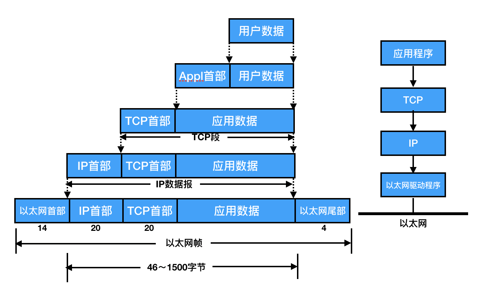
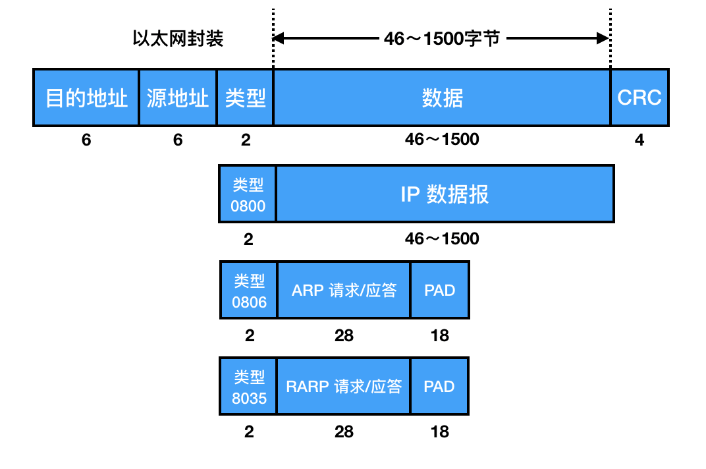
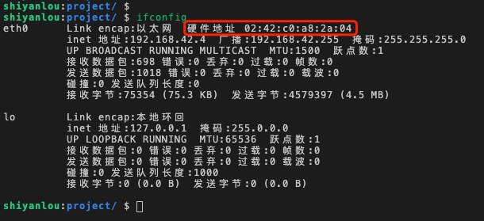
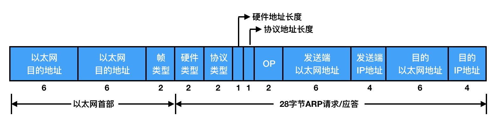
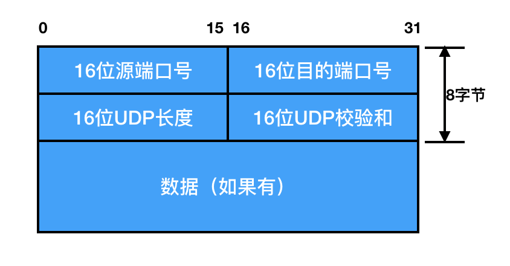
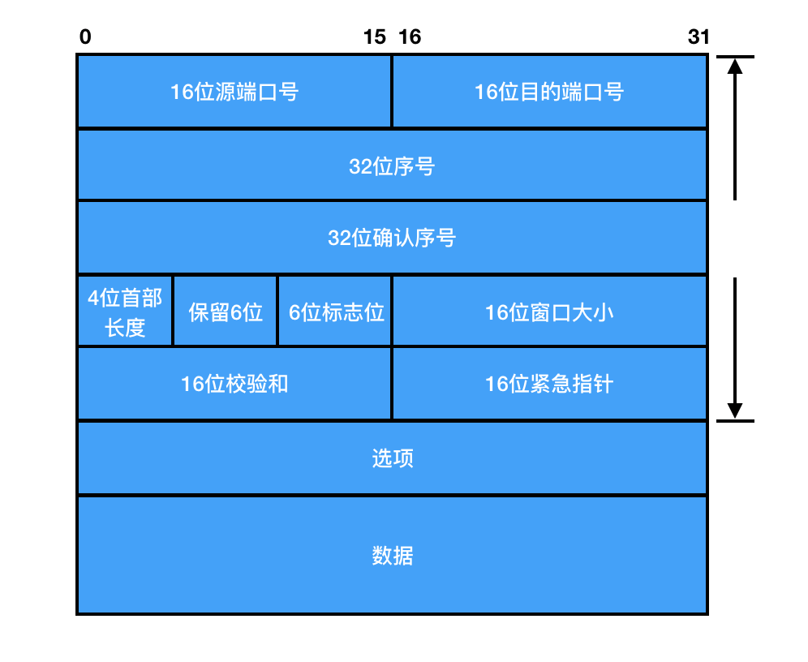
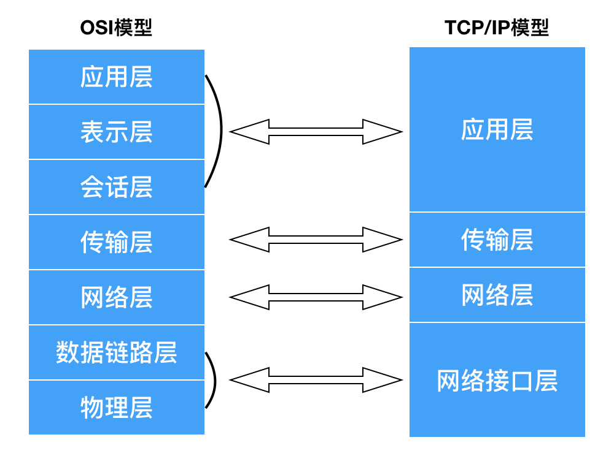
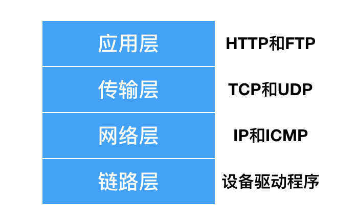
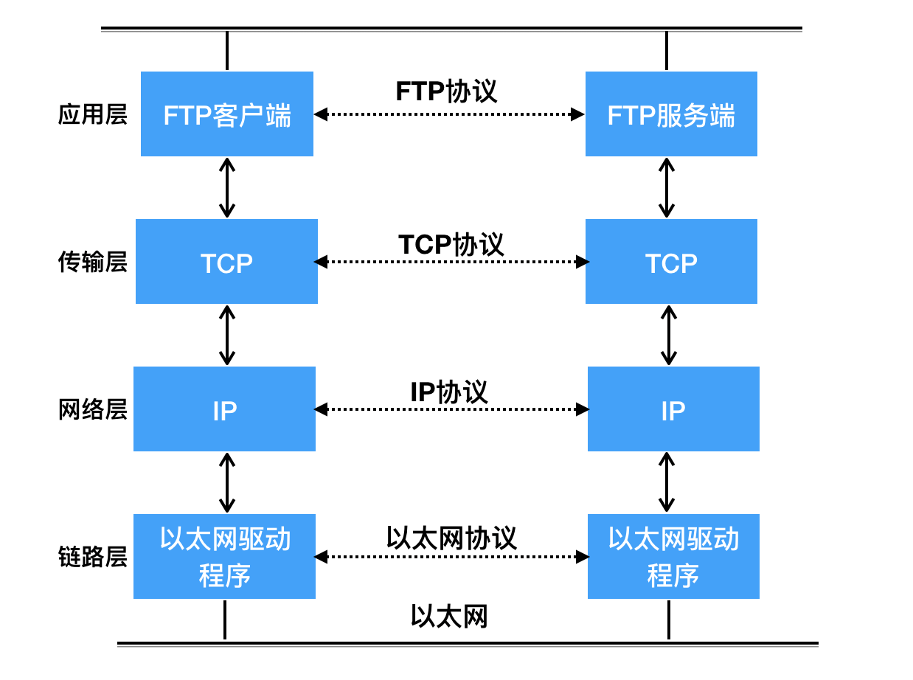
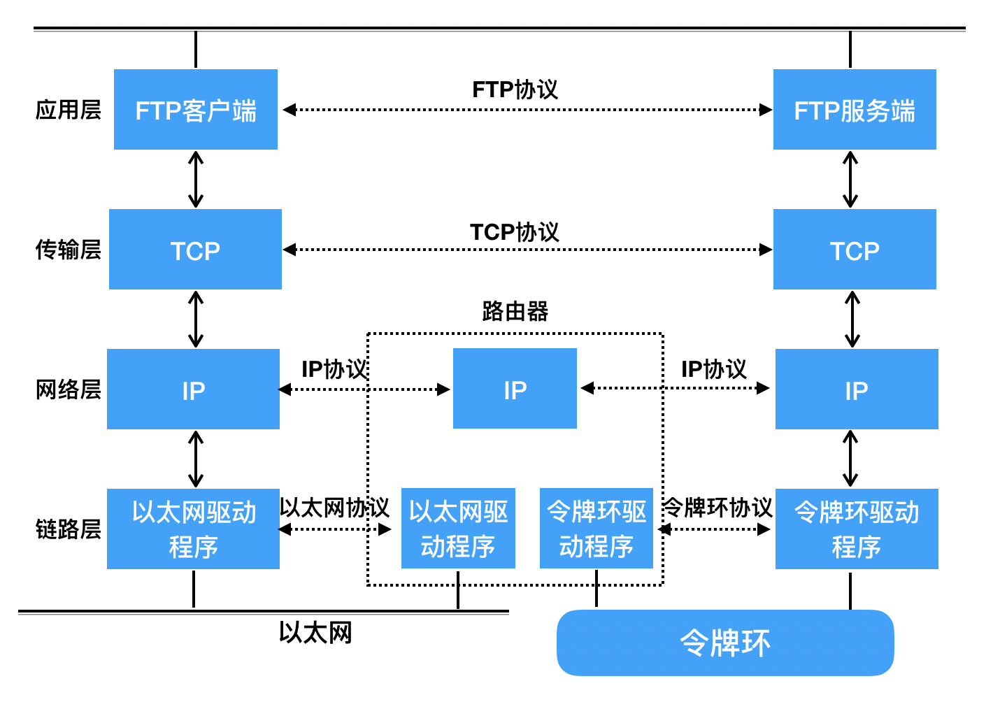

# 网络编程基本介绍

## 实验介绍

关于网络编程其实在互联网中应用是非常广泛的，本实验将从网络编程的基础知识入手，主要介绍网络中的典型协议、端口、网络分层模型以及通信过程，为后续的实验打下基础。

#### 知识点

- 了解协议和端口
- 网络应用程序设计模式
- 分层模型
- 通信过程

## 协议和端口介绍

#### 协议的介绍

- 什么是协议

从应用的角度出发，协议可理解为“规则”，是数据传输和数据的解释的规则。  
假设，A、B 双方想要传输文件，有这么个规定：  
第一次，发送方传输文件名，接收方接收到文件名，应答 OK 给发送方；  
第二次，发送方发送文件的尺寸，接收方接收到该数据再次应答一个 OK；  
第三次，发送方传输文件内容，同样，接收方接收数据完成后应答 OK 表示文件内容接收成功。  
由此，无论 A、B 之间传递何种文件，都是通过三次数据传输来完成，双方形成了一个最简单的数据传输规则。双方都按此规则发送、接收数据，达成的这个相互遵守的规则即为协议。  
这种仅在 A、B 之间被遵守的协议称之为原始协议，当此协议被更多的人采用，不断的增加、改进、维护、完善，最终形成一个稳定的、完整的文件传输协议，被广泛应用于各种文件传输过程中，该协议就成为一个标准协议。

- 典型协议

传输层常见协议有 TCP/UDP 协议。  
应用层常见的协议有 HTTP 协议，FTP 协议。  
网络层常见协议有 IP 协议、ICMP 协议、IGMP 协议。  
网络接口层常见协议有 ARP 协议、RARP 协议。

TCP 传输控制协议是一种面向连接的、可靠的、基于字节流的传输层通信协议。  
UDP 用户数据报协议是 OSI 参考模型中一种无连接的传输层协议，提供面向事务的简单不可靠信息传送服务。  
HTTP 超文本传输协议是互联网上应用最为广泛的一种网络协议。  
FTP 文件传输协议是网络中传输文件的一种协议。  
ICMP 协议是 Internet 控制报文协议，它是 TCP/IP 协议族的一个子协议，用于在 IP 主机、路由器之间传递控制消息。  
ARP 协议是正向地址解析协议，通过已知的 IP，寻找对应主机的 MAC 地址。  
RARP 是反向地址转换协议，通过 MAC 地址确定 IP 地址。

- 协议格式

数据包封装：传输层及其以下的机制由内核提供，应用层由用户进程提供，应用程序对通讯数据的含义进行解释，而传输层及其以下处理通讯的细节，将数据从一台计算机通过一定的路径发送到另一台计算机。应用层数据通过协议栈发到网络上时，每层协议都要加上一个数据首部（header），称为封装，如下图所示：

不同的协议层对数据包有不同的称谓，在传输层叫做段（segment），在网络层叫做数据报（datagram），在链路层叫做帧（frame）。数据封装成帧后发到传输介质上，到达目的主机后每层协议再剥掉相应的首部，最后将应用层数据交给应用程序处理。

以太帧格式：以太网的帧格式如下图所示：

其中的源地址和目的地址是指网卡的硬件地址（也叫 MAC 地址），长度是 48 位，是在网卡出厂时固化的。可在 shell 中使用 ifconfig 命令查看，如下图所示：

其中“02:42:c0:a8:2a:04”部分就是硬件地址。协议字段有三种值，分别对应 IP、ARP、RARP。帧尾是 CRC 校验码。
以太网帧中的数据长度规定最小 46 字节，最大 1500 字节，ARP 和 RARP 数据包的长度不够 46 字节，要在后面补填充位。最大值 1500 称为以太网的最大传输单元（MTU），不同的网络类型有不同的 MTU，如果一个数据包从以太网路由到拨号链路上，数据包长度大于拨号链路的 MTU，则需要对数据包进行分片。ifconfig 命令输出中也有“MTU:1500”。

ARP 数据报格式：在网络通讯时，源主机的应用程序知道目的主机的 IP 地址和端口号，却不知道目的主机的硬件地址，而数据包首先是被网卡接收到再去处理上层协议的，如果接收到的数据包的硬件地址与本机不符，则直接丢弃。因此在通讯前必须获得目的主机的硬件地址，ARP 协议就起到这个作用。
每台主机都维护一个 ARP 缓存表，可以用 arp -a 命令查看。缓存表中的表项有过期时间（一般为 20 分钟），如果 20 分钟内没有再次使用某个表项，则该表项失效，下次还要发 ARP 请求来获得目的主机的硬件地址。
ARP 数据报的格式如下所示：

源 MAC 地址、目的 MAC 地址在以太网首部和 ARP 请求中各出现一次，对于链路层为以太网的情况是多余的，但如果链路层是其它类型的网络则有可能是必要的。硬件类型指链路层网络类型，1 为以太网，协议类型指要转换的地址类型，0x0800 为 IP 地址，后面两个地址长度对于以太网地址和 IP 地址分别为 6 和 4 字节，op 字段为 1 表示 ARP 请求，op 字段为 2 表示 ARP 应答。

UDP 数据报格式：前面提过，UDP 协议不面向连接，也不保证传输的可靠性，其数据报的格式如下图所示：

上图中的源端口号是客户端的端口号，目的端口号是 TFTP 服务的知名端口号，UDP 报长度为 63 字节，包括 UDP 首部和 UDP 层的长度，UDP 首部和 UDP 层 的校验和也是 16 位。

TCP 数据报格式：TCP 的数据报格式如下图所示：

与 UDP 协议一样也有源端口号和目的端口号，通讯的双方由 IP 地址和端口号标识。TCP 有 32 位序号、32 位确认序号，4 位首部长度和 IP 协议头类似，表示 TCP 协议头的长度，以 4 字节为单位，因此 TCP 协议头最长可以是 4x15=60 字节，如果没有选项字段，TCP 协议头最短 20 字节，中间的 6 位标志位分别为 URG、ACK、PSH、RST、SYN、FIN，后续的实验将会解释 SYN、ACK、FIN、RST 四个位。

#### 端口的介绍

逻辑意义上的端口，一般是指 TCP/IP 协议中的端口，端口号的范围从 0 到 65535，比如用于浏览网页服务的 80 端口，用于 FTP 服务的 21 端口等。
端口号小于 256 的定义为常用端口，服务器一般都是通过端口号来识别后台进程的。
客户端只需保证该端口号在本机上是惟一的就可以了，客户端口号因存在时间很短暂又称临时端口号。
大多数 TCP/IP 实现给临时端口号分配 1024—5000 之间的端口号，大于 5000 的端口号是为其它服务器预留的。
我们应该在自定义端口时，避免使用知名的端口。如：80、21 等。

## 网络应用程序设计模式

#### C/S 模式和 B/S 模式

传统的网络应用程序设计模式一般为客户端/服务端模式，这种模式需要在通讯两端各自部署客户机和服务器来完成数据通信，而浏览器/服务器模式，只需在一端部署服务器，而另外一端使用每台 PC 都默认配置的浏览器即可完成数据的传输。

#### 两种模式的优缺点

对于 C/S 模式来说，其优点明显，客户端位于目标主机上可以保证性能，将数据缓存至客户端本地，从而提高数据传输效率。一般来说客户端和服务器程序由一个开发团队开发，所以他们之间所采用的协议相对灵活，可以在标准协议的基础上根据需求裁剪及定制。因此，传统的网络应用程序及较大型的网络应用程序都首选 C/S 模式进行开发。比如，知名的网络游戏魔兽世界，3D 画面，数据量庞大，使用 C/S 模式可以提前在本地进行大量数据的缓存处理，从而提高观感。  
C/S 模式的缺点也较突出，由于客户端和服务器都需要有一个开发团队来完成开发，工作量将成倍提升，开发周期较长；另外，从用户角度出发，需要将客户端安插至用户主机上，对用户主机的安全性构成威胁，这也是很多用户不愿使用 C/S 模式应用程序的重要原因。

B/S 模式相比 C/S 模式而言，由于它没有独立的客户端，使用标准浏览器作为客户端，其工作开发量较小，只需开发服务器端即可。另外由于其采用浏览器显示数据，因此移植性非常好，不受平台限制。如早期的偷菜游戏，在各个平台上都可以完美运行。  
B/S 模式的缺点也较明显，由于使用第三方浏览器，因此网络应用支持有些会受限；其次，没有客户端放到对方主机上，缓存数据不尽如人意，从而传输数据量受到网络 I/O 限制，应用的观感大打折扣；另外，服务端必须与浏览器一样，采用标准 http 协议进行通信，协议选择不灵活。

因此在开发过程中，模式的选择由上述各自的特点决定，根据实际需求选择相应的应用程序设计模式。

## 分层模型

#### OSI 七层模型

互联网的逻辑实现被分为好几层，每一层都有自己的功能，就像建筑物一样，每一层都靠下一层支持。用户接触到的只是最上面的那一层，根本不会感觉到下面的几层，要理解互联网就需要自下而上理解每一层实现的功能。OSI 七层模型如下所示：

接下来我们一层一层的自底向上介绍每一层都是干什么的。

- 物理层

主要定义物理设备标准，如网线的接口类型、光纤的接口类型、各种传输介质的传输速率等。它的主要作用是传输比特流，就是由 1、0 转化为电流强弱来进行传输，到达目的地后再转化为 1、0，也就是我们常说的数模转换与模数转换。

- 数据链路层

定义了如何让格式化数据以帧为单位进行传输，以及如何让控制对物理介质的访问。这一层通常还提供错误检测和纠正，以确保数据的可靠传输。

- 网络层

在位于不同地理位置的网络中的两个主机系统之间提供连接和路径选择。Internet 的发展使得从世界各站点访问信息的用户数大大增加，而网络层正是管理这种连接的层。

- 传输层

定义了一些传输数据的协议和端口号，例如，TCP 传输控制协议，传输效率低，可靠性强，用于传输可靠性要求高，数据量大的数据，而 UDP 用户数据报协议与 TCP 特性恰恰相反，用于传输可靠性要求不高，数据量小的数据。 主要是将从下层接收的数据进行分段和传输，到达目的地址后再进行重组。

- 会话层

通过传输层建立数据传输的通路，在系统之间发起会话或者接受会话请求。

- 表示层

主要是确保一个系统的应用层所发送的信息可以被另一个系统的应用层读取。例如，PC 程序与另一台计算机进行通信，其中一台计算机使用二进制编码，而另一台则使用其它编码，如有必要，表示层会通过使用一种通用格式来实现多种数据格式之间的转换。

- 应用层

应用程序收到传输层的数据，接下来就要对数据进行解包，由于互联网是开放架构，数据来源五花八门，必须事先规定好通信的数据格式，否则接收方根本无法获得真正发送的数据内容，而应用层的作用就是规定应用程序使用的数据格式，例如我们 TCP 协议之上常见的 Email、HTTP、FTP 等协议，这些协议就组成了互联网协议的应用层。

#### TCP/IP 四层模型

TCP/IP 网络协议栈分为应用层、传输层、网络层和链路层四层，一般在应用开发过程中，讨论最多的是 TCP/IP 模型。四层模型如下图所示：

## 通信过程

两台计算机通过 TCP/IP 协议通讯的过程如下图所示：

上图对应两台计算机在同一网段中的情况，如果两台计算机在不同的网段中，那么数据从一台计算机到另一台计算机传输过程中要经过一个或多个路由器，如下图所示：

链路层有以太网、令牌环网等标准，负责网卡设备的驱动、帧同步、冲突检测、数据差错校验等工作。交换机是工作在链路层的网络设备，可以在不同的链路层网络之间转发数据帧，由于不同链路层的帧格式不同，交换机要将进来的数据包拆掉链路层首部重新封装之后再转发。

网络层的 IP 协议是构成 Internet 的基础。Internet 上的主机通过 IP 地址来标识，Internet 上有大量路由器负责根据 IP 地址选择合适的路径转发数据包，数据包从 Internet 上的源主机到目的主机往往要经过多个路由器。路由器是工作在第三层的网络设备，同时兼有交换机的功能，可以在不同的链路层接口之间转发数据包，因此路由器需要将进来的数据包拆掉网络层和链路层两层首部并重新封装。IP 协议不保证传输的可靠性，数据包在传输过程中可能丢失，可靠性可以在上层协议或应用程序中提供支持。

网络层负责点到点的传输（这里的“点”指主机或路由器），而传输层负责端到端的传输（这里的“端”指源主机或目的主机）。
TCP 是一种面向连接的、可靠的协议，有点像打电话，双方拿起电话互通身份之后就建立了连接，然后说话就行了，这边说的话那边保证听得到，并且是按说话的顺序听到的，说完话挂机断开连接。也就是说 TCP 传输的双方需要首先建立连接，之后由 TCP 协议保证数据收发的可靠性，丢失的数据包自动重发，上层应用程序收到的总是可靠的数据流，通讯之后关闭连接。
UDP 是无连接的传输协议，不保证可靠性，有点像寄信，信写好放到邮筒里，既不能保证信件在邮递过程中不会丢失，也不能保证信件寄送顺序。使用 UDP 协议的应用程序需要自己完成丢包重发、消息排序等工作。在平时开发中，传输层可根据业务场景来进行选择 TCP 或 UDP 协议。

## 实验总结

网络的核心基础是一系列协议，而网络编程则是基于这些协议，对网络中的数据进行处理传输等。掌握好网络编程的基础，意味着为后面实操网络编程的实验做准备，希望同学们能够沉下心来把基础打牢。
